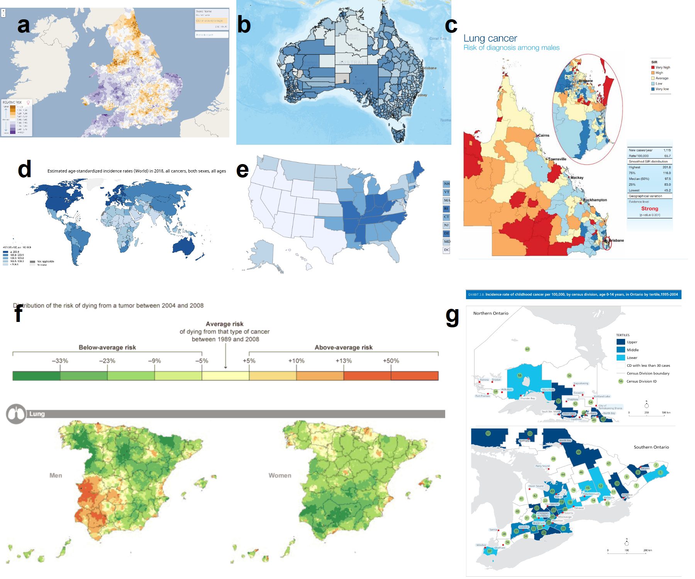
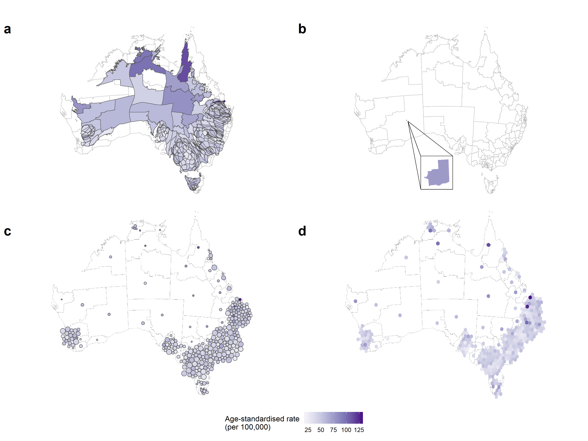
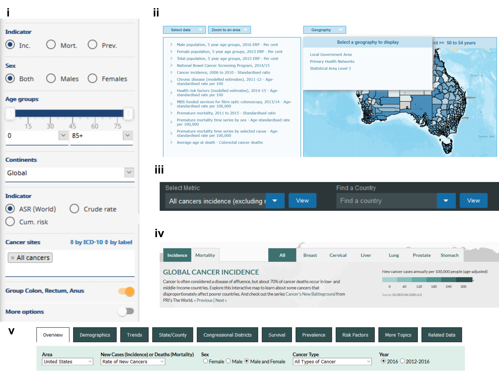
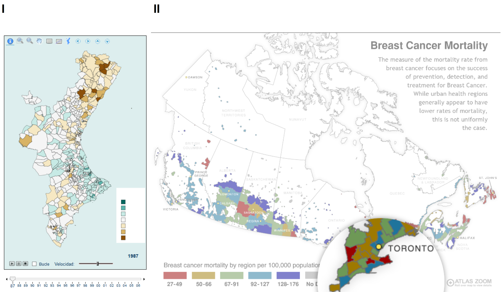

```{r setup, include=FALSE}
knitr::opts_chunk$set(echo = FALSE, 
                      warning = FALSE,
                      message = FALSE,
  fig_path = "figs/",
  out.width = "\\textwidth")
library(ggplot2)
library(cowplot)
library(png)
library(grid)
```

(I) Conception and design: All authors; 
(II) Administrative support: None; 
(III) Provision of study materials or patients: J Roberts, S Kobakian; 
(IV) Collection and assembly of data: None; 
(V) Data analysis and interpretation: All authors; 
(VI) Manuscript writing: All authors; 
(VII) Final approval of manuscript: All authors.

Correspondence to: Stephanie Kobakian, MPhil. Monash University, Melbourne VIC 3800, AUS. Email: stephanie.kobakian@monash.edu.

\section*{Keywords}
Cancer; cancer atlas; choropleth; cartogram; spatial; 

\section*{Abstract}
<!-- 105 words -->

Cancer atlases communicate cancer statistics over geographic domains, typically with a choropleth map. A choropleth map subdivides these domains into administrative regions such as countries, states, or suburbs. When communicating human-related statistics, the choropleth has a disadvantage in that it draws attention to sparsely populated rural areas to the neglect of small inner - city areas. The smaller geographic areas are important to consider if they are densely populated. Alternative map displays, such as a cartogram or a hexagon tile map, can shift the attention of map users from the large rural areas by decreasing their size on the map display. This means alternative displays can be more effective at accurately communicating spatial patterns across spatial areas. This study summarises current practices for cancer atlases and investigates the alternative map displays that could be used to accurately represent the distribution of cancer statistics across a population, as many cancer atlases lack appropriate displays for population statistics. It is recommended that alternative displays are included in cancer atlases for a perceptually accurate display of the distribution of the burden of cancer over the population, in addition to the familiar choropleth map, if possible given time and budget constraints.  With the ease of today’s technology, user interaction with the displays is also encouraged. Users should also be able to interactively display different statistics, such as incidence rate or relative incidence, or filter by demographic variables.

# 1. Introduction
<!-- 436 words -->
<!-- What data are we working with, why, what are the purposes -->

Researchers, health authorities, governments, not-for-profits and the media are common communicators of cancer statistics. They often present statistics to the public as aggregated values for geopolitical areas. Counts and incidence rates are often obtained by state health registries. Data privacy and ethics are key concerns even when combined to small area statistics. Presenting these statistics requires aggregating individual observations for the geographical units, also for political and policy purposes. Examples of typical geographical units include states, provinces, local government areas, and post/zip codes. 
This type of data is routinely collected for public health reasons and may be made available to the general public as a service to the community.

<!-- # Cancer atlases -->
<!-- Displaying of cancer data on choropleth maps -->
A cancer atlas is a map, or collection of maps, commonly representing cancer incidence or mortality patterns across a country, or group of countries. Atlases are key to developing hypotheses regarding areas with unusually high rates, and geographic correlations [@MACM]. The data collection methods across regions and the administrative control within regions lends itself to choropleth visualization. Cancer maps and atlases date back to Haviland's maps in 1875, with more modern atlases directly evolving from early work in US cancer atlases, appearing in 1971 [@burbank]. The presentation of cancer statistics has increased with greater access to computational power and the availability of geographic information systems software [@SE].

<!-- Measures reported in cancer atlases -->
<!-- Structure of the paper -->

This paper considers the current visualization techniques to communicate statistics to the public and their applications to cancer statistics. Alternative approaches are posed because they may be more effective than contemporary techniques. The differences and historic use of these displays is discussed, highlighting the potential and the limitations of the visualization methods.

The paper is structured as follows. The next section describes the common statistics displayed in disease mapping. Section 3 focuses on disease map visualizations. It describes cancer atlases, presents examples of atlases in use today. It discusses the limitations of the most commonly used technique for disease mapping, the choropleth map. This section also describes alternative displays, including the cartogram, which are useful when the map has heterogeneously sized geographic units. Section 4 presents the limitations in the production and use of alternative displays. Disease maps are more useful when made interactive, and common options are described in Section 5, along with a discussion of benefits and disadvantages. Section 6 summarizes this survey of the literature, and provides recommendations. 

# 2. Measures mapped

Epidemiologists and statisticians have developed a range of statistics to communicate the burden of cancer, and the choice of statistics used in maps has changed in recent decades. Table 1<!--\ref{tab:measures}--> summarizes the measures commonly presented in published cancer atlases. Mortality rates are commonly presented as relative rates of risk across the population, and age-adjusted to correct for the higher prevalence of cancers in older populations. As described by Howe [@HEDP], the Englishman P. Stocks advanced the field of mortality statistics by introducing the standardized mortality ratios in the 1930s, which was an improvement on crude death rates. 

The measures displayed are typically aggregations of data values over small areas or model estimates. This to protect patient privacy, and for numerical stability. The counts of cases in small areas can be difficult to obtain as they are often protected for privacy reasons. The information released and the statistics presented in worldwide cancer atlases are often model estimates. The measures described in Table 1 use incidence as the statistic of interest, which reports the number of new cases. These same statistics can be used to describe the mortality, that is, standardized Incidence Rate is analogous to the Standardized Mortality Rate.

Obtaining reliable estimates becomes more difficult as data becomes more sparse, either by increasing geographic resolution or stratifying by age/sex. Many atlases analyzing smaller areas such as the Australian Cancer Atlas [@ACA], use statistical modelling to produce estimates, although some continue to use simple calculations and suppress regions where estimates are unstable.

<!--
Cancer mortality is the number of deaths from cancer in a specific population within a specific period of time, usually a year. It usually only includes deaths where cancer is mentioned as an underlying cause of death on death certificates.

Cancer mortality rates are a standard measure of the frequency of deaths within a specific period of time relative to a fixed population size, usually 100,000 people or expressed per million if rare.
-->

Table 1: <!--\label{tab:measures}--> Common measures for reporting cancer information. Each measure is given along with a description and the Atlases in Figure 1 that display each measure.

|Measure | Details | Fig. |
|:--------------------|:---------------------------------|:----|
|1. Cancer incidence counts| the number of new cases occurring in a specified period and geographic area [@Globocan]| |
|2. Incidence Rate (per 100,000) | The frequency of cases relative to a fixed population size, usually 100,000 people, within a specific period of time [@Globocan] | e, g |
|3. Incidence Ratio | The incidence rate in a region divided by the average incidence rate for all of the regions| c |
|4. Age-Standardized Incidence Rate (per 100,000) | The weighted mean of the age-specific incidence rates; the weights are taken from population distribution of the standard population. The most frequently used standard population is the World Standard Population. [@Globocan] | b |
|4. Age-Standardized Incidence Ratio | The ratio of the observed Age-Standardized Incidence Rate, to the expected number of cases. Having adjusted for differences in population and differences in age structure of the population within each area [@DACA] | d |
|5. Age-Standardized Relative Risk | The relative risks represent the risk of an area (ward) relative to average risk, adjusted for age, deprivation and chance fluctuations due to small numbers. [@EnvEnglandWales2] | a, f |


# 3. Visualisation approaches

## 3.1 Traditional approaches for cancer map displays {#ch:choropleth-maps}

<!-- Ways to visualize, whats our hypothesis -->
A choropleth map is the common display to visualize and communicate geospatial cancer statistics over geographic domain. Choropleth maps are a type of thematic map that show polygons for each of the groups of data points representing the geographic units, where each polygon is shaded with a color according to the area-specific values of the statistic being conveyed. Visualizing this data is helpful as geographic patterns of disease may be obscured when reported in a table [@SAMGIS]. Providing a visual representation of cancer outcomes allows identification of geographic patterns of the disease that can then be addressed with public health policy and actions. The spatial distribution of the disease incidence can be examined using a choropleth map display and may reveal a trend in longitude or latitude, or rural vs urban, or coastal vs inland, or even specific hot spots of the disease. One of the key challenges with mapping spatial patterns of disease is the design of visualizations [@SE]. It is important to consider the strengths and weaknesses of designs, as visualizing diseases on maps is often the first step in exploratory spatial data analysis and helps in the formulation of hypotheses. 

<!-- 381 words -->
<!-- what is a choropleth map -->
A choropleth map displays the geographical distribution of data over a set of spatial units by shading areas of a map [@EI], [@BCM]. Faithful rendering of the geography, when combined with an appropriate color scheme, can reveal spatial patterns among data values. Identifying and explaining spatial structures, patterns, and processes involve considering the individuals and organizing them into representable units of communities [@SAMGIS]. Early versions of choropleth maps used symbols or patterns instead of color. Choropleth maps can be used for displaying disease data [@DMAHP], including cancer data [@CPISACA]. In epidemiology, choropleth maps are often used as a tool to study the spatial distribution of cancer incidence and mortality.

<!-- psychology -->
Displaying familiar state boundaries can make a map easier to read [@CIBMUK] and allow viewers to infer the spatial relationships visually in the data using their mental model of the geography. The users of disease maps may include researchers, the public, policy makers, and the media [@CPISACA]. For these users, the familiarity of the geography is a worthy consideration when presenting results of spatial analysis.

Cancer maps are effective tools for communicating incidence, survival, and mortality to a wide range of audiences, including the public and others not trained in statistical analysis. These visualizations enable non-expert audiences to interpret the outputs of sophisticated statistical analysis. Cruickshank (1947) as cited by S. D. Walter [@DMAHP], discusses using visuals as a 'formal statistical assessment of the spatial pattern'. Overwhelmingly, choropleth maps are visualisations chosen to communicate cancer statistics to members of the public and other non-expert audiences.  


```{r choropleth-grid-create, message=FALSE, warning = FALSE, fig.cap = "Figure 1. A selection of choropleth cancer maps from online atlases that are publicly available. Maps of various countries were chosen: United Kingdom, Australia, Spain, USA, Canada, and display several different colour palettes and legends. These atlases are described in Table 2.", fig.align='center', fig.width=12, fig.height=10}

```


Table 2: <!--\label{tab:choropleths}--> A selection of choropleth cancer maps from online atlases displayed in Figure 1.

| Fig. | Atlas | Data | Statistic | Source |
|----|-----------|-------------|-----------|--------------|
| a | The Environment and Health<br> Atlas of England and Wales<br> [@EnvEnglandWales2] | Sex: Women<br> Year: 2010<br> Cancer: Lung | Relative risk | Office for National Statistics<br> (ONS) (England) and from the<br> Welsh Cancer Intelligence and<br> Surveillance Unit (WCISU) [1a](http://www.envhealthatlas.co.uk/homepage/) |
| b | Globocan 2018: Estimated Cancer<br> Incidence, Mortality and <br> <br> Prevalence Worldwide<br> [@Globocan] | Sex: Both<br> Year: 2018<br> Cancer: All invasive | Age standardized<br> incidence rates<br> (per 100,000) | World Health Organization's<br> International Agency for<br> Research on Cancer [1b](https://gco.iarc.fr/today<br>)  |
| c | Atlas of Cancer in Queensland<br>  [@QLDcancerAtlas] | Sex: Males<br> Year: 1998 - 2007<br> Cancer: Lung | Relative incidence<br> ratio | Queensland Cancer Registry [1c](https://cancerqld.org.au/research/cancer-registries/queensland-cancer-registry/) |
| d | Map of Cancer Mortality<br> Rates in Spain<br> [@cancerSpain] | Sex: Males<br> Year: 1975 - 2017<br> Cancer: Lung | Age Standardized Rate | <br> Map of cancer mortality rates<br> in Spain [1f](http://ariadna.cne.isciii.es/MapP/) |
| e | United States Cancer<br> Statistics: An Interactive<br> Cancer Statistics Website<br> [@USInteractive] | Sex: Both<br> Year: 2016<br> Cancer: All types | Incidence rate per<br> 100,000 | With data from state cancer<br> registries: <br> Centers for Disease Control and Prevention [1e](https://gis.cdc.gov/Cancer/USCS/DataViz.html) |
| f | Australian Cancer Atlas<br> [@ACA] | Sex: Males<br> Year: 2010 - 2014<br> Cancer: Lung | Average standardized<br> incidence rate | Australian Cancer Atlas [1d](https://atlas.cancer.org.au/) |
| g | Atlas of Childhood<br> Cancer in Ontario<br> [@OntarioPediatric] | Sex: Both<br> Year: 1995 - 2004<br> Cancer: All types | Incidence rate per<br> 100,00 | <br> The Pediatric Oncology Group<br> of Ontario Networked Information<br> System [1g](https://www.pogo.ca/research-data/pogonis-childhood-cancer-database/data-requests/) |

<!-- 416 words -->
A review of modern cancer atlases [@roberts2019communication] identified 33 cancer atlases published between 2010 and 2016. Atlases published between 2016 and 2018 have also been considered. Each of these online atlases uses choropleth maps. All except one of these were published by non-commercial organizations, including not-for-profits, government, research organizations, advocacy groups or government-funded partnerships. Figure 1<!--\ref{fig:choropleth-grid-create}--> displays a subset of maps from these atlases, the selection varies in the geographies explored. Figure 1b<!--\ref{fig:choropleth-grid-create}--> shows Globocan 2018 [@Globocan] which explores Estimated Cancer Incidence, Mortality and Prevalence Worldwide using estimates based on available country cancer registries. Most atlases allow users to view sex-specific distributions. 

There is large variation in the resolution of the maps. Figure 1<!--\ref{fig:choropleth-grid-create}-->b shows global information at a national level. The United States Cancer Statistics [@USInteractive] shows data aggregated at the state level (n = 51). The Environment and Health Atlas of England and Wales [@EnvEnglandWales2] (Figure 1a<!--\ref{fig:choropleth-grid-create}-->) shows the relative risk for women developing lung cancer  at a neighborhood (small-area) scale (n = 8850). The Australian Cancer Atlas (Figure 1f<!--\ref{fig:choropleth-grid-create}-->) shows the relative incidence ratio of lung cancer in males for each Statistical Area at Level 2 [@abs2011] (n = 2292). The Atlas of Cancer in Queensland (Figure 1c<!--\ref{fig:choropleth-grid-create}-->) shows a subset of the Australian Statistical Local Areas (SLAs) located in the state of Queensland within Australia [@QLDcancerAtlas] (n = 478).


Age-specific atlases are less common. Figure 1g<!--\ref{fig:choropleth-grid-create}--> displays Atlas of Childhood Cancer in Ontario, this communicates the incidence rate of childhood cancers per 100,000 (by census division) for children aged 0-14, in Ontario from 1995 to 2004 [@OntarioPediatric]. 


Australia presents an extreme case of an urban rural divide. The land mass occupied by urban electoral districts is only 10% of Australia, yet 90% of the population live in these urban areas [@ACTUC]. Choropleth maps provide a familiar display, which shows data in a geographically recognisable way. A disadvantage is that the different population and geographical sizes of administrative areas can attract attention to the shades of the underpopulated but large areas [@EI]. Skowronnek also [@BCM] discusses how choropleth maps suffer from area-size bias, as they give a 'stronger visual weight' to large  administrative units. The administrative boundaries used to define regions may limit a choropleth display, as this display unfaithfully represents the disease distribution across the region by obscuring small geographic areas. Sparsely populated rural areas are emphasized, whereas the areas representing inner city communities are very small. This is especially true for Australia.

Choropleth maps colour each geographic unit to allow map users to measure the value of the statistic [@EI]. Map users contrast the colours in neighbouring areas to understand the spatial distribution. Pickle's [@USMA] suggestions for choropleth map displays include directions to categorise the statistic presented on the map according to percentiles. A colour scheme that communicates high and low rates can be useful in displays of cancer statistics, using a double ended colour scheme such as those provided by the ColorBrewer system [@CB] and viridis [@viridis] palettes provide effective colour schemes for qualitative, sequential and diverging data. When communicating information using colour, a map creator should use a scheme with perceptually uniform color spaces that match equal steps in data space with equal steps in the colour space [@PUCS]. It is possible to allow for data to progress uniformly in both positive and negative directions from a mid point, such as the mean of the data. These diverging colour schemes pair two sequential schemes that use a common light colour at the mid point, each sequential scheme progresses to a dark hue at the extreme value in each direction [@DCS], it prefereable that the scheme use darker or warmer colors for higher cancer rates [@USMA]. A linear color gradient is appropriate for incidence counts and rates. The linear gradient can also be transformed using the log scale, to show appropriate colours for ratio measures. The Australian Cancer Atlas example in Figure 1d implements dark red for areas with an SIR value with a risk level more than 50% (eg. SIR = 1.5) above the Australian average. Areas were coloured dark blue if they had an SIR value below the inverse of the risk value specified (eg. ≈ 0.67). The use of borders and backgrounds, and their colours, can also change the appearance of the colors representing the value of the statistics [@CB]. These supports can be used to implement a reference point in the colour scheme as well as orient users to the geographic regions. 

<!--
Choropleth maps provide a familiar display that may be important for orienting a non-statistical audience. The familiar shape boundaries define individual areas of non-uniform size, containing different population densities and may be subject to change. A spatially heterogeneous population distribution across a country’s landmass is an issue common to many countries, especially British colonies [@ACTUC]. 

A disadvantage of the conventional map is that the different population and geographical sizes of administrative areas can attract attention to the shades of the underpopulated but large areas [@EI]. Skowronnek also [@BCM] discusses how choropleth maps suffer from area-size bias, as they give a 'stronger visual weight' to large  administrative units. The administrative boundaries used to define regions may limit a choropleth display, as this display unfaithfully represents the disease distribution across the region by obscuring small geographic areas. 
Sparsely populated rural areas are emphasized, whereas the areas representing inner city communities are very small.

Those who critique choropleth maps often discuss bi-partisan election mapping in the United States of America [@BCM, @NISCC].
Election mapping in Australia also suffers when presented on choropleth maps, where each electorate decides the outcome of one parliamentary seat in the house of representatives. While all states are visible on a map display of Australia, smaller geographic units such as electorates present an extreme case of an urban-rural divide. The landmass occupied by urban electoral districts is only 10% of Australia, yet 90% of the population live in these urban areas. To present election results on a choropleth map should be ‘unthinkable’, as it means diminishing the visual impact of most of the electorates and incorrectly communicating the distribution of votes across the country. 
-->


<!--
Choropleth maps can inhibit visual inference when presenting human-related statistics as the display may draw attention away from the ‘potentially more important results in the more populous communities’ that are geographically smaller [@SE]. 
Inset maps like in Brisbane city in Figure 1c<!--\ref{fig:choropleth-grid-create} of the state of Queensland are commonly used to reduce distorted interpretations, but it is not always an appropriate solution. As this feature of population distributions continues to intensify, the need for cartograms as an alternative to a choropleth map should only increase.
-->

## 3.2 Contemporary alternatives to choropleth maps {#ch:alternatives}

### 3.2.1 Cartograms
<!-- 1496 words inc table-->

<!-- What is a cartogram? -->
Choropleth maps imply uniformity of data across the geographic space but population densities are unlikely to be uniform [@BCM]. Cartographers developed the cartogram to draw the attention to the population by transforming the map [@ACCAC]. The resulting display can communicate the impact of the disease more accurately across the population, as recorded by the statistic, at the sacrifice of geographic accuracy. 

<!-- Denominators 
Through the purposeful distortion of the map space, a map can present each region using a size that reflects the amount of population, rather than the amount of land the region encompasses. The borders or boundaries can be adjusted and the distortion of map areas can allow for equal representation of the members of population, and provide a uniform population display for the statistic to be presented [@ACTUC] [@CTTMB] [@GOINO]. 
-->
<!-- Why transform?-->
<!-- Common variables used to create cartograms, e.g. population, mortality -->
Cartograms provide an alternative visualization method for statistical and geographical information. Monmonier [@HTLWM] suggests that map creators can use white lies to create useful spatial displays. An area cartogram [@NAC], or population-by-area cartogram [@TAAM] is produced from the distortion of the geographical shape according to population. Event cartograms [@VSSDCUC] change the area of regions on a map depending on the amount of disease-related events, rather than population. It is easy for the reader to disregard the impact of transformations used to create cartograms, for the benefit of reading the statistical distribution more accurately with approximate geographic information. The spatial transformation of map regions relative to the data emphasizes the data distribution instead of land size [@CBATCC]. When visualizing population statistics, Dorling  considers this design 'more socially just' [@ACTUC], or honest [@NISCC], giving equitable representation and attention to all members of the population and reducing the visual impact of large areas with small populations [@DMAHP]. Howe [@HEDP] suggests that 'cancer occurs in people, not in geographical areas' and that spatial socio-economic data, like cancer rates, are best presented on a cartogram for urban areas as the population map base avoids allocating 'undue prominence' to rural areas [@CTTMB]. 

<!-- Overview of varieties -->
<!-- Cartogram makers -->

The creation of cartograms was historically in the hands of professional cartographers [@CD]. Early approaches by John Hunter and Jonathan Young's [@pam] wooden tile methods, Skoda and Robertson's [@imoc] steel ball-bearing approach and Tobler's [@ctufd] computer programs. Howe [@HEDP] discusses the impact of electronic computer-assisted techniques. Geographical information systems allow map creators to produce cartograms and they use these systems depending on ‘the effectiveness, efficiency, and satisfaction of the map products' [@CD].

The intended audience and the communication purpose are important to consider when creating alternative map displays.  Nusrat and Kobourov [@SAIC] provided a framework to investigate implementations of the many algorithms presented, and the "statistical accuracy, geographical accuracy, and topological accuracy". 
The alternative map displays in Figure 2 a - c are created by resizing and reshaping the states of the USA to match the 2015 population of the state. This provides a better sense of the extent of disease relative to the population in the country and can help prevent overlooking the impact of the disease within physically small but population-dense states. Map creators give each state equal size and thus equal emphasis in Figure 2d the hexagon tile map.

```{r ggcartograms, fig.cap = "Figure 2. Common alternatives to maps, showing the same information for the United States of America. The colour of each state communicates the average age-adjusted rate of incidence for lung and bronchus for females and males in the United States 2012-2016: (a) contiguous cartogram distorted each state's shape by the population of the state in 2015, (b) non-contiguous cartogram preserves the shape of the cartogram, but the size now reflects the population of the state in 2015 (c) Dorling cartogram are non-contiguous, circles are used to represent each state and the population of the state determines the size in 2015 (d) hexagon tilemap (non-contiguous) uses a hexagon of equal size for each state, and colours the state by the average age-adjusted rate of incidence. ", message=FALSE, warning=FALSE}
knitr::include_graphics("figures/usa_grid.png")
```


Figure 2<!--\ref{fig:ggcartograms}--> shows four different cartograms for the average age-adjusted rate of incidence for lung and bronchus for females and males in the United States 2012-2016.
Each cartogram highlights different aspects of the population and relation to the average age-adjusted rate of incidence.
 
In the contiguous cartogram map (2a) the state of California has become much larger because of the large population density. This draws attention to the densely populated North-East region and detracts from the less populated Mid West.

In the non-contiguous (2b) the state of California has remained closer to its original size than its surrounding states. The North-East states have remained closer to their geographical size, for Massachusetts and Connecticut. This draws attention to the densely populated North-East region and the sparse Mid West.

In the Dorling cartogram (2c) the North-East states remain closer to their neighbors and are slightly displaced from their geographic location. It highlights the sparsity of the population in the Mid West by the distance between the circles at the geographic centroids.

In the Hexagon Tessellation (2d) it is simple to contrast the neighboring states however the North-East regions have been displaced from their geographic location. It highlights the sparsity of the population in the Mid West by the light yellow color, the Age-Adjusted rate in Kentucky is the darkest and its neighbors are similar.


### 3.2.2 Contiguous

<!-- What is a contiguous cartogram -->
<!-- Intentionally preserve neighbors -->

A contiguous cartogram alters the choropleth according to a statistic and maintains connectivity of the map regions. Min Ouyang and Revesz [@ACA] present three algorithms for creating value-by-area cartograms. They implement 'map deformation' to account for the value assigned to each area. Other methods include Tobler’s Pseudo-Cartogram Method, Dorling’s Cellular Automaton Method [@ACTUC], Radial Expansion Method, Rubber Sheet Method, Line Integral Method, Constraint-Based Method [@CBATCC].

Figure 2a<!--\ref{fig:ggcartograms}--> shows a population contiguous cartogram of the United States. All states are visible and the shape of the United States overall is still recognizable.

To be able to recognize the significant changes, a reader will usually have to know the initial geography to find the differences in the new cartogram layout [@NAC]. The shapes of small areas on a choropleth map and a cartogram are preserved using Tobler's Conformal mapping method.
Koccmoud and House [@CBATCC] present this issue as conflicting tasks or aims, to adjust region sizes and retain region shapes. 

### 3.2.3 Non-contiguous

Non-contiguous cartograms prioritize the shapes of the areas instead of connectivity. Each area stays in a similar position to its location on a choropleth map. Displaying the choropleth map base allows map users to make comparisons regarding the change in the area. The addition is the gap between areas, created as each area shrinks or grows according to the associated value of the statistic. Olson [@NAC] discusses the creation of these maps and the significance of the empty areas left between the geographic boundaries and the new shape. The white space presents the meaningful empty-space property [@ECGC] [@NAC].

### 3.2.4 Dorling

Daniel Dorling presents an alternative display engineered to highlight the spatial distribution and neighborhood relationships without complex distortions of borders and boundaries [@ACTUC]:

>"If, for instance, it is desirable that areas on a map have boundaries which are as simple as possible, why not draw the areas as simple shapes in the first place?"

He acknowledged the sophistication of contiguous cartograms but critiqued their 'very complex shapes,' he answered this with his implementation of maps created using 'the simplest of all shapes'. Circular cartograms use the same circle shape for every region represented, resized  according to the statistic represented or the population. This simple shape may be more effective for understanding the spatial distribution than contiguous cartograms. Contiguous cartograms create 'nonsense' shapes that have 'no meaning' [@NISCC]. Both methods apply a gravity model to produce a layout, that avoids overlaps and keep spatial relationships with neighboring areas over many iterations. The circular cartogram is relatively fast to compute.

Raisz [@RSCW] laid the groundwork for this approach in the mid-1930s, drawing rectangular cartograms that provide simple comparisons, effective for correcting misconceptions communicated by geographic maps. Tobler @TFYCC names and defines these as Value-Area Cartograms. This rectangular display may sacrifice contiguity but allows for tiling where geographic neighbors placed in suitable relative positions also share borders [@CDWCS]. Rectangular cartograms communicate bivariate displays of the population by the size of each rectangular, and they use color to communicate a second variable [@ORC]. 


### 3.2.5 Tile Map
<!-- 173 words -->
A tile map provides a tessellated display of consistent shapes.  A similar method to a rectangular cartogram, represents each geographic area using a square. The squares are tessellated to create a grid. Each area is represented by a square of the same dimensions, each tile is usually one unit of measurement, this could be geographic regions such as states or population-based that use a consistent measure of population for each tile. Regions with over four neighbors require some necessary displacement. The tile map uses color to represent a value of a statistic for each area. A similar method to a rectangular cartogram represents each geographic area using a square of the same dimensions. There are online media sources using this method, these include [@NPR], [@FiveThirtyEight], [@WSJ], [@WP]. Tile maps may be difficult to create as they are best created manually, they require additional time and care as the number of geographic areas to include increases.

Cano and others [@MDAC] define the term 'mosaic cartograms' for hexagonal tile displays, where the number of tiles for each area or the color of them can communicate the statistic of regions. When using several tiles per region, map makers can adjust the complexity of the boundaries in the resulting display. They can also make a trade-off between boundary complexity and simplicity by the size of the tiles used.


### 3.2.6 Geofacet
<!-- 166 words -->
Hafen [@IGF] introduces the term geofacet to describe a grid display of small plots. The arrangement of tiles mimics the geographic topology. Geofaceting has the functionality that a statistical plot can be constructed in each facet for each geographic area. A tile map can communicate only one value per region in a visualization, while geofaceting is a more flexible visualization for communication as it increases the amount of information displayed. Virtually any type of plot can be shown in the tile, allowing displays of multiple variables or values per geographic entity. Creating the layout of a geofacet is manual, but once created can be used for any data on that geographic base.

```{r ggtilemap, fig.cap = "Figure 3. Two alternative displays, tile map (left) and geofaceted map (right), showing state age-adjusted rate of incidence for lung and bronchus in the USA. In the tile map, the layout approximates spatial location, with each state being an equal box filled with color representing cancer incidence. The geo-faceted map shows bar charts laid out in a grid approximating the spatial location of the state. The maps show age-adjusted rates for males and females. This display allows the presentation of multiple variables for each geographic area.", out.width="100%"}
knitr::include_graphics("figures/gggrids.png")
```


### 3.2.7 Multivariate displays
<!-- 222 words -->

Pickle and others [@MMST] present linked micromap plots to match geographic and statistical data visually, this serves as a solution to  multi-dimensionality issues. These maps group areas based on their value for one variable, and additional columns provide displays that contrast the areas in each group by other variables. The display juxtaposes choropleth maps and statistical plots; it shows one map per group of the key separating variable, in a row with each additional statistical plot. Linked micromaps predominantly use the choropleth map for displays of spatial relationships. These maps show spatial relationships by allotting spatial neighbors to the same group. It is one of several alternative displays that allow maps to become bivariate displays, commonly used to present both an estimate and the associated uncertainty.


Lucchesi and Wikle [@VUADBC] present bivariate choropleth maps blend color schemes to convey the intersection of categorized levels of an estimate and the associated uncertainty for each spatial area.  They also suggest map pixilation, which breaks each region into small pixels, and allocates values to the individual pixels to create texture. This reflects the uncertainty around the area's estimate by randomly sampling from the confidence interval of the estimate of the area. Animating these displays involves resampling the pixels for each frame. Areas with uncertain values will flicker more dramatically than areas with more certain values.


# 4. Comparison and critique of alternative displays {#sec:compare}
<!-- 408 words -->


```{r auscartograms, fig.cap = "Figure 4. Cartograms showing melanoma incidence in Australia: (a) contiguous, partially population transformed, (b) non-contiguous shape preserved, (c) Dorling, (d) hexagon tile map. The contiguous cartogram has expanded the highly populated areas while preserving the full shapes of rural areas. If it accurately sized areas by population, the country would be unrecognizable. The shape-preserved is unreadable due to the small area sizes. The Dorling cartogram presents all areas but many are difficult to compare. The hexagon tile map provides a reasonable spatial distribution despite having isolated hexagons in the outback areas.", message=FALSE, warning=FALSE, cache=FALSE, fig.width=8, fig.height=6, dpi=300}

```


## 4.1 Performance of cartograms for Australia

Figure 4<!--\ref{fig:auscartograms}--> shows four main types of cartograms using melanoma incidence on Australian Statistical Areas at Level 3 [@abs2016]. The version of a contiguous cartogram (a) has expanded the highly populated areas while preserving the full shapes of rural areas. 
The south east is enlarged, but high population areas are still small, and low population areas are still large on the map. It has not fully resolved the population transformation of areas, because the algorithm can't reach an optimal configuration where area matches population -- Australia is too heterogeneous. The shape-preserved cartogram is unreadable, and it has reduced all areas to tiny spots on the map. Zooming in on a high-resolution output shows it does preserve the shapes. The Dorling cartogram and the hexagon tile map provide reasonable displays of the spatial distribution, despite having a very large amount of white space in the outback areas.

## 4.2 Limitations of alternative displays

Cartograms provide the spatial distortion to more accurately convey the statistical distribution, focusing on the human impact of the disease. However, the transformation of contiguous cartograms often occurs at the expense of the shape of areas [@CBATCC, @NAC, @TAAM]. When the population density of the geographic units is highly dissonant with geographic density, the cartogram will lose all spatial context. Dorling [@ACTUC] contains a cartogram showing the 1966 general election results for Australia, produced Hughes and Savage [@HS], which looked very little like the geographical shape of Australia. The reader is encouraged to access the freely available pdf of Dorling's book, and this image can be found on page 41.

The most common aesthetics employed in alternative map displays are shape, colour and size. Each alternative alternative display allows for some combination of these. Colour is used most often to represent the variable of interest.
The size and shape are often used to scale the areas to draw attention to regions of interest.

Some mix of tiling, faceting or even micromaps, which allow some spatial continuity while also zooming into small areas, are good solutions for difficult geographies. Bell et al. [@CPISACA] provide suggestions and comments to help map creators best communicate their health data and spatial analysis. The authors highlighted that the map design chosen should be tested on a representative sample of potential consumers, to ensure that the target audience is not misinformed by the display. The authors encourage the consideration of map types beyond the traditional classed choropleth map, but warn that sound cartographic principles must be employed to ensure effective communication to the public.
A clear definition of the purpose of the display can help map creators to select the design that best communicates the statistic of interest [@CPISACA]. Table 3 lists several features, or limitations, of each alternative display in contrast to the commonly used choropleth map. The desirable features of each display can be contrasted within the table, this can be used to help inform the choice of map creators as they consider each alternative display. Map creators should choose a display that best communicates the statistic according to the purpose of their display.


Table 3: <!--\label{tab:methods}--> Summary of features and constraints of common mapping methods used to display cancer statistics. ("Yes" indicates the characteristic is always used, "No" indicates never used, and "Possible" it may be employed, but it is not necessary.)


|           | Choropleth | Contiguous | Non-contig | Dorling | Tile maps | Geofacets |
|:----------|:---------:|:---------:|:-----------:|:---------:|:---------:|:---------:|
|Spatial<br> distortion   | No  | Yes      | Yes | Yes      | Yes      | Yes      |
|Preserves<br> neighbors  | Yes | Yes      | Yes | Possible | Possible | Possible |
|Conceals<br> small areas | Yes | Possible | No  | No       | No       | No       |
|Uniform<br> shapes       | No  | No       | No  | Yes      | Yes      | Yes      |
|Univariate<br> data      | Yes | Yes      | Yes | Possible | Possible | No       |
|Manual<br> construction  | No  | No       | No  | No       | Yes      | Yes      |


## 4.3 Additional considerations
<!-- 479 words -->
Cancer atlases often display supplementary graphs and plots to add more information. Additional materials such as tables, graphs, and text explanations support understanding and inference derived from maps, ensuring the message communicated will be consistent across a range of viewers [@CPISACA]. The many displays of statistical summaries, including dot plots, bar plots, box plots, cumulative distribution plots, scatter plots, and normal probability plots, can provide alternative views of the cancer statistics. These can also display supporting statistics such as error, confidence intervals, distributions, sample or population sizes, and standard deviation. 

The statistics communicated in atlases are often used to describe differences between areas. This can occur at different levels of aggregation. Aggregation of global health statistics occurs within administrative and arbitrarily defined regions, such as those used by the World Health Organization and the United Nations [@IARC_3]. World atlases can allow for displays of data aggregated into continents, countries, states, provinces and congressional districts [@USInteractive]. Each population area will probably have a different number of people, which is typically used to calibrate the statistic. Cancer atlases may also communicate the distribution of the population living in all areas in a table or histogram display [@NICR_1]. Atlases can connect the population to the land available to them by communicating population density. 

Maps can also be used to focus on demographic strata, such as age and sex. Some of the digital atlases surveyed allow subsets to be selected for display, for example the Australian Cancer Atlas [@ACA] allows filtering for the selection of statistics regarding males and females specifically.

Introducing population and demographic information helps to interpret the rates in areas effectively, but there will still be uncertainty around the rates. To address this, a cancer atlas often communicates uncertainty about the value of a statistic. There are several potential sources of uncertainty: sampling error, errors arising from the disease reporting or data collection processes, and uncertainty arising from the statistical modelling or simulation process. The most common measures used to present uncertainty are credible intervals or confidence intervals. Displaying the uncertainty associated with reported statistics is a vital feature of a cancer map, but it is difficult to display effectively, the Australian Cancer Atlas [@ACA] uses transparency to communicate uncertainty. Providing an adjacent map or overlaying maps with symbols [@VSSDCUC] are two common solutions. 

# 5. User interaction {#ch:interacting}
<!-- 634 words -->


One of the concerns of adding too much information to a map is the fear of cognitive overload [@mcgranaghan1993cartographic] in which the user reaches an information threshold, beyond which they become confused. It can be a juggling act for a diverse audience, with experts probably preferring more detail [@cliburn2002design] while a simpler display is more broadly readable. Interactivity is a design feature within modern mapping methods that can be used to incorporate additional information and complexity without overloading the user. Effective  user-centred interactive actions produce rapid, incremental, and reversible changes to the display [@DMIV].

Monmonier [@HTLWM] recommends using interactivity to allow users to explore the map for more information and provide flexibility for the display. The user can toggle between different variables, map views or even multiple realizations of future scenarios [@goodchild1994introduction]. This provides additional mechanisms for the users to digest the uncertainty of the available information [@maceachren1992visualizing], [@van1994visualization]. When the needs of the audience are changeable and are also the priority, the map creator can allow interactivity for map users to explore a data set through dynamic interactions. This can allow inspection of the data from many views [@DQBCM]. User interaction with maps helps to understand and interpret the spatial distribution of disease, to validate, explain or explore the presented statistics and their relationships to each other [@TNTEA].

Interactivity enables supplementary information to be incorporated into online atlases without cluttering the display. Interactive design features, found in online cancer maps, include tool tips, drop-down menus, data selection, zooming, and panning to allow users to explore the map as they want more information and allow flexibility in the display [@HTLWM]. The use of these supports can be found in various online cancer maps and are shown in Figure 5 [@roberts2019communication].

Animation, in contrast to interactivity, usually involves pre-computing views and showing these in a sequence. Lin Pedersen [@TGA] provides an overview of animation for maps using the R package `gganimate` [@gganimate]. Animations are used to communicate a message by capturing and directing users' attention. It is most often employed to show changes over time. The controls for basic animation are usually placed outside of the plot space [@TGA], and the map image is updated/replaced as the animation progresses. 

Weather maps are a thoroughly developed examples of animation of spatial displays to communicate information to the general public [@CPISACA]. The movement of a weather system will follow a forecasted path. All map users can follow the animated path of the weather system across the geography over a specified period. 

The Australian Cancer Atlas [@TACA] provides [tours](
https://atlas.cancer.org.au/app/tour/lungcancer) that change the display to draw users' attention to areas on the map that are relevant to the interpretation of the statistic displayed.
This implementation of animation gives users tools to plan their exploration.


```{r interacting, fig.cap = "Figure 5. Interactive controls of displays in publicly available choropleth cancer maps: (i) GUI controls for statistic, sex, age groups, continents, and cancer types for Globocan 2018 [@Globocan], (ii) Menus for variable selection and zooming on Bowel Cancer Australia Atlas, (iii) Menus for choosing variables and countries in The Cancer Atlas, (iv) Tabs for different indicators and cancer types in Global Cancer Map, (v) Menus and toggles for variable and subset selection in United States Cancer Statistics: Data Visualizations.", results = "asis", message=FALSE, warning=FALSE, cache=FALSE, fig.width=8, fig.height=6, dpi=300}

```


Figure 6 <!--\ref{fig:animating}--> shows two examples of more sophisticated interactive maps. The Spanish Cancer map (left) contains a linked display between a choropleth map and time series plots of cancer change. In linked plots, changing values in one display will trigger changes of corresponding elements in another display. Here, the temporal change in the choropleth map can be played out as an animation. Mousing over the time series plots will highlight the line for a particular region. The Canadian Breast Cancer Mortality map (right) has a magnifying glass that allows the user to zoom into small areas. It is easy to control and shows precise details in small areas. 


```{r animating, fig.cap = "Figure 6. Two examples of advanced interactivity (and animation) in publicly available choropleth cancer maps: a. Linked maps and time-series line plots, with temporal animation in Map of Cancer Mortality Rates in Spain, b. A highly responsive magnifying glass on a map of Breast Cancer Mortality in Canada.", results = "asis", message=FALSE, warning=FALSE, cache=FALSE, fig.width=8, fig.height=6, dpi=300}

```

# 6. Conclusions
<!-- 307 words -->

<!-- summary of mapping -->
This paper provides an overview of mapping practices as commonly used for cancer atlases. The conventional approach is the choropleth map, and it is widely used. The choropleth map suffers when there are small geographic units, as occurs in Australia.  The population of Australia is concentrated in small areas on the coast, and a choropleth map can hide information about the burden of cancer on those communities. Making an inset can clarify congested regions but this breaks the viewers’ attention as they shift focus from the map to the inset, and if there are many congested areas, many insets would be needed. The map alternatives implement trade-offs between the familiar shapes, and the importance of the geographic areas. Given the population or a cancer statistic for each area, the geographic size or shape will change. Alternative displays allow the spatial distribution of cancer data to be digested by map users.

<!-- recommendation -->
Additional mapping methods should be considered by map creators during the development of a cancer atlas, as alternative displays may align better with the communication purpose. Other considerations need to be taken into account, including audience, budget, time, maintenance. Of primary importance is that information about cancer statistics be effectively communicated to the public. The choropleth has an advantage in that it is more familiar in form for more people, but we have seen that it can give an incorrect perception of the information. Public atlases can be useful educational tools. A combination of the choropleth alongside an alternative display, could provide a balance of the familiar along with a perceptually accurate display, and provide an opportunity to educate the reader.  This is especially recommended for Australia, because of the vast difference between spatial area and population density.

Many statistics are commonly used in cancer displays. It is common to see incidence rates, or ratios which displays how far a region is above or below the average. The purpose of using an age standardized ratio is, perhaps the desire to pinpoint the areas that need attention because they have higher than expected rates. Ratios may negatively impact the interpretability of the actual rates of incidence or mortality. However, this impact is offset by the value of seeing the relativity of the values in reference to the mean, especially when the mean value is also given on the display. This helps to put individual areas in perspective, 
as a region might have a value higher than the average, but it may not be a health concern if all regions have a low incidence rate. Supplementary materials such as displaying the mean, or a distribution plot, can allow map users to recognise when this occurs.

<!-- interaction -->
Interaction with maps is an important component of public atlases, and is becoming increasingly straightforward to add with today's technology. The purpose of interaction in public atlases is to provide access to more information than is possible to display in a single map, without overwhelming the viewer. Too many choices can similarly overwhelm a viewer, and thus decisions do need to be made about content to provide for accurate and comprehensive communication of information. Similarly, providing ways for users to interact with the display encourages engagement, and creative, efficient, elegant, interactive tools elicit curiosity about the data. 

# Acknowledgements
<!-- 77 words -->
The authors would like to thank Dr. Earl Duncan for his contributions in editing and refining the drafts of this article.
They would also like to thank Professor Kerrie Mengersen, Dr. Susanna Cramb and Dr. Peter Baade for conversations on the content of this article. 

The following R [@R] packages were used to produce this paper: tidyverse [@tidyverse], RColorBrewer [@RColorBrewer], ggthemes [@ggthemes], png [@png], cowplot [@cowplot], sf [@sf], spData [@spData], cartogram [@cartogram], sugarbag [@sugarbag], knitr [@knitr], rmarkdown [@rmarkdown] and absmapsdata [@ABSmaps].

Files to reproduce the paper, and code to reproduce the plots, are available at https://github.com/srkobakian/review. 

# Footnote

*Conflicts of Interest:* All authors have completed the ICMJE uniform disclosure form. The series “Spatial Patterns in Cancer Epidemiology” was commissioned by the editorial office without any funding or sponsorship. The authors have no other conflicts of interest to declare.

*Ethical Statement:* The authors are accountable for all aspects of the work in ensuring that questions related to the accuracy or integrity of any part of the work are appropriately investigated and resolved.

# References
