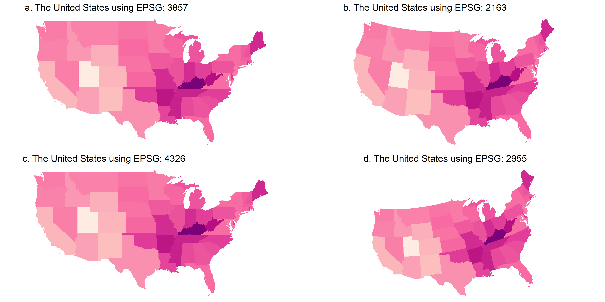
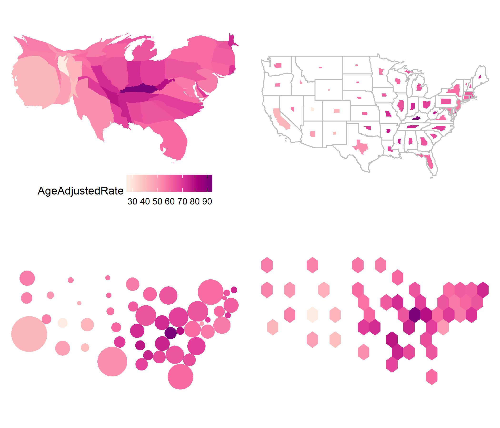
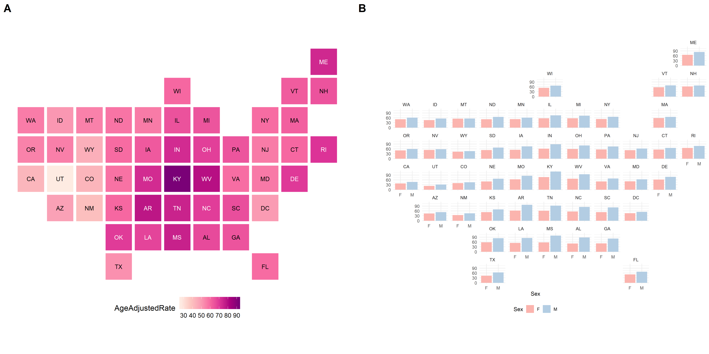

```{r setup, include=FALSE}
knitr::opts_chunk$set(echo = FALSE)
library(ggplot2)
library(png)
library(grid)
```
<!--

Please note that the submission deadline is September 30, 2019.

Author notes:
6000 words maximum.
focused  application  of  literature  to address  a  relevant  clinical  issue:
Mapping cancer outcomes
Cartogram applications should point to examples of cancer outcomes, with the main cartogram section discussing sources considered in grey literature review. Examples of political areas may be considered if cancer data is aggregated at these levels.

- Future steps should consider applications not currently utilised for cancer outcome displays, where their use may improve decision making
- needs to have a clear relevance to spatial patterns in cancer epidemiology
- presents alternative ways of visualising those spatial patterns, or the uncertainty in those patterns
- a more applied-focussed paper (e.g. lots of cool images), rather than theoretical (e.g. lots of formula).
-->


\section*{Abstract}

# Introduction
<!--
Current best practices: Choropleths
Current exploratory practices: Cartograms: cont, non cont, (tilegrams, Dorlings)
Suggested uses of 
-->

<!-- What data are we working with, why, what are the purposes -->
Cancer statistics represent information on people, usually delivered as an aggregated value for a geopolitical area. Presenting statistics requires transforming individual observations into aggregations of communities as geographical units, in large part for privacy protection or political and policy purposes.  The information could be as simple as counts per area (e.g. state, province, local government area, post/zip code). Counts alone is not sufficient on which to compare different areas, because the populations of different areas are likely different. In this case, the counts data needs to be merged with population data to appropriately calibrate it to incidence, for example, rate per 100000 people.  This type of data is collected on a routine basis for public health purposes, and may be made available to the general public as a service to the community. The task, then, is to examine what are the usual ways to communicate cancer statistics, to the public, are there alternative approaches, and what are the pros and cons of these choices. 

<!-- Geospatial statistics have been presented on maps to communicate information to the general public for centuries as they utilise familiar geographic shapes.
The mapping of diseases summarises spatial variations and can be considered a descriptive statistic of the relationship between a disease and the underlying geography [@SEMA].
The distribution of the statistic must be visible, it is not enough for areas on maps to be recognisable.
It is important to explore map views and designs that enhance the communication of the cancer statistics, especially as it is the populations that live on the land that are of interest, not the land itself. 
This has spurred innovations over the previous centuries to enhance maps to effectively communicate both cancer outcomes and health outcomes more broadly.-->

<!-- Ways to visualise, whats our hypothesis -->
A common approach to communicate cancer statistics, is to display statistics on a map. This is a choropleth map: the statistic is mapped to colour and the geographic region is filled with this colour. The viewer would then be able to examine the spatial distribution of the disease incidence, where there is a trend in longitude or latitude, or rural vs urban, or coastal vs inland, or even specific hotspots of the disease. Visualising diseases on maps is often the first step in exploratory spatial data analysis and effectively helps in the formulation of hypotheses [@MTMSIH]. Disease maps help to present geographic patterns that may be overlooked in a table, obscuring the geospatially related statistics [@SAMGIS].
By providing a visual representation of cancer outcomes, geographic patterns of disease are able to be identified and effectively addressed with public healh policy and actions.
@SE recognises one of the key challenges with mapping spatial patterns of disease is the design of visualisations.
This paper addresses the visualisation techniques and their applications to cancer statistics. Highlighting the differences and historic use of these displays.

<!-- Structure of the paper -->
The paper is organised as follows. The next section describes the choropleth map which is the common approach to disease maps. Section \ref{ch:public} surveys atlases in use today. Section \ref{ch:alternatives} describes an alternative display, the cartogram what may be useful for countries that have heterogeneously sized geographic units. The pros and cons of these approaches is discussed in Section \ref{ch:compare}. Disease maps are more useful when made interactive, and common options are described in Section \ref{ch:interacting}, along with a discussion of benefits and disadvantages. The last section summarises the paper and discusses future directions. 


# Map displays for disease data {#ch:choropleths}

<!-- what is a choropleth map -->
A choropleth map is used to display differences in the geographical distribution of data by spatial unit by shading areas of a map. The geography is faithfully rendered, and the colour rendering is designed to reveal spatial patterns among data values. A choropleth is constructed by drawing the geographic or political boundaries, and filling the shapes with colours to represent values of a measured variable [@EI]. 
Figure \ref{fig:choroCRS} shows a choropleth of age-adjusted rate (per 100,000 people) of new cases of lung and bronchus in the USA, averaged over 2012 through 2016. The data was extracted from the official federal statistics by @usa_lung on cancer incidence and deaths, produced by the Centers for Disease Control and Prevention (CDC) and the National Cancer Institute (NCI).

<!-- history and types of choropleths, variations -->
Early versions of choropleth maps used symbols or patterns instead of colour.
@CPISACA discuss the use of choropleths to visualise cancer data, and @DMAHP gives an overview of the development of these maps for displaying disease data.

<!-- psychology -->
Utilising the state boundaries can make a map familiar to read [@CIBMUK], and allows viewers to visually infer the spatial relationships in the data. 
The familiarity of the geography is a worthy consideration when presenting results of spatial analysis. Just as geographers are no longer the only creators of maps, @CPISACA suggests the audiences of spatial health data analysis have extended beyond researchers to the public, policymakers and the media.

<!-- how do we use choropleth's -->
Identifying and explaining spatial structures, patterns, and processes involves considering the individuals in communities and organising communities into representable units [@SAMGIS]. In Figure \ref{fig:choroCRS}, a west to east spatial trend of increasing rates, can be seen. There is also a spatial outlier -- Utah has a noticeably lower rate that its neighbours. Also Kentucky has a noticeably high rate, and Maine also has a higher rate than its neighbours. There is something of a cluster of higher rates around the tobacco states. 


<!-- potential problems -->
While the areas are recognisable shapes, they are often politically driven boundaries with individual areas being of non-uniform size, containing different population densities and subject to change over time. 
The different population and geographical sizes of administrative areas can attract attention to the shades of the unpopulated but large areas [@EI], Skowronnek [-@BCM] calls this an area-size bias. 
Choropleths can inhibit visual inference when presenting human related statistics as the display may draw attention away from the 'potentially more important results in the more populous communities' that are geographically smaller [@SE]. 


```{r choropleth-grid-create, message=FALSE, warning = FALSE, fig.cap = "Publicly available choropleth cancer maps, published between 2010 and 2015.", out.width='100%', fig.align='center', fig.width=12, fig.height=10}
library(cowplot)

# Import the images
plot1 <- png::readPNG('cancer_map_images/choropleths/21.choropleth.png')
plot2 <- png::readPNG('cancer_map_images/choropleths/3.choropleth.png')
plot3 <- png::readPNG('cancer_map_images/choropleths/25.choropleth.png')
plot4 <- png::readPNG('cancer_map_images/choropleths/15.choropleth.png')
plot5 <- png::readPNG('cancer_map_images/choropleths/7.choropleth.png')
plot6 <- png::readPNG('cancer_map_images/choropleths/23.choropleth.png')
plot7 <- png::readPNG('cancer_map_images/choropleths/26.choropleth.png')

ggdraw() +
  draw_plot(rasterGrob(plot1), 0, .75, 0.33, .25) +
  draw_plot(rasterGrob(plot2), 0.33, 0.75, 0.33, .25) +
  draw_plot(rasterGrob(plot3), 0.66, 0.5, .33, .5) +
  draw_plot(rasterGrob(plot4), 0, 0.5, .33, .25) +
  draw_plot(rasterGrob(plot5), 0.33, 0.5, .33, .25) +
  draw_plot(rasterGrob(plot6), 0, 0, .66, .5) +
  draw_plot(rasterGrob(plot7), .66, 0, .33, .5) +
  draw_plot_label(c("a", "b", "c", "d", "e", "f", "g"), 
    c(0.015, 0.33, 0.63, 0.015, 0.33, 0.014, 0.63), 
    c(0.99, 0.99, 0.99, 0.74, 0.74, 0.47, 0.47), size = 20)

ggsave(filename = "figures/choropleth_grid.png", 
  device = "png", width = 6, height = 5, dpi = 300)
```


# Cancer atlases {#ch:public}

<!-- Displaying of cancer data on choropleths -->
Choropleth maps can be useful devices for communicating information to public on a familiar map base.
A cancer atlas is a choropleth map, or collection of maps, representing cancer incidence and mortality for a country, or group of countries. 
In epidemiology, choropleths are often used as a tool to study the spatial distribution of cancer incidence and mortality. 
The data collection methods of cancer mortality rates across regions, and the administrative control within regions lends itself to choropleth visualisation. 
@MACM provides the definition of a cancer atlas, beginning with Haviland's maps in 1875, they attribute UK cancer atlases to Howe (1963), and early work in US cancer atlases can be attributed to Burbank (1971).
The increasing development and use of disease maps can be attributed to the availability of geographic information system software [@SE].
The choropleth maps presented levels via hatchings or dots on a black and white scale.
These atlases were key to developing hypotheses regarding areas with unusually high rates, geographic correlations, work related exposures, and high risk diets [@MACM].


<!-- Measures reported in cancer atlases -->
The presentation of cancer statistics has changed over time with greater access to computational power.
Mortality rates are now often presented as relative rates of risk across the population, and age adjusted to correct for the higher prevalence of cancers in older populations.
Howe [-@HEDP] describes Stock's development of the standardised mortality ratios through the 1930s. Table \ref{tab:measures} summarises the measures presented in published cancer atlases, and provides a definition of each measure.

Table: \label{tab:measures} Measures used to report cancer statistics

|Measure |Details| 
|:--------------------|:------------------------------------------------|  
|1. Count|Crude cancer counts|
|2. Rate per 100,000|Cancer incidence per 100,000 population|  
|3. New cancer cases per 100,000|Specific methods could not be found|   
|4. IR (Incidence Ratio)|$(IR)_i=\frac{(Incidence\ Rate)_i}{Average\ Incidence\ Rate}$, |
||Cancer incidence rate in region $i$ over the average cancer incidence rate for the total region|
|5. Age Adjusted Rate per 100,000| #5 standardised by age structure or region|   
|6. Age Adjusted Relative Risk| RR standardised by age structure in each region $i$|  
|7. SIR (Standardised Incidence Ratio)| IR standardised by age structure in each region $i$|
|8. Below or above Expected|Alternative expression of the SIR|
|9. RER |$RER = \frac{(Cancer\ related\ mortality)_i}{Average\ cancer\ related\ mortality}$|
|(Relative Excess Risk)|Represents the estimate of cancer related mortality within five years of diagnosis|
||Also referred to as 'excess hazard ratio'| 


<!-- Cancer atlas literature -->

The atlas of Cancer in Queensland [@DACQ] focussed on highlighting the difference in experience for those living in rural and disadvantaged areas. They used Standardised Incidence Ratios modelled via Bayesian methods, and explored the information presented in a range of selected atlases. These atlases provided Incidence, Survival and Mortality rates to the public on Areal or Isopleth map bases.

The presentation of these rates considers not only the shapes of the areas, but also appropriate choices of colour blind friendly colour schemes, and categories of the values to highlight significantly different areas.
<!--

Examples of atlases:
Kraak 1998, Kraak and Ormeling 2011
Bertin 1967
Coleman MP, Gatta G, Verdecchia A, Esteve J, Sant M, Storm H, Allemani C,Ciccolallo L, Santaquilani M, Berrino F:EUROCARE-3 summary: cancersurvival in Europe at the end of the 20th century.Ann Oncol2003,14(Suppl 5):v128-149

National Cancer Institute:Cancer Trends Progress Report - 2009/2010 UpdateBethesda: NCI, NIH, DHHS; 2010

Pickle LW:A history and critique of U.S. mortality atlases.Spatial andSpatio-temporal Epidemiology2009,1:3-17.

Mason TJ, McKay FW, Hoover R, Blot WJ, Fraumeni JF:Atlas of cancermortality for U.S. counties: 1950-1969Washington: U.S. Govt. Printing Office;1975.
howmick T, Robinson AC, Gruver A, MacEachren AM, Lengerich EJ:Distributed usability evaluation of the Pennsylvania Cancer Atlas.Int JHealth Geogr2008,7:36.

Queensland Cancer Registry:Cancer in Queensland: Incidence, Mortality,Survival and Prevalence,1982 to 2007Brisbane: QCR, Cancer CouncilQueensland and Queensland Health; 2010.

New York State Department of Health Maps of Cancer Incidence byCounty.[http://www.health.state.ny.us/statistics/cancer/registry/cntymaps/index.htm].
Quinn M, Wood H, Cooper N, Rowan S, Eds:Cancer Atlas of the UnitedKingdom and Ireland 1991-2000.London: Office for National Statistics;2005.
-->

Cancer maps are effective tools for communicating to wide range of audiences, including the general public and others not trained in statistical analyses.
These visualisations enable non-expert audiences to interpret the outputs of sophisticated statistical analyses. Cruickshank (1947) as cited by @DMAHP, discusses using visuals as a 'formal statistical assessment of the spatial pattern'. Overwhelmingly, cancer maps utilised to communicate to the public and other non-expert audiences are choropleths. 

## Overview of publicly available atlases

@roberts2019communication identified 33 publicly available cancer atlases, published between January 2010 and November 2015. All of these use choropleth maps. All but one of these were published by non-commercial organisations, including not-for-profits, government, research organisations, advocacy groups or government funded partnerships. The use of choropleths within the public domain mirrors the heavy use of choropleth maps within the research literature, discussed above. 
The cancer atlases identified by @roberts2019communication covered geographies from all around the world, most focused on single nations. Figure \ref{fig:choropleth-grid-create} displays a global (b), national (a,d,e,f) and state (c,g) choropleths. The sections below provide details on each of the maps within Figure \ref{fig:choropleth-grid-create}.

<!-- While there is significant variation across these maps in terms of the measure represented, the scale of the map, the colour choices, the legend design and supplementary/supporting statistics, the mapping approach has not changes and almost exclusively only choropleth maps are used. Unlike innovation in spatial statistical methods, interactity, data collection and record keeping little work has been done to implement different mapping approaches -->

### The Environment and Health Atlas of England and Wales

Figure 2.a contains an image from the *[The Environmental and Health Atlas of England and Wales](http://www.envhealthatlas.co.uk/eha/Breast/)*. This map shows the relative risk for women developing lung cancer in England and Wales in 2010. The cancer data used to generate this map came from Office for National Statistics (ONS) (England) and from the Welsh Cancer Intelligence and Surveillance Unit (WCISU).    


### Globocan 2012: Estimated Cancer Incidence, Mortality and Prevalence Worldwide

The map seen in Figure 2.b is from the *[Globocan 2012: Estimated  Cancer Incidence, Mortality and Prevalence](http://globocan.iarc.fr/Pages/Map.aspx)*. This global map shows age standardized incidence rates (per 100,000) for all invasive cancers for both men and women, aggregated at a national level for 2018. This map is published by the [World Health Organisation's International Agency for Research on Cancer](https://www.iarc.fr/). Data was sourced from cancer registries in each country, contributing registries can be seen in the supplementary material on the cancer atlas website. 


### Atlas of Cancer in Queensland 

Figure 2.c shows an extract from the *[The Atlas of Cancer in QLD](https://cancerqld.org.au/research/queensland-cancer-statistics/queensland-cancer-atlas/)*. This map was published by the Queensland Cancer Council and shows the relative incidence ratio of lung cancer in males in the state of QLD within Australia based on data from 1998 to 2007. Data to generate this map was sourced from the *[Queensland Cancer Registry](https://cancerqld.org.au/research/cancer-registries/queensland-cancer-registry/)*.  

### Bowel Cancer Australia Atlas 
Figure 2.d shows the *[Bowel Cancer Australia Atlas](http://www.bowelcanceratlas.org/)*. Published by *[Bowel Cancer Australia](https://www.bowelcanceraustralia.org/)* (Australia). This map shows the percentage of Australian males between 50 - 54 years of age that diagnosed with bowel cancer in 2016 in Australia. The source of the data is not provided.  

### United States Cancer Statistics: An Interactive Cancer Statistics Website
The *[United States Cancer Statistics: An Interactive Cancer Statistics Website](https://nccd.cdc.gov/DCPC_INCA/)* can be seen in Figure 2.e. This map contains  the incidence rate per 100,000, of all cancer types for men and women in the United States in 2016, aggregated at the state level. The map was published by the *[Centers for Disease Control and Prevention](https://www.cdc.gov/)*. Incidence data seen in this map were compiled from cancer registries meeting U.S. Cancer Statistics data quality criteria covering 100% of the U.S. population.

<!-- suggested citations: U.S. Cancer Statistics Working Group. U.S. Cancer Statistics Data Visualizations Tool, based on November 2018 submission data (1999-2016): U.S. Department of Health and Human Services, Centers for Disease Control and Prevention and National Cancer Institute; www.cdc.gov/cancer/dataviz, June 2019.-->

### Map of Cancer Mortality Rates in Spain
The *[Map of Cancer Mortality Rates in Spain](http://elpais.com/elpais/2014/10/06/media/1412612722_141933.html)* can be seen in Figure 2.f. The side by side maps show relative risk of lung cancer for men vs women based on data from 2004 to 2008. The source of the data and statistical methods are unknown. 

### Atlas of Childhood Cancer in Ontario 
Figure 2.g shows an extract from the Atlas of Childhood Cancer in Ontario and specifically displays the *[incidence rate of childhood cancers](https://www.pogo.ca/wp-content/uploads/2015/02/POGO_CC-Atlas-3-Incidence_Feb-2015.pdf)* per 100,000 (by census division) for children aged 0-14, in Ontario from 1995 to 2004.

<!-- map is on pg 41 or pdf report-->

## Interactivity

One of the concerns of adding too much information to a map is the fear of cognitive overload [@mcgranaghan1993cartographic] in which the the user reaches an information threshold, beyond which will not be able to make sense of the information. These concerns are not unfounded, complexity and density of representation methods appear to overwhelm novice decision makers, while experts are able to use the detail more readily when making-decisions [@cliburn2002design]. Interactivity is a design feature within modern mapping methods that can be used to incorporate additional information and complexity without overloading the user.

Interactivity enables supplementary information to be incorporated into online atlases without cluttering the display. Interactive design features found in online cancer maps include tool tip features, drop down menus, data selection, zooming and panning allow users to explore the map as they want more information and allow flexibility in the display [@HTLWM]. The use of these supports were found in various online cancer maps identified by @roberts2019communication. The controls for basic interactive features are often placed outside of the plot space [@TGA], thus the map image is updated/replaced as the user interacts with the controls. For example, changing the population age or other demographic variables. Some more advanced interactions include direct interactions with the plot via the use of overlaid tool tip features, very few cancer atlases involve these more complex selection interactivities. 


```{r interacting, fig.cap = "Interactive controls of displays in publicly available choropleth cancer maps. [a. Globocan 2018: Cancer Today](http://globocan.iarc.fr/Pages/Map.aspx)(Controls for indicator, sex, age groups, continents, and cancer types) , [b. Bowel Cancer Australia Atlas](http://www.bowelcanceratlas.org/) (Controls for indicator, age, year, and geographical areas), [c. The Cancer Atlas ](http://canceratlas.cancer.org/data/#?view=map&metric=INCID_ALL_M) (Controls for predetermined combinations of cancer type or risk factors, mortality or incidence, and gender) [d. Global Cancer Map](http://globalcancermap.com/) (Controls for indicator, and cancer type), [e. United States Cancer Statistics: Data Visualizations](https://gis.cdc.gov/Cancer/USCS/DataViz.html) (Controls for demographics, trends, geography, indicators, risk factors, sex, cancer type, and year).", fig.width = 12, fig.height = 9}
i1 <- png::readPNG('cancer_map_images/interactivity/3.interactivity.png') # b in choro grid
i2 <- png::readPNG('cancer_map_images/interactivity/15.interactivity.png') # d in choro grid
i3 <- png::readPNG('cancer_map_images/interactivity/4.interactivity.png')
i4 <- png::readPNG('cancer_map_images/interactivity/5.interactivity.png')
i5 <- png::readPNG('cancer_map_images/interactivity/7.interactivity.png') # e in choro grid

ggdraw() +
  draw_plot(rasterGrob(i1), 0,  0.13,   .28,  .83) + #a
  draw_plot(rasterGrob(i2), 0.32, 0.56, .68, .4) + #b
  draw_plot(rasterGrob(i3), 0.32, 0.41, .68, .13) + #c
  draw_plot(rasterGrob(i4), 0.32, 0.14, .68, .25) + #d
  draw_plot(rasterGrob(i5), 0, 0, 1, .13) + #e
  draw_plot_label(c("i", "ii", "iii", "iv", "v"), 
    c(0.01, 0.3, 0.3, 0.3, 0.01), 
    c(0.99, 0.99, 0.57, 0.40, 0.15), size = 20)

ggsave(filename = "figures/supp_grid.png", device = "png", 
  width = 12, height = 9, dpi = 300)
```


The interactivity of modern mapping methods enable supplementary information to be incorporated without cluttering the screen.
Additionally, interactivity allows the user to toggle between different variables, map views or multiple realizations of possible future scenarios [@goodchild1994introduction]. Thus providing additional mechanisms for the users comprehension as well as the uncertainty of the available information (@maceachren1992visualizing; @van1994visualization). 


These interactive features provide an opportunity for users to explore the additional information available.
Tool tip features and drop down menus allow for user exploration, small screens are not a problem with the flexibility provided by zooming and panning [@HTLWM]. This allows relationships between spatial areas and diseases to be explored with sophistication in nontraditional but still 'cognitively accesible' ways [@TNTEA].This helps users to understand and interpret the spatial distribution presented, as well as validate, explain or explore the presented statistics and their relationships to each other and/or their underlying spatial distribution. This allows relationships between spatial areas and diseases to be explored with sophistication in non-traditional but still 'cognitively accesible' ways [@TNTEA]. The interactive features of the publically available maps identified by @roberts2019communication allow the exploration of geographic hierarchies, population distribution, statistical uncertainty, demographics and socio-economic indicators.
@TNTEA suggested LM plots as a solution to linking cartography and statistical graphics. 


<!-- 

Technological advances may provide a solution to this through the use of interactivity, animation, and sound as additional channels for representing uncertainty information without interfering with the ability to see any features that are present in the display [@maceachren1992visualizing]. However, if uncertainty information is perceived as integral and inseparable from the data it is associated with, assumptions of uncertainty creating cognitive overload may not be as valid. 

-->


## Common statistics displayed

Cancer maps are powerful visualisations that summarise complex statistical analyses, however the statistics represented in these maps cannot tell the entire story.
Supplementary graphs and plots are often included to add more depth and information to the map.
@CPISACA suggests additional materials such as tables, graphs, and text explanations support understanding and inference derived from maps, ensuring the message communicated will be consistent across a range of viewers.
There are many visualisations used for displays of statistical summaries, these may be dot plots, bar plots, box plots, timesseries plots, cumulative distribution plots, scatter plots, Q-Q plots. 
These additional displays of the cancer distribution can provide alternative views of the cancer statistics, as well as the supporting statistics including error, confidence intervals, distributions, sample or population sizes, standard deviation and other measures.
When presenting cancer maps, @MACM believes the intuition derived from maps must be 'validated by rigorous statistical analyses', the supplementary statistics help for this validation.


### Geographic hierarchies

While atlases are often used to describe differences between areas, statistics may be displayed at different levels of aggregation. Global health statistics can be aggregated to administrative and arbitrarily defined regions, such as those used by the World Health Organisation and the United Nations [@IARC_3].
World atlases can allow for displays of data aggregated into continents, countries, states, provinces and congressional districts [@USCS].


### Population distribution

It is extremely likely that each population area will have a different number of people. The distribution of the population residing in all areas may also be communicated in a table or histogram display [@NICR_1].
Atlases have the opportunity to connect the population to the land available to them by communicating population density.
Atlases can also connect the population to the land available to them by communicating population density.

### Statistical uncertainty
Additional statistics that accompany an atlas often include a measure of the statistical uncertainty surrounding the statistics presented in a choropleth.
In the review of atlases in the public domain, atlases were considered to report uncertainty to the non-expert user if they included a measure of statistical uncertainty either within or alongside the map [@roberts2019communication]. 
The maps considered used standard and well known measures including credible intervals and standard deviation, statistical significance, box plots and distributions. Other methods involve providing adjacent maps or overlapping maps with symbols [@VSSDCUC].
The maps employing uncertainty ranged from static documents or infographics, to interactive online visualisations. Communicating the statistical uncertainty associated with the estimates occurs using confidence intervals (CI), credible intervals (CrI), statistical significance levels, boxplots, distribution plots, and reporting sample size and standard deviations.
Close to half of the atlases identified (42%, n=14) included some measure of uncertainty. The most common measure used to represent uncertainty were credible or confidence intervals (CIs).

### Demographics
Demographics include information regarding the age and sex distribution of the areas presented. 
<!-- sex -->
Sex is an important cofactor for cancer atlases. 
As some cancers are sex specific, and others may be found in both males and females, atlases often specify the relevant sex as part of the visual output in the displays. 
Digital atlases allow for users to interact with the controls of the displays, they can select males, females or both depending on the type of cancers explored.

### Socio-economic indicators
Socio-economic indicators can explain how the experience of cancer prevalence varies for various members of a society.
These indicators include unemployment rates, poverty rates, remoteness, and education levels achieved though, only a few atlases also explored the impact of rurality on cancer rates. 
These rates may also be explored as percentages above or below the mean or median value for the set of spatial areas.
The Human Development Index can be used to understand the socio-economic experience of a community, as well as Income levels which can be sourced from the World Bank list of economies [@IARC_3]. 
The areas are often ranked and allocated to quintiles, each quintile can be presented as categories describing the ranking.


One of the concerns of adding too much information to a map is the fear of cognitive overload [@mcgranaghan1993cartographic] in which the the user reaches an information threshold, beyond which will not be able to make sense of the information. These concerns are not unfounded, complexity and density of representation methods appear to overwhelm novice decision makers, while experts are able to use the detail more readily when making-decisions [@cliburn2002design]. Interactivity is a design feature within modern mapping methods that can be used to incorporate additional information and complexity without overloading the user.

Interactivity enables supplementary information to be incorporated into online atlases without cluttering the display. Interactive design features found in online cancer maps include tool tip features, drop down menus, data selection, zooming and panning allow users to explore the map as they want more information and allow flexibility in the display [@HTLWM]. The use of these supports were found in various online cancer maps identified by @roberts2019communication. The controls for basic interactive features are often placed outside of the plot space [@TGA], thus the map image is updated/replaced as the user interacts with the controls. For example, changing the population age or other demographic variables. Some more advanced interactions include direct interactions with the plot via the use of overlaid tool tip features, very few cancer atlases involve these more complex selection interactivities. 

Additionally, interactivity allows the user to toggle between different variables, map views or multiple realizations of possible future scenarios [@goodchild1994introduction]. Thus providing additional mechanisms for the users comprehension as well as the uncertainty of the available information (@maceachren1992visualizing; @van1994visualization). 


These interactive features provide an opportunity for users to explore the additional information available. This helps users to understand and interpret the spatial distribution presented, as well as validate, explain or explore the presented statistics and their relationships to each other and/or their underlying spatial distribution. This allows relationships between spatial areas and diseases to be explored with sophistication in non-traditional but still 'cognitively accesible' ways [@TNTEA]. The interactive features of the publically available maps identified by @roberts2019communication allow the exploration of geographic hierarchies, population distribution, statistical uncertainty, demographics and socio-economic indicators.
@TNTEA suggested LM plots as a solution to linking cartography and statistical graphics.

 

# Alternative to choropleths {#ch:alternatives}

## Micromaps

Choropleths are univariate displays, they do not inherently support multi-dimensionality
This makes it difficult to pair demographic, environmental and other factors with spatial distributions.
@MMST present linked micromap plots as a solution to the issue of multi-dimensionality to visually link geographic and statistical data.
This design is widely used in online atlas displays, it groups areas based on their value for one variable, and uses  additional columns to provide displays that contrast the areas in each group by other variables.
The display juxtaposes of choropleth maps and statistical plots;
it shows one map per group of the key separating variable, in a row with each additional statistical plot.
Linked micromaps predominantly utilise the choropleth map for displays of spatial distributions.
It is one of several alternative displays that allow maps to become bi-variate displays.

<!--
Visualizing Data Patterns with Micromaps.
Two new templates for epidemiology applications: linkedmicromap plots and conditioned choropleth maps-->


## Cartograms

<!-- What is a cartogram? -->
Choropleths imply uniformity of data across the geographic space, when considering population densities it is extremely unlikely to be uniform [@BCM].
A cartogram displays abstracted geographic space, with the intention of improving the presentation of the statistic of interest. For a single variable of interest, each map area is changed to emphasise the distribution by representing the corresponding value, in comparison to the value of the other areas [@ACCAC].
Changes in the map base are implemented by altering the boundaries, and therefore shapes, of individual areas.

Australia presents an extreme case of an urban rural divide. The land mass occupied by urban electoral districts is only 10% of Australia, yet 90% of the population live in these urban areas. To present election results on a choropleth map should be 'unthinkable', as it means diminishing the visual impact of majority of the electorates.
A 1966 cartogram presented an alternative where boundary lines were largely straight line, and the result looked very little like the geographical shape of Australia.
This issue is felt in any nation which experiences a spatially heterogeneous population distribution. As this feature of population distributions continues to intensify, the need for cartograms as an alternative to a choropleth map should only increase.

<!-- There are many alternative views of the world-->
<!-- Tobler map projections-->
Choropleths may be considered true topological maps, however, if the land mass displayed covers enough of the globe, there must be a transformation or distortion to display the land in 2D [@HTLWM]. The amount of distortion is related to the distance covered by the landmass displayed @GAMP.
World map projections reflect the frequent perspectives used to view the earth. Choropleth maps will always be distorted if they cover enough of the globe, just like photographs of the globe from space. Choropleth creation requires choosing a map projection that shows a favourable distortion of the geography for presenting the set of spatial information. Selecting a display can prevent misinterpretation of global statistics, as global maps face the challenge of equitable displays of land mass on maps [@RSCW].
If the statistic presented on the map base relies on physical distance and is influenced by the topology there is no transformation needed, beyond choosing a reasonable projection. 


```{r choroCRS, fig.cap = "Four choropleth maps of the United States of America using various coordinate reference systems. Each state has been coloured according to the average age-adjusted rate of incidence for lung and bronchus for females and males in the United States 2012-2016. The map projections alter the shapes and angles of the boundaries of each state. Maps a and b are similar in their straight edges, unlike maps c and d which curve on the northern United States border.", message=FALSE, warning=FALSE, out.width='100%', fig.align='center', fig.width=12}

```

<!-- Denominators -->
Event cartograms change the area of regions on a map depending on the amount of disease related events, but this does not consider the effects of land area and population [@VSSDCUC].
The purposeful distortion of the map space, transformed according to population density, is beneficial when a uniform density of the map base is desired. Population then becomes a uniformly distributed background for the statistic presented [@GOINO]. @ACTUC suggests 'population distribution is often extremely uneven in former British colonies', this makes the distortion necessary [@CTTMB].
When implementing a distortion of the geographical shape according to population, the resulting display is an area cartogram [@NAC], or population-by-area cartogram [@TAAM].

<!-- Why transform?-->
<!-- Common variables used to create cartograms, e.g. population, mortality -->
Cartograms provide an alternative visualisation method for statistical and geographical information.
The key difference between a choropleth and a cartogram is the desirable augmentation of the size, shape or distance of geographical areas [@ACTUC]. 
@HTLWM suggests that white lies may be employed to create useful displays and map creators have the ability to draw lines that may distort the geometry and suppress features and it is easy for the average person to disregard the impact of transformations used to create cartograms.
Cartograms may be seen as an extension of map transformations and projections. The favourable distortion is proportional to a value other other than actual earth size area [@NAC].
A disadvantage of the conventional map is that sparsely populated rural areas may be emphasized, whereas the areas representing cities are very small, making interpretation of spatial patterns very difficult.
The distortion of a cartogram accounts for the population density, preventing it from obscuring the spatial patterns [@TAAM]. 
The spatial transformation of map regions relative to the data emphasises the data distribution instead of land size [@CBATCC].
When visualising population statistics, @ACTUC considers this equitable representation design 'more socially just', or honest [@NISCC], giving due attention to all members of the population and reducing the visual impact of large areas with small populations [@DMAHP]. 
@HEDP suggests that 'cancer occurs in people, not in geographical areas' and @CTTMB believe that spatial socio-economic data, like cancer rates, are best presented on a cartogram for urban areas as the population map base avoids allocating 'undue prominence' to rural areas. 
@MTMSIH encourage the use of cartograms to highlight small areas and uncover local-level inequalities. 

<!-- Overview of varieties -->
<!-- Cartogram makers -->

The creation of cartograms was historically in the hands of professional cartographers [@CD]. 
Early approaches including John Hunter and Jonathan Young (1968) and Durham's wooden tile method, Skoda and Robertson's (1972) steel ball bearing approach and Tobler's (1973) computer programs [@ACTUC]. 
Geographical information systems allowed map users, and researchers to implement their own cartograms, but these systems are utilised depending on ‘the effectiveness, efficiency, and satisfaction of the map products (Nielsen 1994), [@CD].
@HEDP discusses the impact of electronic computer-assisted techniques.


There are many alternatives to consider, the intended audience of the map, and its purpose are key points in cartogram use and creation.
@ACTUC reiterates: 'There is no "best" cartogram or method of creating cartograms just as there is no "best" map' (Monmonier and Schnell, 1988). 
@SAIC provided a framework to investigate implementations of the many algorithms presented, and the "statistical accuracy, geographical accuracy, and topological accuracy". 


```{r ggcartograms, fig.cap = "Common alternatives to maps, showing the same information as in Figure \ref{choroCRS} for the United States of America: (a) contiguous cartogram, (b) non-contiguous, shape-preserved cartogram, (c)  Dorling cartogram (non-contiguous), (d) hexmap (non-contiguous). In (a) - (c) the state has been resized, and reshaped, to match the 2015 population of the state. This provides a better sense of the extent of disease relative to the population in the country, and can help alleviate losing information about physically small but population dense states. In the hexmap (d) each state is given equal size, and thus equal emphasis.", message=FALSE, warning=FALSE, out.width='100%'}
g1 <- png::readPNG("figures/ggcont.png")
g2 <- png::readPNG("figures/ggncont.png")
g3 <- png::readPNG("figures/ggdorl.png")
g4 <- png::readPNG("figures/gghexmap.png")
#

load("figures/usa_legend.rda")

library(cowplot)
ggdraw() +
  draw_plot(rasterGrob(g1), 0, .5, 0.5, 0.45) +
  draw_plot(rasterGrob(g2), 0.5, 0.5, 0.5, 0.45) +
  draw_plot(rasterGrob(g3), 0.0, 0.0, 0.5, 0.45) +
  draw_plot(rasterGrob(g4), 0.5, 0, 0.5, 0.45) +
  draw_plot(usa_legend, 0, 0, 1, 0.1) +
  draw_plot_label(c("a", "b", "c", "d"), 
    c(0, .5, 0, 0.5), 
    c(1, 1, .5, .5), size = 20)
```

Table: \label{tab:usa} Maps used to present statistics for the United States of America. Each state has been coloured according to the average age-adjusted rate of incidence for lung and bronchus for females and males in the United States 2012-2016.

|Map display |Details| 
|:--------------------|:------------------------------------------------|  
|a. contiguous cartogram| Each stated shape has been distorted according to the population of the state in 2015. The state of California has become much larger due to it's large population density. This draws attention to the densely populated North East region, and detracts from the less populated Mid West.|
|b. Non - Contiguous| The geographic shape of the states has been maintained, but the size has altered according to the population of the state in 2015. The state of California has remained closer to it's original size than it's surrounding states. The North East states have remained closer to their geographical size, in the case of Massachusetts and Connecticut. This draws attention to the densely populated North East region, and the sparse Mid West.|
|Dorling| The states have been represented by a circle, but the size was determined by the population of the state in 2015. The North East states remain closer to their neighbours, and may be displaced from their geographic location. The sparsity of the population in the Mid West is highlight by the distance between the circles, located at the geographic centroids.|
|Hexagon Tessellation| Each state is represented by a hexagon of equal size. The neighbouring states are easily contrasted, however the north east regions has been displaced from their geographic location. The sparsity of the population in the Mid West is highlight by the light yellow colour, the age adjusted rate in Kentucky is the darkest and its neighbours are similar.|


```{r auscartograms, fig.cap = "Alternative maps of the United States of America. Each state has been coloured according to the average age-adjusted rate of incidence for lung and bronchus for females and males in the United States 2012-2016. Each stated shape has been distorted according to the population of the state in 2015. The state of California has become much larger due to it's large population density. This draws attention to the densely populated North East region, and detracts from the less populated Mid West.", message=FALSE, warning=FALSE, out.width='100%'}
aus1 <- png::readPNG("figures/aus_ggcont.png")
aus2 <- png::readPNG("figures/aus_ggncont.png")
aus3 <- png::readPNG("figures/aus_ggdorl.png")
aus4 <- png::readPNG("figures/aus_gghexmap.png")
load("aus_legend.rda")

load("figures/aus_legend.rda")

library(cowplot)
ggdraw() +
  draw_plot(rasterGrob(aus1), 0, .55, 0.5, 0.45) +
  draw_plot(rasterGrob(aus2), 0.5, 0.55, 0.5, 0.45) +
  draw_plot(rasterGrob(aus3), 0.0, 0.1, 0.5, 0.45) +
  draw_plot(rasterGrob(aus4), 0.5, 0.1, 0.5, 0.45) +
  draw_plot(aus_legend, 0, 0, 1, .1) +
  draw_plot_label(c("a", "b", "c", "d"), 
    c(0, .5, 0, 0.5), 
    c(1, 1, .5, .5), size = 20)
```


### Contiguous

<!-- What is a contiguous cartogram -->
<!-- Intentionally preserve neighbours -->

A contiguous cartogram maintains connectivity of the map regions while areas are altered according to a statistic. This transformation often occurs at the expense of the shape of areas [@CBATCC, @NAC, @TAAM].
From a computer graphics perspective, @ACA explain the application of 'map deformation' to account for the value assigned to each area, they provide three methods for creating value-by-area cartograms.
Examples include Tobler’s Pseudo-Cartogram Method, Dorling’s Cellular Automaton Method [-@ACTUC], Radial Expansion Method of Selvin et al., Rubber Sheet Method of Dougenik et al., Gusein-Zade and Tikunov’s Line Integral Method, Constraint-Based Method (Kocmoud and House) [-@CBATCC].


An intentional goal when creating the 1966 Census population cartogram for Canada was to maintain contiguity, while attempting to keep the actual shape of places. The end result was a 'very accurate isodemo-graphic map of Canada'. This intentional design goal coincided with the rising interest in urban geography and presentation of social statistics. 


To be able to recognise the significant changes, a reader will usually have to know the initial geography to find the differences in the new cartogram layout [@NAC]. Tobler's Conformal mapping means to preserve angles locally so that the shapes of small areas on a traditional map and a cartogram would be similar.
@CBATCC presents this issue as conflicting tasks or aims, to adjust region sizes and retain region shapes. 
@MDAC define the term 'mosaic cartograms' for hexagonal tile displays, where the number of tiles for each area can be used to communicate the statistic of regions. 
The complexity of the boundaries can be adjusted in the resulting display, as the size of the tiles used allows a trade-off be made between boundary complexity and simplicity.


<!--
Tobler's method and the many implementations that 'elaborated' on it are derived from 'numerical approximations to a pair of equations'[@ACTUC]. They all operate through incremental adjustments, and can produce wildly different outcomes from small changes in the inputs.
 
Computer generated map examples:  @HEDP
(Hopps et al. 1968; Armstrong 1972). There
has followed a flood of disease atlases, mainly concentrating on the modem problems of cancer and degenerative diseases from countries as scattered as the United States (Burbank 1971; Mason et al. 1975, 1976; Pickle et al. 1987), the Soviet Union (Levin 1980), Japan (Shigematsu 1977), the Federal Republic of Germany
-->


### Non-Contiguous

Non-Contiguous cartograms succeed in maintaining the shape of the areas presented.
Each area stays in a similar position to their location on a choropleth map. The choropleth map base is often also plotted as a comparison point to highlight the change in area. The addition is the gap between areas, created as each individual area shrinks or grows according the associated value of the statistic. @NAC discusses creation of these maps, the significance of the empty areas left between the geographic boundaries and the new shape, and the 'degree of difference from the original map that is the real message' of these displays.

As the trade-off regarding boundaries approaches simplicity, the distortion of region shapes on the contiguous cartogram presents an additional hurdle to visual recognition and this hurdle is not only eliminated on the non-contiguous cartogram but is replaced by the meaningful empty-space property [@NAC, @ECGC].
The shapes are valuable for recognition and allows users to orient themselves on the display. Map creators can efficiently communicate with this kind of map by keeping the outlines or particular elements of the original in the new shape [@NISCC].
The scale of the areas does not impact on the shape recognition. However it may impact on the visibility of all areas if small areas expand beyond their boundaries.


### Dorling

Daniel Dorling presented an alternative display engineers to highlight the spatial distribution and neighbourhood relationships without complex distortions of borders and boundaries. This approach opposes preserving the intricate shape details and is founded in the simple question put forward by Daniel Dorling -@ACTUC:

>"If, for instance, it is desirable that areas on a map have boundaries which are as simple as possible, why not draw the areas as simple shapes in the first place?"

He acknowledged the sophistication of contiguous cartograms but critiqued their 'very complex shapes,' he answers this with his implementation of maps created using 'the simplest of all shapes'. 
Circular cartograms use the same simple shapes for every region represented, and resizes the shapes according to the statistic represented or the population for a base map. This familiar shape may be more effective for understanding the spatial distribution than contiguous cartograms, as the 'nonsense' shapes used have 'no meaning' after distortions are applied @NISCC.
To produce a compelling map, a gravity model is applied to avoid overlaps, and keep spatial relationships with neighbouring areas over many iterations. This implementation can work for up to 'one hundred thousand' areas.
 

The groundwork for this approach had been laid in the mid 1930's by Raisz, and rectangular cartograms provide dramatic comparisons and are especially useful for correcting misconceptions communicated by geographic maps. 
@TFYCC quotes the official definition of Value-Area Cartograms, the simplistic displays which represent each area as a single rectangle, sized according to the value of the statistic.
This rectangular display also allows for tiling, where geographic neighbours placed in suitable relative positions also share borders, however contiguity may be sacrificed [@CDWCS].
Rectangular cartograms allow for bi-variate displays, population can be effectively communicated by the size of each rectangular, and a second variable can be communicated using colour [@ORC]. 

A similar method, where each geographic area is represented using a square, tessellated to create a square grid. This method has been used by FiveThirtyEight, Bloomberg Business, The Guardian, The Washington Post, The New York Times and NPR.
Each area is represented by a square of the same dimensions.
Figure \ref{fig:ggcartograms} d shows a hexagon tilegram representing each state using a single square.


Recommended criteria to contrast mapping methods include average cartographic error, and maximum cartographic error, correct adjacency, maximum aspect ratio, and suitable relative positions [@ORC]. However, this does not consider the issues with actually producing rectangular cartograms. Algorithms for the creation of rectangular cartograms
              
## Tile map

A tile map provides a tessellated display of consistent shapes.
Each tile is usually one unit of measurement, this could be geographic regions such as states, or population based where one tile is used for a consistent measure of population.
<!-- cite mosaic cartograms --> 

A simple tile map presents the areas in a tessellated grid display, where geographic neighbours are found next to each other, with some necessary displacement employed for regions with more than four neighbours.
These tiles may be labelled or coloured to represent a value.
Tile maps may be difficult to create, they are best created manually, with additional time and care required as the amount of geographic areas to include increases.

```{r ggtilemap, fig.cap = "A tile map and geofaceted map of the Unites States of America. Each state in the tilegram has been coloured according to the average age-adjusted rate of incidence for lung and bronchus for females and males in the United States 2012-2016. Each state has been represented by a square, each square is the same size. The geofaceted map allows the rates for males and females to be contrasted. It has the same layout as the tilegram, but shows more information per state than ", message=FALSE, warning=FALSE, fig.width=12, fig.height=6, out.width = "100%"}

```


## Geofaceting
Tilegrams can be extended to allow more than just simple colouring of tiles to present data.
@IGF formalises the term geofaceting to describe a grid display, the arrangement of tiles to create a grid that mimics the geographic topology of the set of areas. 
Like tilegrams, the arrangement of the areas can be reused for other spatial distribution visulisations.
Geofaceting have the functionality of facets, often used to replicate visualisations for each subset of the data, in this case the data subsets are geographic.
The amount of information able to be communicated has increased from one value per region in a tilegram to one visualisation, this is a more flexible display.
Virtually any plot display can be fit into the tile representing the areas, allowing displays of multiple variables or values per geographic entity.
As the amount of areas increase care must be taken to ensure legibility of the displays.
@RPIG acknowledges that this display suffers when the areas have very irregular shapes and large size disparities, as manual creation of the grid is still required.


# Comparison of maps and cartograms {#ch:compare}


<!-- Choropleths, true topology, geographic distance, good for showing geographic importance -->
To choose an appropriate map display, the map creator must consider the intended user, and message the map will communicate.
Choropleth displays utilise more traditional cartographic methods, they are usually true to the topography, displaying familiar boundaries of countries, states or administrative areas. Highlighting the geographic distribution, and differences between equal spatial units.
When there is a relationship between the variable being mapped and geographical features, a choropleth map would pair this information visually.
Choropleth methods require a decision to be made about the projection of the display, in this case aim to find a map projection that gives the least distorted representation of the geography [@UMPT].
However a choropleth is limited to a uni-variate display, presenting a spatial distribution by filling each area with a colour.
These displays favor geographically large regions over small regions, though inset displays are often used to zoom in on a geographic area containing many small regions, this is seen in Figure \ref{fig:choropleth-grid-create} c of the state of Queensland, where the capital city Brisbane is highlighted by the inset map. 
Users can identify the areas relevant to them by the familiar boundaries, and can easily contrast the experience of geographic neighbours. The map is reusable and fit for many purposes.


<!-- Cartograms, sacrifice geography, focus on the outliers/ relationships in data space -->
Cartographers were historically the creators of geographic displays, and epidemiologists utilised the maps that had been prepared in advance.
Cartograms with the population variable used to distortion the geographic map regions and boundaries are density equalising maps, that reduce the visual prominence of large, but low-population areas [@VSSDCUC]. 
Cartogram displays incorporate the statistics and population into the design of the display,
shifting and sometimes sacrificing familiar boundaries to draw attention to large outliers in the data space or population density.
The unusual shapes are not longer familiar and may be difficult to compare. This can prevent effective comparison of the statistic. Cartograms also favour extreme statistics in the positive direction. Small extreme values are often lost due to the resulting small sized areas the do not draw user's attention.
The change in the map based on one variable provides the opportunity for bi-variate displays, using the change in area for one variable, and colour for another.
The difference between the familiar map display helps highlight the impact of the disease on communities.


<!-- Alternatives, remove geographic shapes, keep spatial relationship, focus on the outliers/ relationships in population space -->
Alternative maps may replace the unexpected boundaries and shapes with familiar, simple shapes. This makes the spatial distribution the primary concept communicated by the display.
Areas that are geographically close will maintain connectedness in some way, but the population and the statistic will dominate.
Tilegram displays may only allow one variable to be visualised if each region is given consistent map space, this occurs in geofaceting. 
Dorlings provide bi-variate displays as they use the size of the shape for one variable, and colour for another.
These alternatives are especially helpful for data aggregations where administrative boundaries break populations into groups.
The experience of each community may be worth considering, as the experiences shared by the population within them may be similar due to the services and facilities they share.
This display allows a more equitable view of each community, and does not minimise those that operate on a smaller geographic scale.

Faceting provides an opportunity to contrast the overall distribution of variables across a geographic space or collection of geographic areas.
This display makes is difficult to compare specific regions.


Table: \label{tab:methods} Mapping methods used to display cancer statistics


|  | Choropleth | Contiguous | Non-contiguous | Dorling | Tilegrams |
|:-----------:|------------|-----------|---------------|---------|-----------|
| Preserves shapes | Y | N | Y | N | N |
| Preserves neighbours | Y | Y | Y | S | S |
| Uniform use of shape | N | N | N | Y | Y |
| Bi-variate display^[A bi-variate display refers to a map that allows two variables to be plotted. One variable via the size of the area, and another by filling the area with a colour.] | N | Y | Y | Y | Y |


Creating maps of diseases now involves more decisions to be made by map makers, rather than cartographers. 
Technology has played an enormous role in increasing the opportunities for map makers.
The computation and graphics power have made creation, alteration and interactivity possible.
as these options have expanded and it is the objectives of the investigator that will drive the choices. @CPISACA and @SAMGIS have provided suggestions and comments to help map creators best communicate their health data and spatial analyses.


# Interactivity and Animation  {#ch:interacting}

There are now many suitable methods and mediums to communicate health data.
The choice between them should always be driven by the intended message to be communicated and the needs of the audience.

@CPISACA provide three questions that are generally asked when using a disease map:

- What is the mortality rate in a certain area?
- Are there geographic trends in the data, or regions of unusually high or low rates?
- Is the lung cancer mortality pattern similar to the pattern of smoking prevalence shown in a companion map?

A single map display may not effectively answer all three at the same time.
This is especially true when areas are small and difficult to identify in a display.
However, with the ability to interact with a map, or animate the display, map creators can specify and answer these questions by directing the attention of a map user to the areas of interest.


<!-- Interactivity (Compare movies or tv to video games) -->
The progress from static print media displays to interactive methods allows users to develop maps to ask and answer their own questions.
Interactive methods involve direct manipulation of web displays, keeping a continuous view of the map, which changes due to the physical actions of users. 
The manipulation of the graph may occur directly, via the graph controls or the command-line [@RPIG].
The affects of these actions are rapid, incremental, and reversible @DMIV.
Where the needs of the audience is changeable and is the priority, the map creator can allow interactivity for map users to explore a data set through dynamic interactions that allow inspection of the data from many views [@DQBCM].
This opportunity provides an alternative to the traditional approach of a single map for a single use, into a more exploratory territory.
Interactivity allows users to drive their own exploration, controlling a display through variable controls, links, tool tips, and data selection tools [@TGA]. Tooltips allow users to obtain additional information regarding specific geographic areas.


Developments and adoptions of this technology has allowed map users more control of the message displayed. Figure \ref{fig:interacting} presents forms of low level interactions with a user interface, these are the control menus for several online cancer atlases.
The user interface for these online atlases allow combinations of cancer type, gender, and other factors to be shown on the map display.
These controls may also change the geographies shown, such as continents or countries, states or counties. These displays can show familiar shapes for users to orient themselves on the map, then zoom in to explore densely populated communities.
Interactions with online atlases can also change the amount of detail shown.
It is uncommon to see linked displays utilised in online atlases, but there are several frameworks that support interactive displays of multivariate data.
Linked displays allow for direct manipulation, @RPIG uses Swayne and Klinke's definition of high level interaction that occurs via data selection or brushing tools that highlight subsets of graphical elements such as polygons or points. 
Low level interaction is more common, this occurs via the user interface or the map.
Interacting with the map returns values or information used in the graphical display without referring to, of changing, the original data source of the map.


<!-- Animations -->
Animations communicate a story, showcasing a critical region by defining and progressing through a small set of keyframes, or waypoints @ESRI.
The view the transitions between frames in a linear, fixed narrative to passive users, communicating a message by capturing and directing their attention [@TGA]. 
@TGA suggests the use of moving objects demands attention by taking advantage of the behaviour of the visual cognition system.
They can be produced to not tolerate or require user input, creating useful, directed descriptions of processes, such as highlighting a particular region or time period [@HTLWM].
Animations ensure all users follow the same interpretive path but creators cannot control the level of engagement.

Animations can be implemented to allow users varying degrees of control. 
A basic form of interactivity with animations is the play, pause and rewind of films, where the film is intended to be watched in one direction but the position in the animation can be controlled.
@CPISACA provide weather maps as a thoroughly developed example of animation of spatial displays to communicate information to the general public.
The movement of a weather system will follow a forecasted path, all map users can follow the animated path of the weather system across the geography over a specified period of time.
Where the message is most important, static or animated graphics allow control over the display and interpretation.
User interaction more allow clicks to progress between stages of more complex animations.
The Australian Cancer Atlas [-@TACA] provides [tours](
https://atlas.cancer.org.au/app/tour/lungcancer) which change the display to draw user's attention to areas on the map that are relevant to the story.
This implementation of animation gives users tools to plan their own exploration.


# Acknowledgements

We would like to acknowledge Dr Earl Duncan (Research Associate at ARC Centre of Excellence for Mathematical & Statistical Frontiers, QUT). His time and effort given to edit and comment on this paper was invaluable.


We thank Dr Susanna Cramb (Spatial Modeller, Cancer Council Queensland) and Dr Peter Baade (Senior Research Fellow, Cancer Council Queensland) for providing the opportunity to cover this exploration of disease mapping methods in writing.
This literature review would not be possible without the opportunity provided by Queensland University of Technology, and Cancer Council Queensland, and the roles of Professor Kerrie Mengersen (Professor of Statistics, Science and Engineering Faculty, QUT) and Dr Earl Duncan in contributing to the Australian Cancer Atlas and supervision of Stephanie's Research Masters.

It was in the development of this online cancer atlas that methods for disease map displays, and visual communication strategies were explored. We are thankful for the opportunity to write about these visualisations and the situations in which they are appropriate.

Several R [@R] packages were used to produce this paper.
For data analysis the tidyverse package [@tidyverse] provided many useful functions.
ggplot2 package [@ggplot2] was used to create maps, with RColorBrewer package [@RColorBrewer] providing additional colour palettes and ggthemes [@ggthemes] package providing themes.
The png package [@png] was used to access png images taken from online web atlases, cowplot package [@cowplot] was used to arrange these plots into grouped images.

The following packages were used to create transformations from the sf [@sf] geographical shapes of the states of America [@spData] and the XXX Australian Statistical Areas (Level 3):
The cartogram [@cartogram] package creates contiguous, non-contiguous and Dorling cartograms.
Hexagon tilegram displays were created using the sugarbag package [@sugarbag].


# References


<!--
## counts versus predictions

@SEMA
'Disease mapping is carried out to summarise spatial and spatio-temporal variation in risk.'
Descriptive statistic of the relationship between geography and a disease.
population, exposure, and health data may have point data or aggregated summaries (count data)
potentially be subject to a number of inaccuracies
diagnostic error or misclassification

Not only the counts, but population, migration, deaths and births are modelled across census years.

rapid visual summary of complex geographical information, descriptive purposes, to generate hypotheses, for surveillance, and to aid policy formation and resource allocation.

When using counts:
 small populations imply large variability in estimated rates
 
Decisions taken at this stage may be critical as apparent ‘clusters’ may depend crucially on the boundaries chosen in time or space: ‘The more narrowly the underlying population is defined, the less will be the number of expected cases, the greater will be the estimate of the excess rate, and often the more pronounced will be the statistical significance’ 
 
Using prediction:
assuming that neighbouring μi are correlated leads to a ‘clustering’ prior

-->
