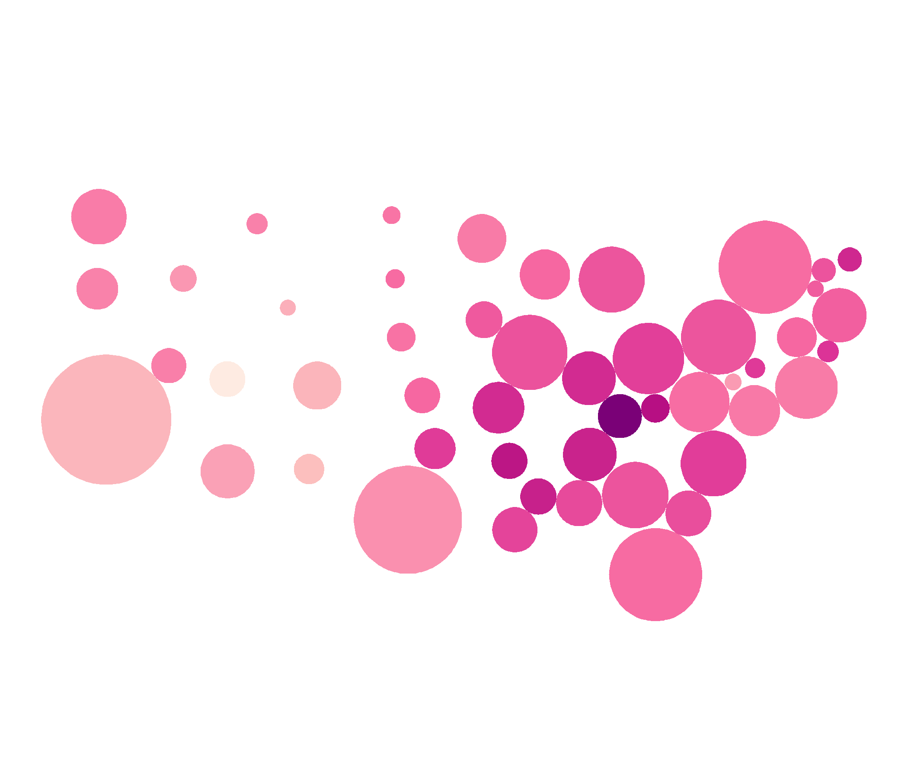

```{r setup, include=FALSE}
knitr::opts_chunk$set(echo = TRUE)
```
<!--

Please note that the submission deadline is September 30, 2019.

Author notes:
6000 words maximum.
focused  application  of  literature  to address  a  relevant  clinical  issue:
Mapping cancer outcomes
Cartogram applications should point to examples of cancer outcomes, with the main cartogram section discussing sources considered in grey literature review. Examples of political areas may be considered if cancer data is aggregated at these levels.

- Future steps should consider applications not currently utilised for cancer outcome displays, where their use may improve decision making
- needs to have a clear relevance to spatial patterns in cancer epidemiology
- presents alternative ways of visualising those spatial patterns, or the uncertainty in those patterns
- a more applied-focussed paper (eg lots of cool images), rather than theoretical (eg lots of formula).
-->


## Abstract

Utilising maps to present statistics has been widely used for centuries.
Connecting the data to the geographical representation of areas that are already familiar.
It is not enough to be recognisable, if the value of the statistic cannot be seen. Cancer outcomes directly relate to the people living within a geographical area. In situations where the people are of interest, not the land they live on, it is reasonable to explore views that enhance the communication of the cancer outcomes. This has spurred innovations over the previous centuries to enhance the shapes and maps presented to effectively communicate cancer outcomes.

## Introduction
<!--
Current best practices: Choropleths
Current exploratory practices: Cartograms: cont, non cont, (tilegrams, dorlings)
Suggested uses of 
-->


## Disease mapping methods


### Current best practice map displays for cancer data
<!--Choropleth map (Steff)-->

<!-- what is a choropleth map -->
A choropleth map is used to show the spatial variability of measurements, with usage dating back to the 1800s. They are constructed by drawing administrative boundaries, and filling the polygon with colour to represent values of a measured variable. Early versions used symbols or patterns instead of colour. @CPISACA discusses the use of choropleth maps for visualising cancer data, and @DMAHP gives an overview of the development of the use of choropleth maps for displaying disease data. Figure 1 shows a choropleth map where each state of the United States of America is coloured by the average annual rate of new cases of lung and bronchus cancer from years 2012 to 2016. A choropleth map is a true map of the topology, constructed for visual inspection of spatial patterns across a familiar geographic form, that might show trends in disease occurrence, or even localised outbreaks. 


<!-- psychology -->
Utilising the familiar state shapes can make a map intuitive to read [@CIBMUK], and allow viewers to visually infer the spatial relationships in the data. 
The familiarity of the geography is a worthy consideration when presenting results of spatial analysis. Just as geographers are no longer the only creators of maps, @CPISACA suggests the audience of spatial health data analysis has extended beyond researchers to the public, policymakers and the media.
However, while they can be recognisable shapes, the different sizes of administrative areas can lead viewers to give more attention to the shades of the largest areas. Choropleths can inhibit visual inference when presenting human related statistics as the display may draw attention from the 'potentially more important results in the more populous communities' [@SE]. 

<!--
Urbanisation has pushed people closer together,
-in workplaces and in homes. 
-this issue is not with the size of the administrative areas,
- the increasing urbanisation is contributing to the changing density of population
-->

<!-- Displaying cancer data on choropleths -->
In epidemiology, choropleths are often used as a tool to study the spatial distribution of cancer incidence and mortality. 
Almost 100 years of cancer maps have explored the United States and the United Kingdom with increased effectiveness in presentation of unbiased rates. The increasing development and use of disease maps can be attributed to the availability of geographic information system softwares [@SE]. The data collection methods of cancer mortality rates across regions, and administrative control within regions lends itself choropleth visualisation. Mortality rates are now often presented as relative rates of risk across the population, and age adjusted to correct for the proportion of old people. Howe [-@HEDP] describes Stocks development of the standardised mortality ratios through the 1930s. The choropleth maps used presented levels of cancer via hatchings on a black and white scale. 


<!-- Usage and availability -->
@DMAHP cites Cruickshank's (1947) discussion of using visuals as 'formal statistical assessment of the spatial pattern' as a major advancement.
@CD considers cartographic data analysis in practice. Presenting a clear guide for preparing cartograms for use with both qualitative and quantitative information.
The authors recognise that the creation of cartograms was largely the work of professional cartographers until the innovation of geographical information systems that welcomed map users as map creators. These systems are utilised depending on ‘the effectiveness, efficiency, and satisfaction of the map products (Nielsen 1994)’. @MACM also recognises the intuition that can be derived from choropleths must be 'validated by rigorous statistical analyses.' 
 
 

<!-- Published atlases -->


Examples of atlases:
Kraak 1998, Kraak and Ormeling 2011
Bertin 1967


<!--
Current atlases utilising choropleth methods 
- include Australia: 

cites: Cancer Mortality Atlas of EU and of the European Economic Area last published 8 years ago
@MTMSIH Bayesian disease mapping methods for areal data - explains key concepts applied to create an atlas
Explores Australia as a case study, utilising QLD SA2 areas

-->


### Public face (Jessie)

what has been provided to the public, norms, common practices, all of Jessie's lit review


## Cartograms (Steff)


<!-- Going from choropleth to cartogram -->

<!-- There are many alternative views of the world-->
<!-- Tobler map projections-->
Choropleths may be considered true topological maps, however, if the land mass presented covers enough of the globe, there must be a transformation to visualise it in 2D.
The world projections reflect the frequent distortions seen from altering perspectives. Choropleth maps will always be distorted if they cover enough of the globe, as will photographs of the globe from space. Choropleth creation requires choosing a favourable distortion of the geography for presenting the set of spatial information.


<!-- Why transform?-->
Cartograms provide an alternative visualisation method for statistical and geographical information. The key difference is the intentional, and desirable, augmentation of the size, shape or distance of geographical areas [@ACTUC].
Waldo Tobler [-@TVSSS] explores many graphical techniques, and suggests there are particular methods for particular purposes.


<!-- Cartograms extend transformations -->
Cartograms may be seen as an extension of this concept, implementing a distorion of the geographical shape to allow a map base that represents the population within each region. 
@ACTUC considers this design a 'more socially just form of mapping' by giving all members of the population 'equitable representation'. 
@DMAHP reduce the visual impact of large areas with small populations, the distortion of spatial areas is proportional to the denominator variable. This is known as an iso-demographic map, and the design inherently lends itself to epidemiolgy. 

<!-- Common variables used to create cartograms, eg population, mortality -->

@HEDP argues that 'cancer occurs in people, not in geographical areas' and the map base should reflect this to avoid allocating 'undue prominence' to rural areas. 


<!-- 
@CTTMB
choropleth maps of population characteristics exhibit serious graphic distortions when the population concerned varies greatly in density. The topological cartogram is proposed as a viable alternative in such situations

there is likely 'to manifest a growing demand for urban thematic maps'

paper presents 'the topological cartogram as a base map for the communication of the spatial variation of socio-economic data within urban areas. '

'it is possible to adjust their boundaries so that the areas which they enclose become proportional to these quantities rather than to their areal extent.'

'Firstly, that no such transformation has a unique solution, leaving the subjective choice in the hands of the individual map designer. '
Design goals:
- to maintain as much as possible of the intricate detail
- to maximize the simplicity of the transformation
- maintenance of directional accuracy
- attempt to influence and direct the map user's attention, 

1) that the size of the electoral subdivisions should be made proportional to their respective electoral populations, 
2) that the contiguity relationships between the DCU's should be maintained, 
3) that true directions should be retained from the centre of the transformation, 
4) that the main shape characteristics of the DCU's should be preserved, and 
5) that the map should possess the overall shape of the built-up area. 
-->


<!-- Overview of varieties -->

Alternatively, the area of the map space can represent the value. There have been many algorithms presented, @SAIC provided a framework to investigate implementations and the "statistical accuracy, geographical accuracy, and topological accuracy".

@HEDP shows the introduction of electronic computer-assisted techniques created a flood of disease atlases like Howe's National Atlas of Disease Mortality in the United Kingdom (Howe 1963) which upgraded to a demographic base "map" (Howe 1970).

The presentation of small areas requires more thought during the implementation of maps, @MTMSIH encourage their use to uncover local-level inequalities frequently masked by health estimates from large areas.


### Contiguous

<!-- What is a contiguous cartogram -->


<!-- Intentionally preserve shape-->

@ACTUC presents the three methods for creating contiguous cartograms. John Hunter and Johnathan Young (1968), and Durham used phsyical accretion models, arranging wooden tiles by hand. Tobler (1973) used a computer programs. Skoda and Robertson (1972) developed a mechanical model utilising steel ball bearings.

<!--describes the process of creating a population cartogram for Canada, using the 1966 Census. An intentional goal of this project was to maintain contiguity, while attempting to keep the actual shape of places. The end result was a 'very accurate isodemo-graphic map of Canada'. This intentional design goal coincided with the rising interest in urban geography. 
-->

Cartograms keep spatial relationships of neighbours intact by preserving borders when adjusting sizes. Tobler's Conformal mapping means to preserve angles
locally so that the shapes of very small areas on a traditional map and a
cartogram would be similar
From a computer graphics perspective it is a problem of 'map deformation' to account for the value assigned to each area. @ACA discuss their implementation of three methods for creating value-by-area cartograms.
 
Their intention is to allow the map space to highlight the distribution of the variable. However a reader may have to know the difference between initial geography and new layout given by a cartogram, to be able to recognise the significant changes.


Australia (McGlashan 1977),

@ACTUC reiterates: 'There is no "best" cartogram or method of creating cartograms just as there is no "best" map' (Monmonier and Schnell, 1988). There are many alternatives to consider, the intended audience of the map, and its purpose are key points in cartogram use and creation.


### Non-Contiguous





Dorling -@ACTUC puts forward a simple question:

>If, for instance, it is desirable that areas on a map have boundaries which are as simple as possible, why not draw the areas as simple shapes in the first place?

He answers this with his implementation of maps created with 'the simplest of all shapes'. While contiguous cartograms may be a 'more sophisticated' method, they produce 'very complex shapes'. Circular cartograms use the same shape for every region represented, and size them according to the population, or statistic represented.
To produce a compelling map, a gravity model is applied to avoid overlaps, and keep spatial relationships with neighbouring areas over many iterations. This implementation can work for up to 'one hundred thousand' areas.

 @ECGC also present the problem of maintaining shape presevation in non-contiguous cartograms. 


@ACTUC suggests 'population distribution is often extremely uneven in former British colonies'. 

'In Australia the urban federal constituencies occupy only a tenth of the land, but contain nine tenths of the people. It would be almost unthinkable to show election results for that country on a conventional equal land area map.'
This 1966 cartogram uses mostly straight lines, and the result looks very little like the geographical shape of Australia.

'Given the increasingly uneven population distribution of the United States and the growing social divides between the populations of neighbourhoods living at different densities, the need for cartograms like this is greater now than ever.'

< Figure 3 here>


Used in displays of the UK by Howe in 1986 cited by @HEDP
<!--
## Temporal displays
-->

 
Tobler's method and the many implementations that 'elaborated' on it are derived from 'numerical approximations to a pair of equations'[@ACTUC]. They all operate through incremental adjustments, and can produce wildly different outcomes from small changes in the inputs.
 
@TFYCC Value-Area Cartograms. In these cartograms a region,country, or continent is subdivided into small regions, each ofwhich is represented by a rectangle. This rectangle is proportionate in area to the value which it represents in certain statistical distributions. The regions are grouped in approximately the same positions as they are on the map.


Computer generated map examples:  @HEDP
(Hopps et al. 1968; Armstrong 1972). There
has followed a flood of disease atlases, mainly concentrating on the modem problems of cancer and degenerative diseases from countries as scattered as the United States (Burbank 1971; Mason et al. 1975, 1976; Pickle et al. 1987), the Soviet Union (Levin 1980), Japan (Shigematsu 1977), the Federal Republic of Germany

<!--
@CVBGSD presents bivariate maps, using size and colour for different variables. 
-->

@MDAC define the term 'mosaic cartograms'. 
Compare amount of tiles to contrast population of regions.
'Cartograms show a data value per input region by scaling each region such that its area is proportional to its data value. Mosaic cartograms show data in multiples of tiles, hence the input data must consist of, or be cast into, small integer units.'

### Centroid displays

Dot plot: one dot for each region, coloured, and placed at centroid. 

Plotting centroids on top of geographies. (Size is kept constant)
Hex maps

If the goal of the map is the statistic.

If the distribution is the focus, the display should reflect that.

Replies on the idea that every area is important, no matter the size.

Recent methods have every area represented with the same map space.

This gives equal emphasis to every area, allows distributions and relationships between neighbours to become more clear.

## A critique choropleth and cartograms

>designing a map tailored to precise goals [is] easier than forcing a single map to accommodate diverse objectives - @CPISACA

With that in mind, the intented user and message to communicate should drive map selection.

@SAMGIS suggests it is the "investigators' objectives" that drive the "representation of diseases on maps". 
-infectious diseases may require choropleth methods

'Where control of the message is important, static maps will continue to be the most effective, although good tables, graphs, and explanatory text are still needed in order to ensure that different people will see the same thing in the maps' @CPISACA

<!-- @CPISACA contrasted several online atlases in a 2006 paper, consider for structure? -->

(only worth including if it is possible for us to implement)
Tabular form comparing and contrasting
- Relationship to geography

- Show using cancer examples

## Animation

lends to temporal pattern exploration

@ECGC ?? Highlight the value of animating contigous to see changes over time, US can be recognisable but animation aides interpretation 

## Acknowledgements

What software did we use, for eg

## References

<!--
## Software
Commonly available tools to implement.
-->

<!--
### counts versus predictions

@SEMA
'Disease mapping is carried out to summarise spatial and spatio-temporal variation in risk.'
Descriptive statistic of the relationship between geography and a disease.
population, exposure, and health data may have point data or aggregated summaries (count data)
potentially be subject to a number of inaccuracies
diagnostic error or misclassification

Not only the counts, but population, migration, deaths and births are modelled across census years.

rapid visual summary of complex geographical information, descriptive purposes, to generate hypotheses, for surveillance, and to aid policy formation and resource allocation.

When using counts:
 small populations imply large variability in estimated rates
 
Decisions taken at this stage may be critical as apparent ‘clusters’ may depend crucially on the boundaries chosen in time or space: ‘The more narrowly the underlying population is defined, the less will be the number of expected cases, the greater will be the estimate of the excess rate, and often the more pronounced will be the statistical significance’ 
 
Using prediction:
assuming that neighbouring μi are correlated leads to a ‘clustering’ prior


Driven by progressions in computing, statistical methods and collection of data.

Models summarise relationships between counts of diseases and other factors.


Recognition of biases when utilising the geography to map people. Small areas contain more people, work towards representing regions of importance more clearly.
-->


