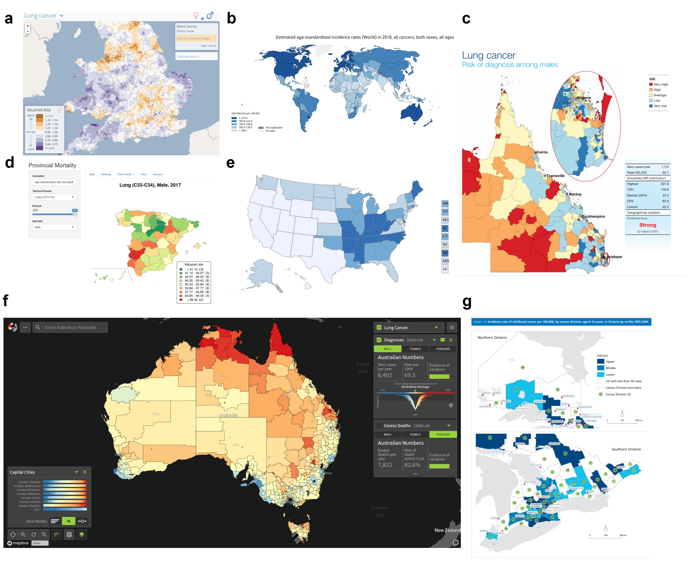
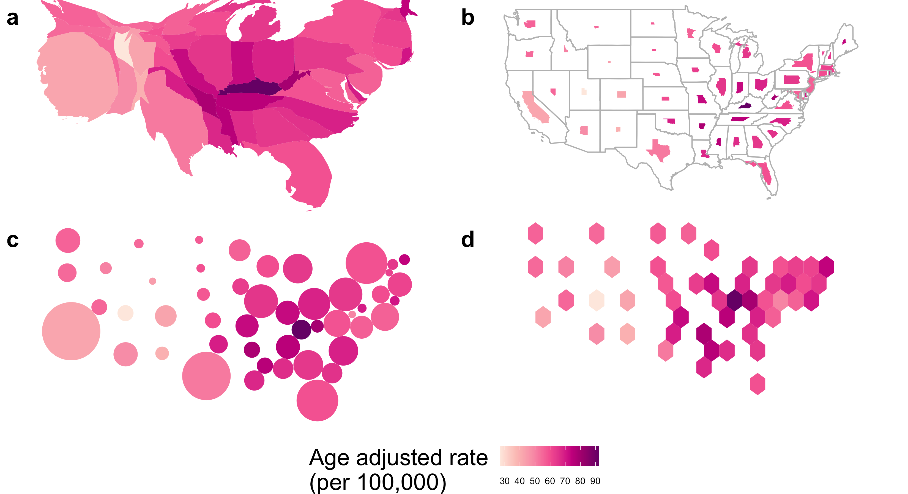

```{r setup, include=FALSE}
fig_path <- glue::glue("figs/")
knitr::opts_chunk$set(echo = FALSE, 
                      warning = FALSE,
                      message = FALSE)
library(ggplot2)
library(cowplot)
library(png)
library(grid)
```


\section*{Abstract}
<!-- 105 words -->

Cancer atlases communicate cancer statistics over geographic domains, typically with a choropleth map. They subdivide these domains into administrative regions such as countries, states, or suburbs. When communicating human-related statistics, the choropleth has a disadvantage in that it draws attention to sparsely populated rural areas to the neglect of small inner city areas. The smaller geographic areas are important to consider if they are densely populated. Alternative map displays, such as a cartogram or a hexagon tile map, can shift the attention of map users from the large rural areas by decreasing their size on the map display. This means alternative displays can be more effective at accurately communicating spatial patterns across spatial areas. It is recommended that alternative displays are included in cancer atlases. In addition, with the ease of today's technology, user interaction with the displays is encouraged. Users should also be able to interactively display different statistics, such as incidence rate or relative incidence, or filtered by demographic variables. 

# 1. Introduction
<!-- 436 words -->
<!-- What data are we working with, why, what are the purposes -->
Researchers, health authorities, governments, not-for-profits and the media are common communicators of cancer statistics. They often present statistics to the public as aggregated values for geopolitical areas. Presenting these statistics requires aggregating individual observations for the geographical units, especially for privacy protection, but also for political and policy purposes. Examples of typical geographical units include states, provinces, local government areas, and post/zip codes. It is easy to provide counts or incidence rates of the diagnoses of these areas.  This type of data is routinely collected for public health reasons and may be made available to the general public as a service to the community. 

<!-- Ways to visualize, whats our hypothesis -->
To visualize and communicate geospatial cancer statistics over geographic domain, a choropleth map is the common display. Choropleth maps show polygons representing the geographic units, where each polygon is shaded with a color according to the area-specific values of the statistic being conveyed. Visualizing this data is helpful as geographic patterns of disease may be obscured when reported in a table [@SAMGIS]. Providing a visual representation of cancer outcomes allows identification of geographic patterns of the disease that can then be addressed with public health policy and actions. The spatial distribution of the disease incidence can be examined using a choropleth and may reveal a trend in longitude or latitude, or rural vs urban, or coastal vs inland, or even specific hot spots of the disease. One of the key challenges with mapping spatial patterns of disease is the design of visualizations [@SE]. It is important to consider the strengths and weaknesses of designs, as visualizing diseases on maps is often the first step in exploratory spatial data analysis and helps in the formulation of hypotheses. This paper considers the current visualization techniques to communicate statistics to the public and their applications to cancer statistics. Alternative approaches are posed because they may be more effective than contemporary techniques. The limitations of the visualization methods, highlighting the differences and historic use of these displays is discussed.

<!-- Structure of the paper -->
The paper is structured as follows. The next section describes the choropleth map, which is the common approach to disease maps and presents examples of atlases in use today and discusses the limitations of the choropleth map. Section 3 describes alternative displays, including the cartogram, which is useful when the map has heterogeneously sized geographic units. Section 4 presents the limitations of the production and use of alternative displays. Disease maps are more useful when made interactive, and common options are described in Section 5, along with a discussion of benefits and disadvantages.


# 2. Traditional approaches for cancer map displays {#ch:choropleth_maps}
<!-- 381 words -->
<!-- what is a choropleth map -->
A choropleth map displays the geographical distribution of data over a set of spatial units by shading areas of a map [@EI, @BCM]. Faithful rendering of the geography, when combined with an appropriate color scheme, can reveal spatial patterns among data values. Identifying and explaining spatial structures, patterns, and processes involve considering the individuals and organizing them into representable units of communities [@SAMGIS]. Early versions of choropleth maps used symbols or patterns instead of color. Choropleth maps can be used for displaying disease data [@DMAHP], including cancer data [@CPISACA]. In epidemiology, choropleth maps are often used as a tool to study the spatial distribution of cancer incidence and mortality.

<!-- psychology -->
Displaying familiar state boundaries can make a map easier to read [@CIBMUK] and allow viewers to infer the spatial relationships visually in the data using their mental model of the geography. The map users of disease displays may include researchers, the public, policymakers, and the media [@CPISACA]. For these users, the familiarity of the geography is a worthy consideration when presenting results of spatial analysis.


## 2.1 Cancer atlases {#ch:public}
<!-- 360 words -->
<!-- Displaying of cancer data on choropleth maps -->
A cancer atlas is a map, or collection of maps, representing cancer incidence and mortality for a country, or group of countries. Atlases are key to developing hypotheses regarding areas with unusually high rates, and geographic correlations [@MACM]. The data collection methods across regions and the administrative control within regions lends itself to choropleth visualization. Cancer maps and atlases date back to Haviland's maps in 1875, and early work in US cancer atlases appearing in 1971 [@burbank]. The presentation of cancer statistics has increased with greater access to computational power and the availability of geographic information systems software [@SE].

<!-- Measures reported in cancer atlases -->
Cancer maps are effective tools for communicating incidence, survival, and mortality to a wide range of audiences, including the public and others not trained in statistical analysis. These visualizations enable non-expert audiences to interpret the outputs of sophisticated statistical analysis. Cruickshank (1947) as cited by S. D. Walter [@DMAHP], discusses using visuals as a 'formal statistical assessment of the spatial pattern'. Overwhelmingly, choropleth maps are visualisations chosen to communicate cancer statistics to members of the public and other non-expert audiences.  


```{r choropleth-grid-create, message=FALSE, warning = FALSE, fig.cap = "Figure 1: A selection of choropleth cancer maps from online atlases that are publicly available. Maps of various countries were chosen: United Kingdom, Australia, Spain, USA, Canada, and display several different colour palettes and legends. These atllases are described in Table 1.", out.width='100%', fig.align='center', fig.width=12, fig.height=10}

```


Table: Table 1: <!--\label{tab:choropleths}--> A selection of choropleth cancer maps from online atlases.

|Fig.| Atlas | Statistic | Data source | 
|:---:|:------------|:----------------------|:----------------|  
|1a | The Environment and Health Atlas of England and Wales | relative risk for women developing lung cancer in England and Wales in 2010 [@EnvEnglandWales2]| [ Office for National Statistics (ONS) (England) and from the Welsh Cancer Intelligence and Surveillance Unit (WCISU) ](http://www.envhealthatlas.co.uk/homepage/)|
|1b | Globocan 2018: Estimated Cancer Incidence, Mortality and Prevalence Worldwide | age standardized incidence rates (per 100,000) for all invasive cancers for both men and women, aggregated at a national level for 2018 [@Globocan]| [World Health Organization's International Agency for Research on Cancer](https://www.iarc.fr/). |
|1c | Atlas of Cancer in Queensland | the relative incidence ratio of lung cancer in males in the state of QLD within Australia based on data from 1998 to 2007, Queensland Cancer Council[@QLDcancerAtlas] | [Queensland Cancer Registry](https://cancerqld.org.au/research/cancer-registries/queensland-cancer-registry/) |
|1d | Bowel Cancer Australia Atlas | the percentage of Australian males between 50 - 54 years of age diagnosed with bowel cancer in 2016 in Australia [@Bowel]. |  [Bowel Cancer Australia](https://www.bowelcanceraustralia.org/)|
|1e | United States Cancer Statistics: An Interactive Cancer Statistics Website | the incidence rate per 100,000, of all cancer types for men and women in the United States in 2016, aggregated at the state level [@USInteractive].|  *[Centers for Disease Control and Prevention](https://www.cdc.gov/)*, with data from state cancer registries. | 
|1f | Map of Cancer Mortality Rates in Spain | side by side maps of relative risk of lung cancer for men vs women for 2004 to 2008 [@cancerSpain].| [Map of cancer mortality rates in Spain](https://elpais.com/elpais/2014/10/06/media/1412612722_141933.html)|
|1g | Atlas of Childhood Cancer in Ontario | the incidence rate of childhood cancers per 100,000 (by census division) for children aged 0-14, in Ontario from 1995 to 2004 [@OntarioPediatric]. | [The Pediatric Oncology Group of Ontario Networked Information System](https://www.pogo.ca/research-data/pogonis-childhood-cancer-database/data-requests/)|


Epidemiologists and statisticians have developed the statistics used to communicate the burden of cancer over several decades. Table 2<!--\ref{tab:measures}--> summarizes the measures commonly presented in published cancer atlases. Mortality rates are commonly presented as relative rates of risk across the population and age-adjusted to correct for the higher prevalence of cancers in older populations. As described in Howe [@HEDP], Englishman P. Stocks advanced the field of mortality statistics by introducing the standardized mortality ratios in the 1930s, which is an improvement on crude death rates. 

Table: Table 2: <!--\label{tab:measures}--> Common measures for reporting cancer information.

|Measure |Details| 
|:--------------------|:------------------------------------------------|  
|1. Count| Crude cancer counts|
|2. Rate per 100,000| Cancer incidence per 100,000 population|  
|3. IR (Incidence Ratio)| $(IR)_i=\frac{(Incidence\ Rate)_i}{Average\ Incidence\ Rate}$, |
|| The cancer incidence rate in region $i$ over the average cancer incidence rate for all of the regions|
|4. Age-Adjusted Rate per 100,000| Standardized by age structure or region|   
|5. Age-Adjusted Relative Risk| Standardized by age structure in each region $i$|  
|6. SIR (Standardized Incidence Ratio)| Incidence standardized by population at risk in each region $i$|
|7. Below or above Expected| An alternative expression of the SIR|
|8. RER | $RER = \frac{(Cancer\ related\ mortality)_i}{Average\ cancer\ related\ mortality}$|
|(Relative Excess Risk)| Represents the estimate of cancer-related mortality within five years of diagnosis. Also referred to as 'excess hazard ratio'| 


<!-- 416 words -->
Roberts [@roberts2019communication] identified 33 cancer atlases published between 2010 and 2018. Each of these online atlases uses choropleth maps. All except one of these were published by non-commercial organizations, including not-for-profits, government, research organizations, advocacy groups or government-funded partnerships. Figure 1<!--\ref{fig:choropleth-grid-create}--> displays a subset of maps from these atlases, the selection varies in the geographies explored. Figure 1<!--\ref{fig:choropleth-grid-create}-->b shows Globocan 2018 [@Globocan] which explores Estimated Cancer Incidence, Mortality and Prevalence Worldwide using data sourced from cancer registries of each country. The Bowel Cancer Australia Atlas in Figure 1<!--\ref{fig:choropleth-grid-create}-->d presents an example of a cancer specific atlas -- it shows the average Standardized Incidence Ratio of colorectal cancer for Australian males from 2006 to 2010 [@Bowel]. Like many of the atlases examined, there is a choice of gender displayed in the Bowel Cancer Atlas. Gender is displayed in side-by-side maps in the Map of Cancer Mortality Rates in Spain (Figure 1f)<!--\ref{fig:choropleth-grid-create}--> [@cancerSpain]. 

Resolution of the maps varies greatly. Figure 1<!--\ref{fig:choropleth-grid-create}-->b shows global information at a national level. The United States Cancer Statistics [@USInteractive] shows data aggregated at the state level. The Environment and Health Atlas of England and Wales [@EnvEnglandWales2] (Figure 1<!--\ref{fig:choropleth-grid-create}-->a) shows the relative risk for women developing lung cancer  at a neighborhood (small-area) scale. The Atlas of Cancer in Queensland (Figure 1<!--\ref{fig:choropleth-grid-create}-->c) shows the relative incidence ratio of lung cancer in males for each Statistical Area at Level 2 [@abs2016] in the state of Queensland within Australia [@QLDcancerAtlas].


Age-specific atlases are less common. Figure 1<!--\ref{fig:choropleth-grid-create}-->g displays Atlas of Childhood Cancer in Ontario, this communicates the incidence rate of childhood cancers per 100,000 (by census division) for children aged 0-14, in Ontario from 1995 to 2004 [@OntarioPediatric]. 


## 2.2 Additional considerations
<!-- 479 words -->
Cancer atlases often display supplementary graphs and plots to add more information. Additional materials such as tables, graphs, and text explanations support understanding and inference derived from maps, ensuring the message communicated will be consistent across a range of viewers [@CPISACA]. The many displays of statistical summaries, including dot plots, bar plots, box plots, cumulative distribution plots, scatter plots, and normal probability plots, can provide alternative views of the cancer statistics. These can also display supporting statistics such as error, confidence intervals, distributions, sample or population sizes, and standard deviation. 

The statistics communicated in atlases are often used to describe differences between areas. This can occur at different levels of aggregation. Aggregation of global health statistics occurs within administrative and arbitrarily defined regions, such as those used by the World Health Organization and the United Nations [@IARC_3]. World atlases can allow for displays of data aggregated into continents, countries, states, provinces and congressional districts [@USInteractive]. Each population area will probably have a different number of people, which is typically used to calibrate the statistic. Cancer atlases may also communicate the distribution of the population living in all areas in a table or histogram display [@NICR_1]. Atlases can connect the population to the land available to them by communicating population density. 

Maps can also be used to focus on demographic strata, such as age and sex. Some of the digital atlases surveyed allow subsets such as males, females, or those aged over 65, to be selected for display. Similarly, socioeconomic indicators, such as unemployment rates, poverty rates, remoteness, and education levels, can be used to filter data, in order to communicate how cancer prevalence varies for different members of society. Few atlases provide this level of detail. 

Introducing population and demographic information helps to interpret the rates in areas effectively, but there will still be uncertainty around the rates. To address this, a cancer atlas often communicates uncertainty about the value of a statistic. There are several potential sources of uncertainty: sampling error, errors arising from the disease reporting process (or data collection), and errors arising from the statistical modeling or simulation process. The most common measures used to present uncertainty are credible or confidence intervals (CIs). Displaying the uncertainty associated with reported statistics is a vital feature of a cancer map, but it is difficult to display effectively. The map focuses on displaying the statistic and lacks additional space to represent the uncertainty. Providing an adjacent map or overlaying maps with symbols [@VSSDCUC] are two common solutions. 

## 2.3 Limitations of choropleth displays {#ch:chorolimit}

Australia presents an extreme case of an urban rural divide. The land mass occupied by urban electoral districts is only 10% of Australia, yet 90% of the population live in these urban areas [@ACTUC]. 

Choropleth maps provide a familiar display, which shows data in a geographically recognisable way. A disadvantage is that the different population and geographical sizes of administrative areas can attract attention to the shades of the underpopulated but large areas [@EI]. Skowronnek also [@BCM] discusses how choropleth maps suffer from area-size bias, as they give a 'stronger visual weight' to large  administrative units. The administrative boundaries used to define regions may limit a choropleth display, as this display unfaithfully represents the disease distribution across the region by obscuring small geographic areas. Sparsely populated rural areas are emphasized, whereas the areas representing inner city communities are very small. This is especially true for Australia.

Choropleth maps colour each geographic unit to allow map users to measure the value of the statistic [@EI]. Map users contrast the colours in neighbouring areas to understand the spatial distribution. The ColorBrewer system [@CB] and viridis [@viridis] palettes provide effective colour schemes for qualitative, sequential and diverging data. When communicating information using colour, a map creator should use a scheme that has a linear color gradient, with perceptually uniform color spaces that match equal steps in data space with equal steps in the colour space [@PUCS]. 
The use of borders and backgrounds, and their colours, can also change the appearance of the colors representing the value of the statistics [@CB]. These supports can be used to implement a reference point in the colour scheme as well as orient users to the geographic regions. 

<!--
Choropleth maps provide a familiar display that may be important for orienting a non-statistical audience. The familiar shape boundaries define individual areas of non-uniform size, containing different population densities and may be subject to change. A spatially heterogeneous population distribution across a country’s landmass is an issue common to many countries, especially British colonies [@ACTUC]. 

A disadvantage of the conventional map is that the different population and geographical sizes of administrative areas can attract attention to the shades of the underpopulated but large areas [@EI]. Skowronnek also [@BCM] discusses how choropleth maps suffer from area-size bias, as they give a 'stronger visual weight' to large  administrative units. The administrative boundaries used to define regions may limit a choropleth display, as this display unfaithfully represents the disease distribution across the region by obscuring small geographic areas. 
Sparsely populated rural areas are emphasized, whereas the areas representing inner city communities are very small.

Those who critique choropleth maps often discuss bi-partisan election mapping in the United States of America [@BCM, @NISCC].
Election mapping in Australia also suffers when presented on choropleth maps, where each electorate decides the outcome of one parliamentary seat in the house of representatives. While all states are visible on a map display of Australia, smaller geographic units such as electorates present an extreme case of an urban-rural divide. The landmass occupied by urban electoral districts is only 10% of Australia, yet 90% of the population live in these urban areas. To present election results on a choropleth map should be ‘unthinkable’, as it means diminishing the visual impact of most of the electorates and incorrectly communicating the distribution of votes across the country. 
-->

Inset maps like in Brisbane city in Figure 1<!--\ref{fig:choropleth-grid-create}-->c of the state of Queensland are commonly used to reduce distorted interpretations, but it is a bandaid remedy. For Australia, many, many inset maps would be needed.


<!--
Choropleth maps can inhibit visual inference when presenting human-related statistics as the display may draw attention away from the ‘potentially more important results in the more populous communities’ that are geographically smaller [@SE]. 
Inset maps like in Brisbane city in Figure Figure 1<!--\ref{fig:choropleth-grid-create}c of the state of Queensland are commonly used to reduce distorted interpretations, but it is not always an appropriate solution. As this feature of population distributions continues to intensify, the need for cartograms as an alternative to a choropleth map should only increase.
-->

# 3. Contemporary alternatives to choropleth maps {#ch:alternatives}

## 3.1 Cartograms
<!-- 1496 words inc table-->

<!-- What is a cartogram? -->
Choropleth maps imply uniformity of data across the geographic space but population densities are unlikely to be uniform [@BCM]. Cartographers developed the cartogram to draw the attention to the population by transforming the map [@ACCAC]. The resulting display can communicate the impact of the disease more accurately across the population, as recorded by the statistic, at the sacrifice of geographic accuracy. 

<!--
```{r choroCRS, fig.cap = "Four choropleth maps average age-adjusted rate of incidence for lung and bronchus in the United States averaged from sex and years 2012-2016, using four different map projections. The map projections alter the shapes and angles of the boundaries of each state.", message=FALSE, warning=FALSE, out.width='100%', fig.align='center'}
#knitr::include_graphics("figures/ggchoroCRS.png")
c1 <- png::readPNG("figures/gg3857.png")
c2 <- png::readPNG("figures/gg2163.png")
c3 <- png::readPNG("figures/gg4326.png")
c4 <- png::readPNG("figures/gg2955.png")
#
load("figures/usa_legend.rda")

ggdraw() +
  draw_plot(rasterGrob(c1), 0, .55, 0.5,    0.45) +
  draw_plot(rasterGrob(c2), 0.5, 0.55, 0.5, 0.45) +
  draw_plot(rasterGrob(c3), 0.0, 0.1, 0.5, 0.45) +
  draw_plot(rasterGrob(c4), 0.5, 0.1, 0.5,   0.45) +
  draw_plot(usa_legend, 0, 0, 1, 0.1, scale = 2) +
  draw_plot_label(c("a", "b", "c", "d"), 
    c(0, .5, 0, 0.5), 
    c(1, 1, .5, .5), size = 20)
```
-->

<!-- Denominators -->
When a map creator desires a uniform population density of the map base, the purposeful distortion of the map space is beneficial. The "population distribution is often extremely uneven", making a distortion necessary so that population is more faithfully represented as a uniformly distributed background for the statistic to be presented [@ACTUC] [@CTTMB] [@GOINO]. An area cartogram [@NAC], or population-by-area cartogram [@TAAM] is produced from the distortion of the geographical shape according to population. Event cartograms [@VSSDCUC] change the area of regions on a map depending on the amount of disease-related events, rather than population.

<!-- Why transform?-->
<!-- Common variables used to create cartograms, e.g. population, mortality -->
Cartograms provide an alternative visualization method for statistical and geographical information. Monmonier [@HTLWM] suggests that map creators can use white lies to create useful spatial displays. It is easy for the reader to disregard the impact of transformations used to create cartograms, for the benefit of reading the statistical distribution more accurately with approximate geographic information. The spatial transformation of map regions relative to the data emphasizes the data distribution instead of land size [@CBATCC]. When visualizing population statistics, Dorling  considers this design 'more socially just' [@ACTUC], or honest [@NISCC], giving equitable representation and attention to all members of the population and reducing the visual impact of large areas with small populations [@DMAHP]. Howe [@HEDP] suggests that 'cancer occurs in people, not in geographical areas' and that spatial socio-economic data, like cancer rates, are best presented on a cartogram for urban areas as the population map base avoids allocating 'undue prominence' to rural areas [@CTTMB]. 

<!-- Overview of varieties -->
<!-- Cartogram makers -->

The creation of cartograms was historically in the hands of professional cartographers [@CD]. Early approaches by John Hunter and Jonathan Young (1968) and Durham's wooden tile method, Skoda and Robertson's (1972) steel ball-bearing approach and Tobler's (1973) computer programs [@ACTUC]. Howe [@HEDP] discusses the impact of electronic computer-assisted techniques. Geographical information systems allow map creators to produce cartograms and they use these systems depending on ‘the effectiveness, efficiency, and satisfaction of the map products' [@CD].

There are two key issues to consider when creating alternative map displays, (1) the intended audience of the map, and (2) its purpose. Nusrat and Kobourov [@SAIC] provided a framework to investigate implementations of the many algorithms presented, and the "statistical accuracy, geographical accuracy, and topological accuracy". 

```{r ggcartograms, fig.cap = "Figure 2: Common alternatives to maps, showing the same information for the United States of America: (a) contiguous cartogram, (b) non-contiguous, shape-preserved cartogram, (c)  Dorling cartogram (non-contiguous), (d) hexagon tilemap (non-contiguous). Maps (a) - (c) are created by resizing and reshaping the states of the USA to match the 2015 population of the state. This provides a better sense of the extent of disease relative to the population in the country and can help ease losing information about physically small but population-dense states. Map creators give each state equal size and thus equal emphasis in (d) the hexagon tile map.", message=FALSE, warning=FALSE, out.width='100%'}

```

Table: Table 3: <!--\label{tab:usa}--> Maps used to present statistics for the United States of America. The colour of each state communicates the average age-adjusted rate of incidence for lung and bronchus for females and males in the United States 2012-2016.

|Map display |Details| 
|:--------------------|:------------------------------------------------|  
|a. Contiguous| It has distorted each state's shape according to the population of the state in 2015. The state of California has become much larger because of the large population density. This draws attention to the densely populated North-East region and detracts from the less populated Mid West.|
|b. Non-contiguous| It maintains the geographic shape of the states, but the size has altered according to the population of the state in 2015. The state of California has remained closer to its original size than its surrounding states. The North-East states have remained closer to their geographical size, for Massachusetts and Connecticut. This draws attention to the densely populated North-East region and the sparse Mid West.|
|c. Dorling| Circles are used to represent each state, but the population of the state determines the size in 2015.  The North-East states remain closer to their neighbors and are slghtly displaced from their geographic location. It highlights the sparsity of the population in the Mid West by the distance between the circles at the geographic centroids.|
|d. Hexagon Tessellation| A hexagon of equal size represents each state. It is easy to contrast the neighboring states however the North-East regions have been displaced from their geographic location. It highlights the sparsity of the population in the Mid West by the light yellow color, the Age-Adjusted rate in Kentucky is the darkest and its neighbors are similar.|


Figure 2<!--\ref{fig:ggcartograms}--> shows four different cartograms for the same data. The information in Table 3<!--\ref{tab:usa}--> summarizes what can be observed in the four types of cartograms.


### 3.1.1 Contiguous

<!-- What is a contiguous cartogram -->
<!-- Intentionally preserve neighbors -->

A contiguous cartogram alters the choropleth according to a statistic and maintains connectivity of the map regions. Min Ouyang and Revesz [@ACA] present three algorithms for creating value-by-area cartograms. They implement 'map deformation' to account for the value assigned to each area. Other methods include Tobler’s Pseudo-Cartogram Method, Dorling’s Cellular Automaton Method [@ACTUC], Radial Expansion Method, Rubber Sheet Method, Line Integral Method, Constraint-Based Method [@CBATCC].

Figure 2a<!--\ref{fig:ggcartograms}--> shows a population contiguous cartogram of the United States. All states are visible and the shape of the United States overall is still recognizable. In contrast, Figure 3<!--\ref{fig:auscartograms}--> a shows an Australian contiguous cartogram also based on population. The south east is enlarged, but high population areas are still small, and low population areas are still large on the map. The algorithm doesn't fully reach an optimal configuration where area matches population -- Australia is too heterogeneous for the algorithm to handle. 

To be able to recognize the significant changes, a reader will usually have to know the initial geography to find the differences in the new cartogram layout [@NAC]. Tobler's Conformal mapping means to preserve angles locally so that the shapes of small areas on a traditional map and a cartogram would be similar.
@CBATCC presents this issue as conflicting tasks or aims, to adjust region sizes and retain region shapes. 

### 3.1.2 Non-contiguous

Non-contiguous cartograms prioritize the shapes of the areas instead of connectivity. Each area stays in a similar position to its location on a choropleth map. Displaying the choropleth map base allows map users to make comparisons regarding the change in the area. The addition is the gap between areas, created as each area shrinks or grows according to the associated value of the statistic. Olson [@NAC] discusses the creation of these maps and the significance of the empty areas left between the geographic boundaries and the new shape. 

The white space presents the meaningful empty-space property [@ECGC] [@NAC] but it also distracts the reader from the data, with a low data density [@TVDQI].

### 3.1.3 Dorling

Daniel Dorling presents an alternative display engineered to highlight the spatial distribution and neighborhood relationships without complex distortions of borders and boundaries [@ACTUC]:

>"If, for instance, it is desirable that areas on a map have boundaries which are as simple as possible, why not draw the areas as simple shapes in the first place?"

He acknowledged the sophistication of contiguous cartograms but critiqued their 'very complex shapes,' he answers this with his implementation of maps created using 'the simplest of all shapes'. Circular cartograms use the same circle shape for every region represented, resized  according to the statistic represented or the population. This simple shape may be more effective for understanding the spatial distribution than contiguous cartograms. Contiguous cartograms create 'nonsense' shapes that have 'no meaning' [@NISCC]. Both methods applies a gravity model to produce a layout, that avoids overlaps and keep spatial relationships with neighboring areas over many iterations. The circular cartogram is relatively fast to compute.

Raisz [@RSCW] laid the groundwork for this approach in the mid-1930s, drawing rectangular cartograms that provide simple comparisons, effective for correcting misconceptions communicated by geographic maps. Tobler @TFYCC names and defines these as Value-Area Cartograms. This rectangular display may sacrifice contiguity but allows for tiling where geographic neighbors placed in suitable relative positions also share borders [@CDWCS]. Rectangular cartograms communicate bivariate displays of the population by the size of each rectangular, and they use color to communicate a second variable [@ORC]. 


## 3.2 Tile Map
<!-- 173 words -->
A tile map provides a tessellated display of consistent shapes.  A similar method to a rectangular cartogram, represents each geographic area using a square. The squares are tessellated to create a grid. Each area is represented by a square of the same dimensions, each tile is usually one unit of measurement, this could be geographic regions such as states or population-based that use a consistent measure of population for each tile. Regions with over four neighbors require some necessary displacement. The tile map uses color to represent a value of a statistic for each area. A similar method to a rectangular cartogram represents each geographic area using a square of the same dimensions. There are online media sources using this method, these include [@NPR], [@FiveThirtyEight], [@WSJ], [@WP]. Tile maps may be difficult to create as they are best created manually, they require additional time and care as the number of geographic areas to include increases.

Cano and others [@MDAC] define the term 'mosaic cartograms' for hexagonal tile displays, where the number of tiles for each area or the color of them can communicate the statistic of regions. When using several tiles per region, map makers can adjust the complexity of the boundaries in the resulting display. They can also make a trade-off between boundary complexity and simplicity by the size of the tiles used.


## 3.3 Geofacet
<!-- 166 words -->
Hafen [@IGF] introduces the term geofacet to describe a grid display of small plots. The arrangement of tiles mimics the geographic topology. Geofaceting has the functionality that a statistical plot can be constructed in each facet for each geographic area. A tile map can communicate only one value per region in a visualization, while geofaceting is a more flexible visualization for communication as it increases the amount of information displayed. Virtually any type of plot can be shown in the tile, allowing displays of multiple variables or values per geographic entity. Creating the layout of a geofacet is manual, but once created can be used for any data on that geographic base.

```{r ggtilemap, fig.cap = "Figure 3: Two alternative displays, tile map (left) and geofaceted map (right), showing state age-adjusted rate of incidence for lung and bronchus in the USA. In the tile map, the layout approximates spatial location, with each state being an equal box filled with color representing cancer incidence. The geo-faceted map shows bar charts laid out in a grid approximating the spatial location of the state. The maps show age-adjusted rates for males and females. This display allows the presentation of multiple variables for each geographic area.", out.width="100%"}
knitr::include_graphics("figures/gggrids.png")
```


## 3.4 Multivariate displays
<!-- 222 words -->

Pickle and others [@MMST] present linked micromap plots to match geographic and statistical data visually,  this serves as a solution to  multi-dimensionality issues. These maps group areas based on their value for one variable, and additional columns provide displays that contrast the areas in each group by other variables. The display juxtaposes choropleth maps and statistical plots; it shows one map per group of the key separating variable, in a row with each additional statistical plot. Linked micromaps predominantly use the choropleth map for displays of spatial relationships. These maps show spatial relationships by allotting spatial neighbors to the same group. It is one of several alternative displays that allow maps to become bivariate displays, commonly used to present both an estimate and the associated uncertainty.


Lucchesi and Wikle [@VUADBC] present bivariate choropleth maps blend color schemes to convey the intersection of categorized levels of an estimate and the associated uncertainty for each spatial area.  They also suggest map pixilation, which breaks each region into small pixels, and allocates values to the individual pixels to create texture. This reflects the uncertainty around the area's estimate by randomly sampling from the confidence interval of the estimate of the area. Animating these displays involves resampling the pixels for each frame. Areas with uncertain values will flicker more dramatically than areas with more certain values.


# 4. Comparison and critique of alternative displays {#sec:compare}
<!-- 408 words -->


```{r auscartograms, fig.cap = "Figure 4: Cartograms showing melanoma incidence in Australia: (a) contiguous, partially population transformed, (b) non-contiguous shape preserved, (c) Dorling, (d) hexagon tile map. The contiguous cartogram has expanded the highly populated areas while preserving the full shapes of rural areas. If it accurately sized areas by population, the country would be unrecognizable. The shape-preserved is unreadable due to the small area sizes. The Dorling cartogram presents all areas but many are difficult to compare. The hexagon tile map provides a reasonable spatial distribution despite having isolated hexagons in the outback areas.", message=FALSE, warning=FALSE, out.width='100%', cache=FALSE, fig.width=8, fig.height=6, dpi=300}
knitr::include_graphics("figures/auscartograms.png")
```


## 4.1 Neither choropleth maps or cartograms perform well for Australia

Figure 4<!--\ref{fig:auscartograms}--> shows four main types of cartograms using melanoma incidence on Australian Statistical Areas at Level 3 [@abs2016]. The version of a contiguous cartogram (a) has expanded the highly populated areas while preserving the full shapes of rural areas. It has not fully resolved the population transformation of areas, and if it had accurately sized areas by population, the country would be unrecognizable. The shape-preserved cartogram is unreadable, and it has reduced all areas to tiny spots on the map. Zooming in on a high-resolution output shows it does preserve the shapes. The Dorling cartogram and the hexagon tile map provide reasonable displays of the spatial distribution, despite having too much white-space in the outback areas.

## 4.2 Limitations of alternative displays

Cartograms provide the spatial distortion to more accurately convey the statistical distribution, focusing on the human impact of the disease. However, the transformation of contiguous cartograms often occurs at the expense of the shape of areas [@CBATCC, @NAC, @TAAM]. When the population density of the geographic units is highly dissonant with geographic density, the cartogram will lose all spatial context. Dorling [@ACTUC] has a cartogram showing the 1966 general election results, which looked very little like the geographical shape of Australia. 

Some mix of tiling, faceting or even micromaps, which allow some spatial continuity while also zooming into small areas, are good solutions for difficult geographies. Table 3 <!--\ref{tab:methods}--> summarizes the key criteria for testing maps and alternative displays. Moore and Carpenter [@SAMGIS] and Bell et al. [@CPISACA] provide suggestions and comments to help map creators best communicate their health data and spatial analysis.


<!-- Cartograms, sacrifice geography, focus on the outliers/ relationships in data space 
Cartographers were historically the creators of geographic displays, and epidemiologists utilized the maps that had been prepared in advance.
Cartograms with the population variable used to distortion the geographic map regions and boundaries are density equalizing maps, that reduce the visual prominence of large, but low-population areas [@VSSDCUC]. 
Cartogram displays incorporate the statistics and population into the design of the display,
shifting and sometimes sacrificing familiar boundaries to draw attention to large outliers in the data space or population density.
The unusual shapes are not longer familiar and may be difficult to compare. This can prevent effective comparison of the statistic. Cartograms also favor extreme statistics in the positive direction. Small extreme values are often lost due to the resulting small sized areas the do not draw user's attention.
The change in the map based on one variable provides the opportunity for bi-variate displays, using the change in area for one variable, and color for another.
The difference between the familiar map display helps highlight the impact of the disease on communities.
-->

<!-- Alternatives, remove geographic shapes, keep spatial relationship, focus on the outliers/ relationships in population space 
Alternative maps may replace the unexpected boundaries and shapes with familiar, simple shapes. This makes the spatial distribution the primary concept communicated by the display.
Areas that are geographically close will maintain connectedness in some way, but the population and the statistic will dominate.
tilemap displays may only allow one variable to be visualized if each region is given consistent map space, this occurs in geofaceting. 
Dorlings provide bi-variate displays as they use the size of the shape for one variable, and color for another.
These alternatives are especially helpful for data aggregations where administrative boundaries break populations into groups.
The experience of each community may be worth considering, as the experiences shared by the population within them may be similar due to the services and facilities they share.
This display allows a more equitable view of each community, and does not minimise those that operate on a smaller geographic scale.

Faceting provides an opportunity to contrast the overall distribution of variables across a geographic space or collection of geographic areas.
This display makes is difficult to compare specific regions.-->


Table: Table 3: <!--\label{tab:methods}--> Summary of features and constraints of common mapping methods used to display cancer statistics (Y=Yes, N=No, S=Sometimes).


|                     | Choropleth | Contiguous | Non-contig | Dorling | Tile maps | Geofacets |
|:-----------|:------------:|:-----------:|:---------------:|:---------:|:-----------:|:----------:|
|Spatial distortion   |  N  |  Y  |  Y  |  Y  |  Y  |  Y  |
|Preserves neighbors  |  Y  |  Y  |  Y  |  S  |  S  |  S  |
|Conceals small areas |  Y  |  S  |  N  |  N  |  N  |  N  |
|Uniform shape        |  N  |  N  |  N  |  Y  |  Y  |  Y  |
|Univariate only      |  Y  |  Y  |  Y  |  S  |  S  |  N  |
|Manual construction  |  N  |  N  |  N  |  N  |  Y  |  Y  |


<!-- Creating maps of diseases now involves more decisions to be made by map makers, rather than cartographers. 
Technology has played an enormous role in increasing the opportunities for map makers.
The computation and graphics power have made creation, alteration and interactivity possible.
as these options have expanded and it is the objectives of the investigator that will drive the choices. @CPISACA and @SAMGIS have provided suggestions and comments to help map creators best communicate their health data and spatial analyses.-->

# 5. User interaction {#ch:interacting}
<!-- 634 words -->

<!-- Interactivity and animation can add value to online atlases, by enabling additional information to be presented on-the-fly with one display. It also invites the viewer to engage with the display, and the information.  

The word "interactive" is used, and perhaps, confused for many different graphics actions. At one extreme, it is synonymous with direct manipulation of the display, such as selecting an area, mousing over, or panning and zooming, using mouse action on the plot. At the other extreme, it refers to graphical user interfaces (GUI) such as selecting an item on a menu to change the variable being displayed, or checking a toggle box, or dragging a scrollbar. @RPIG provides a good overview of types of interactivity with plots. a key difference from an animation is that interactivity typically involves on-the-fly computations, and changes to the plot. 

The primary interactive tools found in online cancer maps include 

- drop-down menus to select features,
- variable selection, 
- tool tips, 
- zooming and panning.

The latter two would be considered to be direct manipulation on the map display, and the former two are GUI interfaces. The effects of these actions are rapid, incremental, and reversible [@DMIV]. 
-->

One of the concerns of adding too much information to a map is the fear of cognitive overload [@mcgranaghan1993cartographic] in which the user reaches an information threshold, beyond which they become confused. It can be a juggling act for a diverse audience, with experts probably preferring more detail [@cliburn2002design] while a simpler display is more broadly readable. Interactivity is a design feature within modern mapping methods that can be used to incorporate additional information and complexity without overloading the user. Effective  user-centred interactive actions produce rapid, incremental, and reversible changes to the display [@DMIV].

Monmonier [@HTLWM] says that interactivity can be used to allow users to explore the map for more information and provides flexibility for the display. The user can toggle between different variables, map views or even multiple realizations of future scenarios [@goodchild1994introduction]. This provides additional mechanisms for the users to digest the uncertainty of the available information [@maceachren1992visualizing, @van1994visualization]. When the needs of the audience are changeable and are also the priority, the map creator can allow interactivity for map users to explore a data set through dynamic interactions. This can allow inspection of the data from many views [@DQBCM]. User interaction with maps helps to understand and interpret the spatial distribution of disease, to validate, explain or explore the presented statistics and their relationships to each other [@TNTEA].

Interactivity enables supplementary information to be incorporated into online atlases without cluttering the display. Interactive design features, found in online cancer maps, include tool tips, drop-down menus, data selection, zooming, and panning to allow users to explore the map as they want more information and allow flexibility in the display [@HTLWM]. The use of these supports can be found in various online cancer maps and are shown in Figure 5 [@roberts2019communication].

Animation, in contrast to interactivity, usually involves pre-computing views and showing these in a sequence. Lin Pedersen [@TGA] provides an overview of animation for maps using the R package `gganimate` [@gganimate]. Animations are used to communicate a message by capturing and directing users' attention. It is most often employed to show changes over time. The controls for basic animation are usually placed outside of the plot space [@TGA], and the map image is updated/replaced as the animation progresses. 

Weather maps are a thoroughly developed examples of animation of spatial displays to communicate information to the general public [@CPISACA]. The movement of a weather system will follow a forecasted path. All map users can follow the animated path of the weather system across the geography over a specified period. 

The Australian Cancer Atlas [@TACA] provides [tours](
https://atlas.cancer.org.au/app/tour/lungcancer) that change the display to draw users' attention to areas on the map that are relevant to the story.
This implementation of animation gives users tools to plan their exploration.

<!-- 
XXX This part needs to go to interactivity!
One of the concerns of adding too much information to a map is the fear of cognitive overload [@mcgranaghan1993cartographic] in which the user reaches an information threshold, beyond which will not be able to make sense of the information. These concerns are not unfounded, complexity and density of representation methods appear to overwhelm novice decision makers, while experts are able to use the detail more readily when making-decisions [@cliburn2002design]. Interactivity is a design feature within modern mapping methods that can be used to incorporate additional information and complexity without overloading the user.

Interactivity enables supplementary information to be incorporated into online atlases without cluttering the display. Interactive design features, found in online cancer maps, include tooltips, drop-down menus, data selection, zooming and panning allow users to explore the map as they want more information and allow flexibility in the display [@HTLWM]. The use of these supports were found in various online cancer maps identified by @roberts2019communication. The controls for basic interactive features are often placed outside of the plot space [@TGA], thus the map image is updated/replaced as the user interacts with the controls. For example, changing the population age or other demographic variables. Some more advanced interactions include direct interactions with the plot via the use of overlaid tool tip features, very few cancer atlases involve these more complex selection tools. 

Additionally, interactivity allows the user to toggle between different variables, map views or multiple realizations of possible future scenarios [@goodchild1994introduction]. Thus providing additional mechanisms for the users comprehension as well as the uncertainty of the available information (@maceachren1992visualizing; @van1994visualization). 

These interactive features provide an opportunity for users to explore the additional information available. This helps users to understand and interpret the spatial distribution presented, as well as validate, explain or explore the presented statistics and their relationships to each other and/or their underlying spatial distribution. This allows relationships between spatial areas and diseases to be explored with sophistication in non-traditional but still 'cognitively accessible' ways [@TNTEA]. The interactive features of the publicly available maps identified by @roberts2019communication allow the exploration of geographic hierarchies, population distribution, statistical uncertainty, demographics and socio-economic indicators.
@TNTEA suggested LM plots as a solution to linking cartography and statistical graphics.
-->


<!-- ## 5.1 Under-utilized techniques-->

Figure 6 <!--\ref{fig:animating}--> shows two examples of more sophisticated interactive maps. The Spanish Cancer map (left) contains a linked display between a choropleth map and time series plots of cancer change. In linked plots, changing values in one display will trigger changes of corresponding elements in another display. Here, the temporal change in the choropleth map can be played out as an animation. Mousing over the time series plots will highlight the line for a particular region. The Canadian Breast Cancer Mortality map (right) has a magnifying glass that allows the user to zoom into small areas. It is easy to control and shows precise details in small areas. 

<!-- It is uncommon to see linked displays utilized in online atlases, but there are several frameworks that support interactive displays of multivariate data. @TNTEA suggested LM plots as a solution to linking cartography and statistical graphics. 
Linked displays allow for direct manipulation, @RPIG uses Swayne and Klinke's definition of high level interaction that occurs via data selection or brushing tools that highlight subsets of graphical elements such as polygons or points. Selections can be made statistically through interactions which allow subsets to be selected from statistical displays, such as tables of data.
Monmonier implemented linking choropleth maps with statistical plots, adding a geographic component to scatter plots [@MCRG], the use of link allows spatial dimensions to be reserved for geographic locations of areas. The statistical variation of additional variables can be presented in other appropriate displays.
Low level interaction is more common, this occurs via the user interface or the map.
Interacting with the map returns values or information used in the graphical display without referring to, of changing, the original data source of the map.
-->

<!-- Animations -->
<!--Animations communicate a story, showcasing a critical region by defining and progressing through a small set of keyframes, or waypoints [@ESRI].
@TGA suggests the use of moving objects demands attention by taking advantage of the behaviour of the visual cognition system.
They can be produced to not tolerate or require user input, creating useful, directed descriptions of processes, such as highlighting a particular region or time period [@HTLWM].
Animations ensure all users follow the same interpretive path but creators cannot control the level of engagement.
-->

<!-- Animations can be implemented to allow users varying degrees of control.
Figure \ref{fig:animating} a gives an example of how time can be included through animating displays. This is a basic form of interactivity with animation allowing users to play, pause and rewind films, where the film is intended to be watched in one direction but the position in the animation can be controlled.
@CPISACA provide weather maps as a thoroughly developed example of animation of spatial displays to communicate information to the general public.
The movement of a weather system will follow a forecasted path, all map users can follow the animated path of the weather system across the geography over a specified period of time.
Where the message is most important, static or animated graphics allow control over the display and interpretation.
User interaction more allow clicks to progress between stages of more complex animations.
The Australian Cancer Atlas [@TACA] provides [tours](
https://atlas.cancer.org.au/app/tour/lungcancer) which change the display to draw user's attention to areas on the map that are relevant to the story.
This implementation of animation gives users tools to plan their own exploration.
-->

```{r interacting, fig.cap = "Figure 5: Interactive controls of displays in publicly available choropleth cancer maps: (i) GUI controls for statistic, sex, age groups, continents, and cancer types for [Globocan 2018: Cancer Today ](http://globocan.iarc.fr/Pages/Map.aspx), (ii) Menus for variable selection and zooming on [Bowel Cancer Australia Atlas](http://www.bowelcanceratlas.org/), (iii) Menus for choosing variables and countries in [The Cancer Atlas ](http://canceratlas.cancer.org/data/#?view=map&metric=INCID_ALL_M),  (iv) Tabs for different indicators and cancer types in [Global Cancer Map](http://globalcancermap.com/), (v) Menus and toggles for variable and subset selection in [United States Cancer Statistics: Data Visualizations](https://gis.cdc.gov/Cancer/USCS/DataViz.html).", fig.width = 12, fig.height = 9}
knitr::include_graphics("figures/interacting.png")
```

```{r animating, fig.cap = "Two examples of advanced interactivity (and animation) in publicly available choropleth cancer maps: a. Linked maps and time-series line plots, with temporal animation in [Map of Cancer Mortality Rates in Spain](http://www.geeitema.org/AtlasET/atlas.jsp?causa=e27MEPOC), b. A highly responsive magnifying glass on a map of [Breast Cancer Mortality in Canada](http://www.ehatlas.ca/light-pollution/maps/breast-cancer-mortality).", fig.width = 12, fig.height = 7}
knitr::include_graphics("figures/animating.png")
```

# 6. Conclusions
<!-- 307 words -->

<!-- summary of mapping -->
This paper provides an overview of mapping practices as commonly used for cancer atlases and recommends new approaches, such as cartograms and hexagon tile maps that should be adopted going forward. The conventional approach is the choropleth map, and it is widely used. The choropleth map suffers when there are small geographic units, as occurs in Australia where the population is concentrated on the coast, the information about the burden of cancer on those communities can be hidden. Making an inset can clarify congested regions but this breaks the viewers' attention as they shift focus from the map to the inset, and if there are many congested areas, many insets would be needed. The map alternatives implement tradeoffs between the familiar shapes, and the importance of the geographic areas in the context of the areas. Given the population or a cancer statistic for each area, the geographic size or shape will change. Alternative displays allow the spatial distribution of cancer data to be digested by map users.

<!-- statistics -->
Many statistics are commonly used in cancer displays. The most basic is the incidence rate. It is common to see relative rates which measure how far a region is above or below the average. The purpose of using a relative rate is, perhaps the desire to pinpoint the areas that need attention because they have higher than expected rates. 
<!--However, we lose the incidence rate information and thus interpretability. --> A region might be much higher than average, but it may not be close to a health concern, because all regions have a low incidence. Supplementary materials can allow map users to recognise when this occurs.

<!-- interaction -->
Interaction with maps is an important component of public atlases, and is easy to add with today's technology. The purpose is to provide access to more information than is possible to display in a single map, without overwhelming the viewer. Too many choices can similarly overwhelm a viewer, and thus decisions do need to be made about content to provide for accurate and comprehensive communication of information. Similarly, providing ways for users to interact with the display encourages engagement, and creative, efficient, elegant, interactive tools elicit curiosity about the data. 

# Acknowledgements
<!-- 77 words -->
The authors would like to thank Dr. Earl Duncan for his contributions in editing and refining the drafts of this article.
They would also like to thank Professor Kerrie Mengersen, Dr. Susanna Cramb and Dr. Peter Baade for conversations on the content of this article. 

The following R [@R] packages were used to produce this paper: tidyverse [@tidyverse], RColorBrewer [@RColorBrewer], ggthemes [@ggthemes], png [@png], cowplot [@cowplot], sf [@sf], spData [@spData], cartogram [@cartogram], sugarbag [@sugarbag], knitr [@knitr], rmarkdown [@rmarkdown] and absmapsdata [@ABSmaps].

Files to reproduce the paper, and code to reproduce the plots, are available at https://github.com/srkobakian/review. 

# References


<!--
## counts versus predictions

@SEMA
'Disease mapping is carried out to summarise spatial and spatio-temporal variation in risk.'
Descriptive statistic of the relationship between geography and a disease.
population, exposure, and health data may have point data or aggregated summaries (count data)
potentially be subject to a number of inaccuracies
diagnostic error or misclassification

Not only the counts, but population, migration, deaths and births are modelled across census years.

rapid visual summary of complex geographical information, descriptive purposes, to generate hypotheses, for surveillance, and to aid policy formation and resource allocation.

When using counts:
 small populations imply large variability in estimated rates
 
Decisions taken at this stage may be critical as apparent ‘clusters’ may depend crucially on the boundaries chosen in time or space: ‘The more narrowly the underlying population is defined, the less will be the number of expected cases, the greater will be the estimate of the excess rate, and often the more pronounced will be the statistical significance’ 
 
Using prediction:
assuming that neighboring μi are correlated leads to a ‘clustering’ prior

-->

<!-- presents forms of low level interactions with a user interface, these are the control menus for several online cancer atlases.
The user interface for these online atlases allow combinations of cancer type, gender, and other factors to be shown on the map display and the user to move between and/or compare different views of these variables. 
These controls may also change the geographies shown, such as continents or countries, states or counties. These displays can show familiar shapes for users to orient themselves on the map, then zoom in to explore densely populated communities.
Interactions with online atlases can also change the amount of detail shown.-->


<!-- Interactivity can be implemented within modern mapping methods to incorporate additional information and complexity without overloading the user.
Adding too much information to a map may create cognitive overload [@mcgranaghan1993cartographic] in which the user reaches an information threshold, beyond which will not be able to make sense of the information. 
Complexity and density of visualization methods can overwhelm novice decision makers however, experts are able to use the detail more readily when making-decisions [@cliburn2002design]. 
Supplementary information can be incorporated into online atlases without cluttering the display. Interactive design features found in online cancer maps include tool tip features, drop-down menus, data selection, zooming and panning.
Allowing users to explore the map for more information and providing flexibility in the display [@HTLWM]. The use of these supports were found in various online cancer maps identified by @roberts2019communication.
Additionally, interactivity allows the user to toggle between different variables, map views or multiple realizations of possible future scenarios [@goodchild1994introduction]. Thus providing additional mechanisms for the users comprehension as well as the uncertainty of the available information [@maceachren1992visualizing, @van1994visualization]. For example, changing the population, age or other demographic variables.
The controls for basic interactive features are often placed outside of the plot space [@TGA], the map image is updated/replaced as the user interacts with the controls. 
Some more advanced interactions include direct interactions with the plot via the use of overlaid tool tip features, very few cancer atlases involve these more complex selection interactive capabilities. 

Relationships between spatial areas and diseases can be explored with sophistication in nontraditional but still 'cognitively accessible' ways [@TNTEA]. This helps users to understand and interpret the spatial distribution presented, as well as validate, explain or explore the presented statistics and their relationships to each other and/or their underlying spatial distribution.

The interactive features of the publicly available maps identified by @roberts2019communication allow the exploration of geographic hierarchies, population distribution, statistical uncertainty, demographics and socio-economic indicators.


Interactivity and animation provide an alternative to the traditional approach of a single map for a single use, and enable the map to become more exploratory.
Interactivity allows users to drive their own exploration, controlling a display through variable controls, links, tooltips, and data selection tools [@TGA]. tooltips allow users to obtain additional information regarding specific geographic areas.

Development and adoption of this technology has allowed map users more control of the displayed message. 
-->


<!--to expand the communicative ability of a disease map. It is important to identify the primary questions that might be asked by the users of a map, and allow the display to change to best answer these questions. @CPISACA provide three questions that are generally asked when using a disease map:

- What is the mortality rate in a certain area?
- Are there geographic trends in the data, or regions of unusually high or low rates?
- Is the lung cancer mortality pattern similar to the pattern of smoking prevalence shown in a companion map?

A single map display may not effectively answer all three at the same time.
This is especially true when some areas are small and difficult to identify clearly in a single display or resolution. However, with the ability to interact with a map, or animate the display, map creators can specify and answer these questions by directing the attention of a map user to the areas of interest.
-->