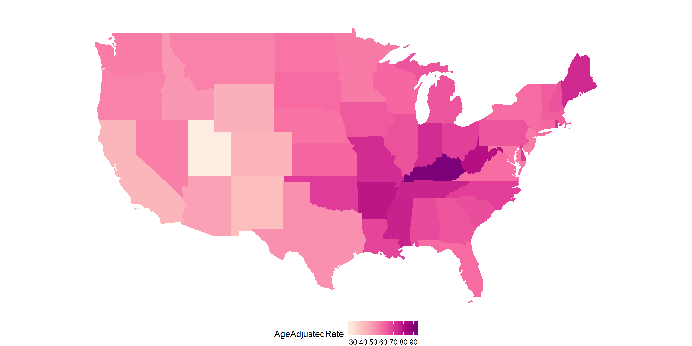

```{r setup, include=FALSE}
knitr::opts_chunk$set(echo = FALSE)
```
<!--

Please note that the submission deadline is September 30, 2019.

Author notes:
6000 words maximum.
focused  application  of  literature  to address  a  relevant  clinical  issue:
Mapping cancer outcomes
Cartogram applications should point to examples of cancer outcomes, with the main cartogram section discussing sources considered in grey literature review. Examples of political areas may be considered if cancer data is aggregated at these levels.

- Future steps should consider applications not currently utilised for cancer outcome displays, where their use may improve decision making
- needs to have a clear relevance to spatial patterns in cancer epidemiology
- presents alternative ways of visualising those spatial patterns, or the uncertainty in those patterns
- a more applied-focussed paper (e.g. lots of cool images), rather than theoretical (e.g. lots of formula).
-->


\section*{Abstract}

# Introduction
<!--
Current best practices: Choropleths
Current exploratory practices: Cartograms: cont, non cont, (tilegrams, dorlings)
Suggested uses of 
-->

Maps have been adopted to present geospatial statistics for centuries.
Maps connect data and statistics to the geographical representation of areas that are generally familiar to the audience.
However, it is not enough for areas on maps to be recognisable, if information regarding the distribution of the statistic cannot be gleaned.
In situations where the people are of interest, not the land they live on, it is reasonable to explore views that enhance the communication of the cancer statistics.
Identifying and explaining spatial structures, patterns, and processes involves considering the individuals in communities and organising communities into representable units [@SAMGIS]. 
This has spurred innovations over the previous centuries to enhance the shapes and maps presented to effectively communicate cancer outcomes, and health outcomes more broadly.
Cancer statistics directly represent and relate to the people living within individual geographical areas.

The visualisation methods used to present cancer statistics will depend on the intended message and users of the map. 
Transforming statistics to visualisations considers individual observations or observation points aggregated into communities and geographical units.
Visualising diseases on maps is often the first step in exploratory spatial data analysis and effectively helps in the formulation of hypotheses [@MTMSIH]. 
Disease maps help to present geographic patterns that may have been overlooked in a table, obscuring the geospatially related statistics [@SAMGIS].
By providing a visual representation of cancer outcomes, geographic patterns of disease are able to be identified and effectively addressed.

# Disease mapping methods

## Current best practice map displays for cancer data

<!-- what is a choropleth map -->
A choropleth map is used to display the spatial characteritics of a relationship, or variability, of measurements. 
As an alternative storage device to a table, it preserves locations for geographically ordered data, with usage dating back to the 1800s [@GOINO].
A choropleth is constructed by drawing the geographic or political boundaries, and filling the shapes with colours to represent values of a measured variable [@EI].
Early versions of choropleth maps used symbols or patterns instead of colour.
@CPISACA discusses their use in visualising cancer data, and @DMAHP gives an overview of the development of these maps for displaying disease data.
Just as geographers are no longer the only creators of maps, @CPISACA suggests the audiences of spatial health data analysis have extended beyond researchers to the public, policymakers and the media.
A choropleth map is a true map of the topology, constructed for visual inspection of spatial patterns across a familiar geographic form. 
Figure 1 shows a choropleth map where each state of the United States of America is coloured by the average annual rate of new cases of lung and bronchus cancer from years 2012 to 2016.

```{r choro, fig.cap = "A choropleth map of the United States of America.", echo=FALSE, message=FALSE, warning=FALSE, fig.align='center', out.width='80%'}

```

<!-- psychology -->
Utilising the familiar state boundaries can make a map intuitive to read [@CIBMUK], and allow viewers to visually infer the spatial relationships in the data, i.e. how cancer rate differs across the states.
The familiarity of the geography is a worthy consideration when presenting results of spatial analysis. Just as geographers are no longer the only creators of maps, @CPISACA suggests the audiences of spatial health data analysis have extended beyond researchers to the public, policymakers and the media.
While the areas are recognisable shapes, they are often politically driven boundaries with individual areas being of non-uniform size, containing different population densities and subject to change over time. 
The different population and geographical sizes of administrative areas can attract attention to the shades of the unpopulated but large areas [@EI]. 
Choropleths can inhibit visual inference when presenting human related statistics as the display may draw attention from the 'potentially more important results in the more populous communities' [@SE]. 

<!--
They are untrustworthy when interpretations of spatial association are needed; there are both severe physiological and psychological constraints on our abilities to assess correlations of spatial distributions visually.
-->


<!-- Displaying of cancer data on choropleths -->

<!-- Displaying of cancer data on choropleths -->
Choropleth maps can be useful devices for communicating information to public on a familiar map base.
In epidemiology, choropleths are often used as a tool to study the spatial distribution of cancer incidence and mortality. 
A cancer atlas is a choropleth map, or collection of maps, representing cancer incidence and mortality for a country, or group of countries. @MACM provide the definition and reports that cancer atlases began with Haviland's maps in 1875.
The data collection methods of cancer mortality rates across regions, and the administrative control within regions lends itself to choropleth visualisation. 
The increasing development and use of disease maps can be attributed to the availability of geographic information system software [@SE].
Early work in US cancer atlases can be attributed to Burbank ???, and UK cancer atlases to Howe 1963 ???.
The choropleth maps presented levels via hatchings or dots on a black and white scale.
These atlases were key to developing hypotheses regarding areas with unusually high rates, geographic correlations, work related exposures, and high risk diets @MACM.

<!--
A particular spatial structure includes
the individuals affected and how they are connected in
communities, as well as the dynamics of these communities
and their organization into larger units. @SAMGIS
-->

<!-- Measures reported in cancer atlases -->

<!-- Measures reported in cancer atlases -->
Almost 100 years of cancer mapping in the United States and the United Kingdom has seen increased effectiveness in the presentation cancer statistics.
Mortality rates are now often presented as relative rates of risk across the population, and age adjusted to correct for the the higher prevalence of cancers in older populations.
Howe [-@HEDP] describes Stock's development of the standardised mortality ratios through the 1930s. Table 1 presents summarises the measures presented in published cancer atlases, and provides a definition of each measure.

<!-- ??? Table tags-->
Table 1: Measures used to report cancer statistics

|Measure |Details| 
|:--------------------|:------------------------------------------------|  
|1. IR (Incidence Ratio)|$(IR)_i=\frac{(Incidence\ Rate)_i}{Average\ Incidence\ Rate}$, |
||Cancer incidence rate in region $i$ over the average cancer incidence rate for the total region|
|2. SIR (Standardised Incidence Ratio)| IR standardised by age structure in each region $i$|
|3. RER |$RER = \frac{(Cancer\ related\ mortality)_i}{Average\ cancer\ related\ mortality}$|
|(Relative Excess Risk)|Represents the estimate of cancer related mortality within five years of diagnosis|
||Also referred to as 'excess hazard ratio'|
|4. Age Adjusted Relative Risk| RR standardised by age structure in each region $i$|   
|5. Rate per 100,000|Cancer incidence per 100,000 population|  
|6. Age Adjusted Rate per 100,000| #5 standardised by age structure or region|   
|7. New cancer cases per 100,000|Specific methods could not be found|   
|8. Count|Crude cancer counts|  
|9. Below or above Expected|Alternative expression of the SIR|   

<!-- Cancer atlas literature -->

<!--

Examples of atlases:
Kraak 1998, Kraak and Ormeling 2011
Bertin 1967


Current atlases utilising choropleth methods 
- include Australia: 

cites: Cancer Mortality Atlas of EU and of the European Economic Area last published 8 years ago
@MTMSIH Bayesian disease mapping methods for areal data - explains key concepts applied to create an atlas
Explores Australia as a case study, utilising QLD SA2 areas

-->

### Supporting material in cancer atlases

A map communicates quickly and draws attention to prominent geographies, but an atlas is often supplemented with supporting statistics. Cruickshank's (1947) as cited by @DMAHP, discusses using visuals as 'formal statistical assessment of the spatial pattern'. However, when presenting cancer atlases, @MACM believes the intuition derived must be 'validated by rigorous statistical analyses.'

<!--
'Where control of the message is important, static maps will continue to be the most effective, although good tables, graphs, and explanatory text are still needed in order to ensure that different people will see the same thing in the maps' @CPISACA

-->

<!-- The supplementary statistics ??? -->
These additional statistics often include a measure of the statistical uncertainty of the values of the statistics presented in a choropleth.
In the review of atlases in the public domain, atlases were considered to report uncertainty to the non-expert user if they included a measure of statistical uncertainty either within or alongside the map. Maps that only reported this information within the supplementary material were not considered to have directly attempted to report uncertainty. The maps considered used standard and well known measures including credible intervals and standard deviation, statistical significance, box plots and distributions. These maps ranged from static pdfs or infographics, to interactive online resources.


<!-- Presentation methods of supplementary statistics ??? -->
The interactivity of the more modern maps enabled supplementary information to be incorporated without cluttering the screen, such as in a tool tip feature. 


## Public face

Cancer maps are effective communication tools for a general or non-expert audience. They are commonly used in the public domain to communicate results of sophisticated statistical analyses.
The heavy use of chloropleth maps within the research literature is reflected in the types of maps that are found in the public domain.
A grey literature review conducted by (ref) identified 33 cancer atlases published on the internet between January 2010 and November 2015. These chloropleth maps were mostly published by non-commercial organisations, including not-for-profits (NFPs), government, research organisations, advocacy groups or a partnership between an NFP & government.
Only one map was published by a commercial entity. 
 
<!-- geographic coverage-->
The cancer atlases covered geographies from all around the world, four were global atlases. Most focussed on single nations, the United States was considered by eleven atlases, the United Kingdom by seven, followed by three of Australia, two of Canada, and one of each from Switzerland, Germany, Norway. One atlas covered the European Union.
Not all maps had a national focus and ten covered a region or state rather than an entire nation. The states or counties/regions covered were South Australia (AUS), Queensland (AUS), Ontario (CAN), Valencia (Spain), Pennsylvania county Massachusetts (US), New Hampshire (US), Cape Cod (US), Missouri (US), Florida (US), New York State (US) and Arizona (US).

### Examples of supporting statistics in public facing atlases

Close to half of the atlases identified (42%, n=14) included some measure of uncertainty. The most common measure used to represent uncertainty were credible or confidence intervals (CIs).

<!--
Create a table:
cofactors: Greater capital city regions, states, socio demographic status, Remoteness


Supplementary stats
stat        | Literature examples | Public atlas examples
uncertainty |      ...            |    ...
co factor(1)|      ...            |    ...
co factor(2)|      ...            |    ...
-->


```{r ci-viz2, fig.cap = "Example of CI visualisation for uncertainty representation in cancer mapping (1/3). Source: Alberta Health IHDA Geographic. (2012) ", echo=FALSE, message=FALSE, warning=FALSE, fig.align='center', out.width='50%', eval = FALSE}

knitr::include_graphics("figures/Alberta_CI_viz.png")
```

```{r ci-viz3, fig.cap = "Example of CI visualisation for uncertainty representation in cancer mapping (2/3). Source: Pensylvania Cancer Atlas ", echo=FALSE, message=FALSE, warning=FALSE, out.width='50%', fig.align='center', eval = FALSE}

knitr::include_graphics("figures/Pennsylvania_CI_viz.png")

```

```{r ci-tooltip, fig.cap= "Example of CI visualisation for uncertainty representation in cancer mapping (3/3). Source: Centres for Disease Control and Prevention (CDC). United States Cancer Statistics: An Interactive Cancer Atlas (InCA) ", echo=FALSE, message=FALSE, warning=FALSE, fig.show='hold', out.width= '50%', fig.align = 'center', eval = FALSE}

knitr::include_graphics("figures/CDC_CI_viz_tooltip.png")
```

```{r ci-table, fig.cap= "Example of an interactive data table with CI upper and lower bounds used in cancer mapping. Source: Pennsylvania Cancer Atlas", echo=FALSE, message=FALSE, warning=FALSE, fig.show='hold', out.width= '50%', fig.align = 'center', eval = FALSE}

knitr::include_graphics("figures/uncert_table.png")
```
  
Methods for representing sources of uncertainty information can be visualised or communicated in different ways, examples identified through this grey literature review are listed below. 


```{r stndvn-example, fig.cap= "Example of standard deviation visualised in cancer mapping", echo=FALSE, message=FALSE, warning=FALSE, fig.show='hold', out.width= '90%', fig.align = 'center'}


```


```{r boxplot-example, fig.cap= "Example of boxplot used in cancer mapping. Source: Source: Pensylvania Cancer Atlas ", echo=FALSE, message=FALSE, warning=FALSE, fig.show='hold', out.width= '40%', fig.align = 'center', eval = FALSE}


```


Table: (\#tab:method-exp) Implicit and explicit measures of uncertainty.

|Measure | Example | 
|:-------------------------|:-------------------------------------------|
|CI Interval |Figures 3.1, 3.2, 3.3|
|Statistical Significance|Textured overlay on top of coloured regions used to indicate statistical significance|
|Distribution|Figure 3.4|
|Boxplots|Figures 3.4, 3.5|
|Sample Size|Textured overlay or lack of colour on a region, was used to show regions with small sample size|
|Standard deviation |Figure 3.6 - the second map in the bottom right corner shows standard deviation|


## Cartograms

<!-- What is a cartogram? -->
A cartogram alters the map base with the intention of improving the presentation of the statistic of interest. For a single variable of interest, each map area is changed to emphasise the distribution by representing the corresponding value, in comparison to the value of the other areas [@ACCAC].


<!-- There are many alternative views of the world-->
<!-- Tobler map projections-->
Choropleths may be considered true topological maps, however, if the land mass displayed covers enough of the globe, there must be a transformation or distortion to display the land in 2D. The amount of distortion is related to the distance covered by the landmass displayed @GAMP.
World map projections reflect the frequent perspectives used to view the earth. Choropleth maps will always be distorted if they cover enough of the globe, just as photographs of the globe from space. Choropleth creation requires choosing a map projection that shows a favourable distortion of the geography for presenting the set of spatial information.
Diagrams that do not specify a projection can be considered to have some unknown projection. <!-- ??? cite tobler.-->


<!-- Denominators -->
If the statistic presented on the map base relies on physical distance and is influenced by the topology there is no transformation needed beyond choosing a projection. 
The purposeful distortion of the map space is beneficial when a uniform density of the map base is desired.
When a map base is transformed according to population density, population becomes a uniformly distributed background for the statistic presented [@GOINO]. 


<!-- Denominators -->
If the statistic presented on the map base relies on physical distance and is influenced by the topology there is no transformation needed beyond choosing a projection. 
The purposeful distortion of the map space is beneficial when a uniform density of the map base is desired, @ACTUC suggests 'population distribution is often extremely uneven in former British colonies', this makes the distortion necessary. 
When a map base is transformed according to population density, population becomes a uniformly distributed background for the statistic presented [@GOINO]. 
Using choropleth maps for population characteristics requires graphic distortions when the population concerned varies greatly in density [@CTTMB].
When implementing a distortion of the geographical shape according to population, an area cartogram [@NAC], population-by-area cartograms [@TAAM], or iso-demographic map is the result. 

<!-- Why transform?-->
<!-- Common variables used to create cartograms, e.g. population, mortality -->
Cartograms provide an alternative visualisation method for statistical and geographical information.
The key difference between a choropleth and a cartogram is the desirable augmentation of the size, shape or distance of geographical areas [@ACTUC].
Cartograms may be seen as an extension of map transformations and projections. The favourable distortion is proportional to a value other other than actual earth size area [@NAC].
A disadvantage of the conventional map is that sparsely populated rural areas may be emphasized, whereas the areas representing cities are very small, making interpretation of spatial patterns very difficult.
The distortion of a cartogram prevents the density obscuring the spatial patterns [@TAAM]. 
The spatial transformation of map regions relative to the data emphasises the data distribution instead of land size [@CBATCC].
When visualising population statistics @ACTUC considers this equitable representation design 'more socially just', or honest [@NISCC], giving due attention to all members of the population and reducing the visual impact of large areas with small populations [@DMAHP]. 
@CTTMB suggest that spatial socio-economic data is best presented on a cartogram for urban areas.
@HEDP agrees that 'cancer occurs in people, not in geographical areas' and the map bases of population reflect this and avoid allocating 'undue prominence' to rural areas. 
@MTMSIH encourage the use of cartograms to highlight small areas and uncover local-level inequalities. 

<!--
 Disease atlases were implemented using both geographic (Howe 1963) and demographic bases (Howe 1970).

Design goals:
- to maintain as much as possible of the intricate detail
- to maximize the simplicity of the transformation
- maintenance of directional accuracy
- attempt to influence and direct the map user's attention, 

2) that the contiguity relationships between the DCU's should be maintained, 
3) that true directions should be retained from the centre of the transformation,
4) that the main shape characteristics of the DCU's should be preserved, and 
5) that the map should possess the overall shape of the built-up area. 
-->

<!--
@NISCC
two advantages of the cartogram: (1) new relationships are often revealed visually, and ( Finally, and most important for the present discussion, they suggest that the ability to preserve shape of the statistical units drops with an increase in the number of these units, and in situations where the difference is great between the smallest and largest values mapped.
Until we know how the map reader compares it to an ordinary thematic map, we are experimenting with a graphic device that may be reducing (or at least hindering) the flow of information from the map to the map reader.
-->

<!-- Overview of varieties -->
<!-- Cartogram makers -->

The creation of cartograms was largely in the hands of professional cartographers [@CD]. 
@ACTUC discusses early approaches including John Hunter and Jonathan Young (1968) and Durham's wooden tile method, Skoda and Robertson's (1972) steel ball bearing approach and Tobler's (1973) computer programs. @HEDP discusses the impact of electronic computer-assisted techniques.
Geographical information systems allowed map users, and researchers to implement their own cartograms, but these systems are utilised depending on ‘the effectiveness, efficiency, and satisfaction of the map products (Nielsen 1994)’[@CD].

There have been many algorithms presented, @SAIC provided a framework to investigate implementations and the "statistical accuracy, geographical accuracy, and topological accuracy". 

There are many alternatives to consider, the intended audience of the map, and its purpose are key points in cartogram use and creation.
@ACTUC reiterates: 'There is no "best" cartogram or method of creating cartograms just as there is no "best" map' (Monmonier and Schnell, 1988). 


### Contiguous

<!-- What is a contiguous cartogram -->


<!-- Intentionally preserve neighbours -->

A contiguous cartogram maintains connectivity of the map regions while areas are resized according to a statistic. This transformation often occurs at the expense of the shape of areas [@CBATCC, @NAC, @TAAM].
From a computer graphics perspective, @ACA believe it is a problem of 'map deformation' to account for the value assigned to each area, they provide three methods for creating value-by-area cartograms.
Examples include Tobler’s Pseudo-Cartogram Method, Dorling’s Cellular Automaton Method [-@ACTUC], Radial Expansion Method of Selvin et al., Rubber Sheet Method of Dougenik et al., Gusein-Zade and Tikunov’s Line Integral Method, Constraint-Based Method (Kocmoud and House) [-@CBATCC].


An intentional goal when creating the 1966 Census population cartogram for Canada was to maintain contiguity, while attempting to keep the actual shape of places. The end result was a 'very accurate isodemo-graphic map of Canada'. This intentional design goal coincided with the rising interest in urban geography. 


<!--
presents 7 desirable characteristics
1. Independent of region traversal order
2. Independent of coordinate axes
3. Conformal mapping
4. Global displacements per iteration
5. Intersection prevention
6. Ability to fix (pin down) points
7. User controls on area vs. shape

Australia (McGlashan 1977),

-->

To be able to recognise the significant changes, a reader will usually have to know the initial geography to find the differences in the new cartogram layout [@NAC]. Tobler's Conformal mapping means to preserve angles
locally so that the shapes of very small areas on a traditional map and a
cartogram would be similar.
@CBATCC presents this issue as conflicting tasks or aims, to adjust region sizes and retain region shapes. Distortion of region shapes on the contiguous cartogram presents an additional hurdle to visual recognition and this hurdle is not only eliminated on the noncontiguous cartogram but is replaced by the meaningful empty-space property [@NAC, @ECGC].


### Non-Contiguous

<!--
[-@NAC] observation units stay in more or less their correct location and maintain correct shape, but at least some units are separated by gaps from their neighbours.
Each area in a non-contiguous cartogram is scaled down or up according to value for the specific area.
A scaling factor specific to 

the empty area between units is meaningful. 
the degree of difference from the original map that is the real message of a cartogram, @NAC

A cartogram using the unit with the mean or median density as the anchor would also show relative discrepancies, but it is more difficult to produce by computer because many units increase in size and overlap. @NAC

The success of the
visual representation (contiguous or noncontiguous)
depends, in fact, on the readers’
recognition of the units shown and
such recognizable units are generally fairly
large for the area represented. @NAC

constant shapes are easily recognized regardless of scale;

Presenting an alternative view can help to correct interpretation of global statistics when some areas loom large on maps [@RSCW].
-->


Dorling -@ACTUC puts forward a simple question:

>If, for instance, it is desirable that areas on a map have boundaries which are as simple as possible, why not draw the areas as simple shapes in the first place?

He answers this with his implementation of maps created with 'the simplest of all shapes'. While contiguous cartograms may be a 'more sophisticated' method, they produce 'very complex shapes'. Circular cartograms use the same shape for every region represented, and size them according to the statistic represented or the population for a base map.
To produce a compelling map, a gravity model is applied to avoid overlaps, and keep spatial relationships with neighbouring areas over many iterations. This implementation can work for up to 'one hundred thousand' areas.

<!--
-simple shapes of the circle, square, and triangle are relatively easily recognized.
-sacrifice communication efficiency;
-There is evidence, too, that angular shapes are more easily seen than ones with smooth outlines. Shapes that contain the qualities of simplicity and regularity are more readily perceived than others that do not possess these qualities.
-Finally, psychologists tell us that shapes having familiarity are more quickly
recognized than nonsense shapes or those that have no meaning.
-The cartographer can efficiently communicate with this kind of map if he has preserved particular elements of the original outline and incorporated them in the new shape.
-
@NISCC 
-->


'In Australia the urban federal constituencies occupy only a tenth of the land, but contain nine tenths of the people. It would be almost unthinkable to show election results for that country on a conventional equal land area map.'
This 1966 cartogram uses mostly straight lines, and the result looks very little like the geographical shape of Australia.

'Given the increasingly uneven population distribution of the United States and the growing social divides between the populations of neighbourhoods living at different densities, the need for cartograms like this is greater now than ever.'


Used in displays of the UK by Howe in 1986 cited by @HEDP
<!--
# Temporal displays
-->

 
Tobler's method and the many implementations that 'elaborated' on it are derived from 'numerical approximations to a pair of equations'[@ACTUC]. They all operate through incremental adjustments, and can produce wildly different outcomes from small changes in the inputs.
 
@TFYCC Value-Area Cartograms. In these cartograms a region,country, or continent is subdivided into small regions, each of which is represented by a rectangle. This rectangle is proportionate in area to the value which it represents in certain statistical distributions. The regions are grouped in approximately the same positions as they are on the map.


Computer generated map examples:  @HEDP
(Hopps et al. 1968; Armstrong 1972). There
has followed a flood of disease atlases, mainly concentrating on the modem problems of cancer and degenerative diseases from countries as scattered as the United States (Burbank 1971; Mason et al. 1975, 1976; Pickle et al. 1987), the Soviet Union (Levin 1980), Japan (Shigematsu 1977), the Federal Republic of Germany

<!--
@CVBGSD presents bivariate maps, using size and colour for different variables. 
-->

@MDAC define the term 'mosaic cartograms'. 
Compare amount of tiles to contrast population of regions.
'Cartograms show a data value per input region by scaling each region such that its area is proportional to its data value. Mosaic cartograms show data in multiples of tiles, hence the input data must consist of, or be cast into, small integer units.'


# A critique of mapping methods

>designing a map tailored to precise goals [is] easier than forcing a single map to accommodate diverse objectives - @CPISACA

Waldo Tobler [-@TVSSS] explores many graphical techniques, and suggests there are particular methods for particular purposes. To choose an approporiate map display, the map creator must consider the intended user, and message the map will communicate.
It is the objectives of the investigator that will drive the choice of representation [@CPISACA]. 

There are two keys presented by @SAMGIS to drive the choice of display: 
 - the properties of the visualisation, and 
 - the ease or accuracy of information extraction for map users


<!-- @CPISACA contrasted several online atlases in a 2006 paper, consider for structure? 

(only worth including if it is possible for us to implement)
Tabular form comparing and contrasting
- Relationship to geography
- Show using cancer examples
-->

# Animation and Interactivity

Recent developments in technology allowed interactive web atlases.

> 'Where control of the message is important, static maps will continue to be the most effective, although good tables, graphs, and explanatory text are still needed in order to ensure that different people will see the same thing in the maps' @CPISACA

The intention of interactivity and animation is to allow users to answer their own questions.

<!--
Using e-Delphi to Evaluate the Pennsylvania Cancer Atlas - explains PCA and reasons for interactivity.
-->

<!--
@ECGC ?? Highlight the value of animating contiguous to see changes over time, US can be recognisable but animation aides interpretation 
-->

# Acknowledgements


# References

<!--
# Software
Commonly available tools to implement.
-->
@tidyerse for data analysis, @spData and @sf to implement plotting of spatial data.
@sugarbag to create hexagon tesselation. @ggthemes to enhance plot displays.
@cartogram for contiguous and non-contiguous cartogram displays.


<!--
## counts versus predictions

@SEMA
'Disease mapping is carried out to summarise spatial and spatio-temporal variation in risk.'
Descriptive statistic of the relationship between geography and a disease.
population, exposure, and health data may have point data or aggregated summaries (count data)
potentially be subject to a number of inaccuracies
diagnostic error or misclassification

Not only the counts, but population, migration, deaths and births are modelled across census years.

rapid visual summary of complex geographical information, descriptive purposes, to generate hypotheses, for surveillance, and to aid policy formation and resource allocation.

When using counts:
 small populations imply large variability in estimated rates
 
Decisions taken at this stage may be critical as apparent ‘clusters’ may depend crucially on the boundaries chosen in time or space: ‘The more narrowly the underlying population is defined, the less will be the number of expected cases, the greater will be the estimate of the excess rate, and often the more pronounced will be the statistical significance’ 
 
Using prediction:
assuming that neighbouring μi are correlated leads to a ‘clustering’ prior

-->


<!--
@SE Researchers mapping spatial patterns of disease
for small areas are confronted with a number of
challenges, including cartographic design, the
modifiable area unit problem, and also the “small
number” problem, where some places have no,
or few, disease events and/or a low population at
risk of contracting the disease.

-->

