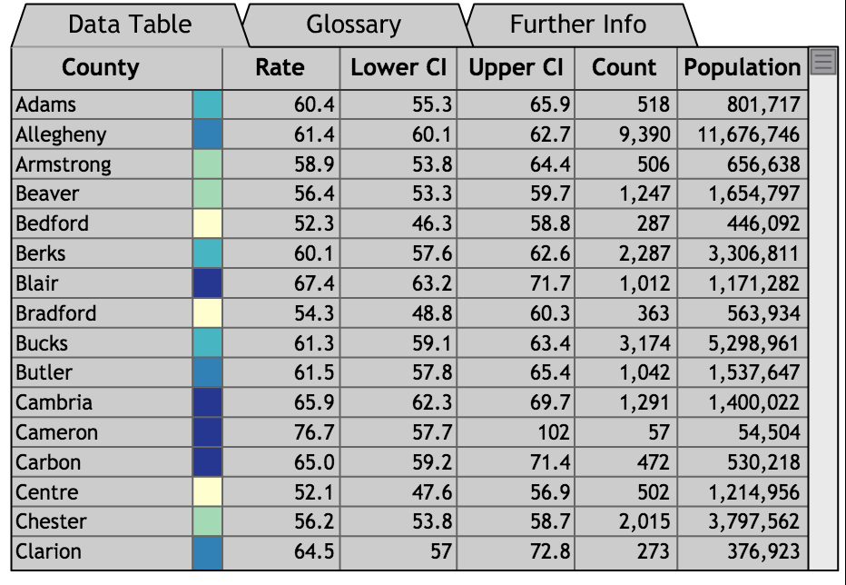
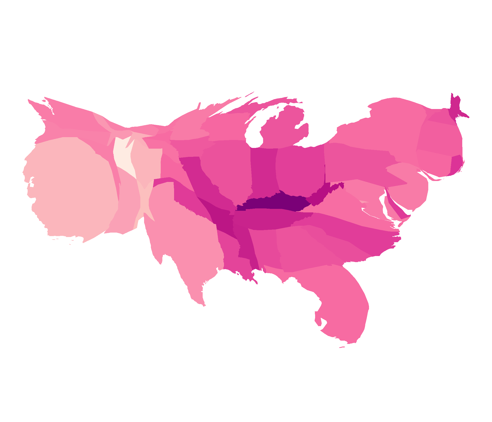
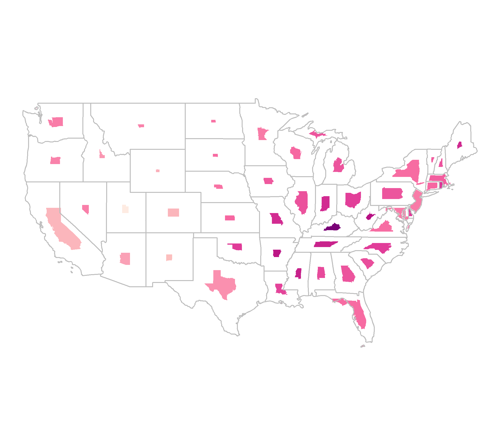

```{r setup, include=FALSE}
knitr::opts_chunk$set(echo = TRUE)
```
<!--

Please note that the submission deadline is September 30, 2019.

Author notes:
6000 words maximum.
focused  application  of  literature  to address  a  relevant  clinical  issue:
Mapping cancer outcomes
Cartogram applications should point to examples of cancer outcomes, with the main cartogram section discussing sources considered in grey literature review. Examples of political areas may be considered if cancer data is aggregated at these levels.

- Future steps should consider applications not currently utilised for cancer outcome displays, where their use may improve decision making
- needs to have a clear relevance to spatial patterns in cancer epidemiology
- presents alternative ways of visualising those spatial patterns, or the uncertainty in those patterns
- a more applied-focussed paper (e.g. lots of cool images), rather than theoretical (e.g. lots of formula).
-->


\section*{Abstract}

# Introduction
<!--
Current best practices: Choropleths
Current exploratory practices: Cartograms: cont, non cont, (tilegrams, dorlings)
Suggested uses of 
-->

Maps have been adopted to present geospatial statistics for centuries.
These maps connect data and/or statistics to the geographical representation of areas that are generally familiar to the audience.
However, it is not enough for areas on maps to be recognisable, if the distribution of the statistic cannot be understood.
This is particularly relevant to cancer statistics, as cancer outcomes directly relate to the people living within a geographical area.
In situations where the people are of interest, not the land they live on, it is reasonable to explore views that enhance the communication of the cancer statistics.
This has spurred innovations over the previous centuries to enhance the shapes and maps presented to effectively communicate cancer outcomes, and health outcomes more broadly.


# Disease mapping methods

<!--
Disease maps present geographic patterns that may have been overlooked in a table that obscures the geospatially related statistics [@SAMGIS].
Often used as a first step to drive hypotheses 


Transforming statistics to visualisations begins with the coordinates of observations.
The observation points can be aggregated to regions within boundaries.
The polygon regions may be presented directly, or transformed first according to associated values.

The visualisation method used will depend on the intended use of the map, namely the message a map will communicate. 

commonly used for hypothesis generating and as the first step in exploratory
spatial data analysis. @SE Geography is concerned with the identification and
explanation of spatial structure, pattern, and process, and with the analysis and explanation of the links
between humans and the environment (2). @SAMGIS

By providing a visual representation of cancer outcomes, geographic patterns of disease are able
to be identified and effectively addressed
--> 

## Current best practice map displays for cancer data


<!--Choropleth map (Steff)-->

<!-- what is a choropleth map -->
A choropleth map is used to show the spatial characteritics of a 
relationship, or variability, of measurements. Created as a storage device which preserves locations for geographically ordered data, with usage dating back to the 1800s [@GOINO]. They are constructed by drawing the given geographic or political boundaries, and filling the shapes with colours to represent values of a measured variable [@EI]. Early versions used symbols or patterns instead of colour. @CPISACA discusses the use of choropleth maps for visualising cancer data, and @DMAHP gives an overview of the development of the use of choropleth maps for displaying disease data. A choropleth map is a true map of the topology, constructed for visual inspection of spatial patterns across a familiar geographic form. Figure 1 shows a choropleth map where each state of the United States of America is coloured by the average annual rate of new cases of lung and bronchus cancer from years 2012 to 2016.

<!--
Thematic maps, on the other hand, do select some geographical concept or arrangement and attempt to focus attention entirely on the spatial characteristics of the entire distribution and upon its relation to other geographical factors.
-->


<!-- psychology -->

Utilising the familiar state boundaries can make a map intuitive to read [@CIBMUK], and allow viewers to visually infer the spatial relationships in the data, i.e. how cancer rate differs across the states.
The familiarity of the geography is a worthy consideration when presenting results of spatial analysis. Just as geographers are no longer the only creators of maps, @CPISACA suggests the audiences of spatial health data analysis have extended beyond researchers to the public, policymakers and the media.
However, while the areas are recognisable shapes, they are often politically driven boundaries with individual areas being of non-uniform size, containing different population densities and subject to change over time. 
The different population and geographical sizes of administrative areas can attract attention to the shades of the unpopulated but large areas [@EI]. Choropleths can inhibit visual inference when presenting human related statistics as the display may draw attention from the 'potentially more important results in the more populous communities' [@SE]. 

<!--
criticisms:
Certain limitations to the standard graphic techniques have also become apparent, however.
They are slow, and do not permit instant retrieval of information. They are untrustworthy when interpretations of spatial association are needed; there are both severe physiological and psychological constraints on our abilities to assess correlations of spatial distributions visually.
-->

<!--
Urbanisation has pushed people closer together,
-in workplaces and in homes. 
-this issue is not with the size of the administrative areas,
- the increasing urbanisation is contributing to the changing density of population

A particular spatial structure includes
the individuals affected and how they are connected in
communities, as well as the dynamics of these communities
and their organization into larger units. @SAMGIS
-->

<!-- Displaying of cancer data on choropleths -->

In epidemiology, choropleths are often used as a tool to study the spatial distribution of cancer incidence and mortality. 
Choropleth maps can be useful devices for communicating information to public on a familiar map base. A cancer atlas is a choropleth map, or collection of maps, representing cancer incidence and mortality for a country, or group of countries. @MACM provide the definition and report that cancer atlases began with Haviland's maps in 1875. The data collection methods of cancer mortality rates across regions, and administrative control within regions lends itself to choropleth visualisation. 
The increasing development and use of disease maps can be attributed to the availability of geographic information system software [@SE]. Early work in US cancer atlases can be attributed to Burbank ???, and UK cancer atlases to Howe 1963 ???.  The choropleth maps used at this time presented levels  via hatchings or dots on a black and white scale. These atlases were key to developing hypotheses regarding areas with unusually high rates, geographic correlations, work related exposures, and high risk diets @MACM.

<!-- Measures reported in cancer atlases -->

Almost 100 years of cancer mapping in the United States and the United Kingdom has seen increased effectiveness in the presentation of unbiased rates. Mortality rates are now often presented as relative rates of risk across the population, and age adjusted to correct for the the higher prevalence of cancers in older populations. Howe [-@HEDP] describes Stocks development of the standardised mortality ratios through the 1930s.

<!--
Literature regarding measures presented in public facing atlases.
-->

The list below summarises the measures presented in published cancer atlases, and provides a definition of each measure.

Table: (\#tab:measures) Measures used to report cancer statistics

|Measure |Details| 
|:--------------------|:------------------------------------------------|  
|1. IR (Incidence Ratio)|$(IR)_i=\frac{(Incidence\ Rate)_i}{Average\ Incidence\ Rate}$, |
||Cancer incidence rate in region $i$ over the average cancer incidence rate for the total region|
|2. SIR (Standardised Incidence Ratio)| IR standardised by age structure in each region $i$|
|3. RER |$RER = \frac{(Cancer\ related\ mortality)_i}{Average\ cancer\ related\ mortality}$|
|(Relative Excess Risk)|Represents the estimate of cancer related mortality within five years of diagnosis|
||Also referred to as 'excess hazard ratio'|
|4. Age Adjusted Relative Risk| RR standardised by age structure in each region $i$|   
|5. Rate per 100,000|Cancer incidence per 100,000 population|  
|6. Age Adjusted Rate per 100,000| #5 standardised by age structure or region|   
|7. New cancer cases per 100,000|Specific methods could not be found|   
|8. Count|Crude cancer counts|  
|9. Below or above Expected|Alternative expression of the SIR|   


@DMAHP cites Cruickshank's (1947) discussion of using visuals as 'formal statistical assessment of the spatial pattern' as a major advancement.

When presenting cancer atlases, @MACM believes the intuition that can be derived must be 'validated by rigorous statistical analyses.' Additional statistics are often 

<!--
of some element, for example population density, or purchasing power, or agricultural fertility; reality, of course, is not like this. the background variable assumed to be uniform (such as population density) can be adjusted so that it behaves as if uniformity were the case
@GOINO
-->

<!-- Published atlases -->


Examples of atlases:
Kraak 1998, Kraak and Ormeling 2011
Bertin 1967


<!--
Current atlases utilising choropleth methods 
- include Australia: 

cites: Cancer Mortality Atlas of EU and of the European Economic Area last published 8 years ago
@MTMSIH Bayesian disease mapping methods for areal data - explains key concepts applied to create an atlas
Explores Australia as a case study, utilising QLD SA2 areas

-->

### Supporting material in cancer atlases

<!-- Moved Jessies stat uncertainty up-->
Cancer atlases were considered to report uncertainty to the non-expert user if they included a measure of statistical uncertainty either within or alongside the map. Maps that only reported this information within the supplementary material were not considered to have directly attempted to report uncertainty.

The review did not reveal any novel uncertainty visualisation approaches or visualisations. Maps used standard and well known measures including credible intervals and standard deviation, statistical significance, box plots and distributions. These maps ranged from static pdfs or infographics to interactive online resources. The interactivity of the more modern maps enabled uncertainty information to be incorporated without cluttering the screen, such as in a tool tip feature. 


## Public face

Cancer maps are effective communication tools for a general or non-expert audience and are commonly used in the public domain to communicate the output of sophisticated statistical analyses to these audiences. The heavy use of chloropleth maps within the research literature is reflected in the types of maps that are found in the public domain. A grey literature review conducted by (ref) identified 33 cancer atlases published on the internet between 01/01/2010 to 11/11/2015 all of which were chloropleth maps. These maps were mostly published by non-commercial organisations, including not-for-profits (NFPs), government, research organisations, advocacy groups or a partnership between an NFP & government. Only one map was published by a commercial entity (Maps of Cancer Mortality Rates in Spain), published by the media organisation El Pais^[https://elpais.com/].  
 
### Geographical coverage
 
Identified cancer atlases covered geographies from all around the world, four were global atlases. Most focussed on single nations, the United States was considered by eleven atlases. The United Kingdom was considered by seven, followed by three of Australia, two of Canada, and one of each from Switzerland, Germany, Norway. One atlas covered the European Union.
Not all maps had a national focus and ten covered a region or state rather than an entire nation. The states or counties/regions covered were South Australia (AUS), Queensland (AUS), Ontario (CAN), Valencia (Spain), Pennsylvania county Massachusetts (US), New Hampshire (US), Cape Cod (US), Missouri (US), Florida (US), New York State (US) and Arizona (US).

### Statistical uncertainty in public facing atlases
 
```{r ci-viz2, fig.cap = "Example of CI visualisation for uncertainty representation in cancer mapping (1/3). Source: Alberta Health IHDA Geographic. (2012) ", echo=FALSE, message=FALSE, warning=FALSE, fig.align='center', out.width='80%'}


```

```{r ci-viz3, fig.cap = "Example of CI visualisation for uncertainty representation in cancer mapping (2/3). Source: Pensylvania Cancer Atlas ", echo=FALSE, message=FALSE, warning=FALSE, out.width='55%', fig.align='center'}


```

Close to half of the atlases identified (42%, n=14) included some measure of uncertainty. The most common measure used to represent uncertainty were credible or confidence intervals (CIs). CIs were either visualised by including their bounds in a scatterplot or graph of estimates vs region (see Figures \@ref(fig:ci-viz2)^[Alberta Health IHDA Geographic. (2012). Age-Standardised Incidence Rate of COPD, 2011. Retrieved from: http://www.health.alberta.ca/health-info/IHDA-geographic/COPD/incidence-agestandard/atlas.html?epik=0GJSpE_IW34lx], and \@ref(fig:ci-viz3)^[Centres for Disease Control and Prevention (CDC). (n.d). United States Cancer Statistics: An Interactive Cancer Atlas (InCA). Retrieved from:https://nccd.cdc.gov/DCPC_INCA/] positioned next to the map, or reported numerically through the CI upper and lower bounds listed in a data table (see Figure 3.4^[Pennsylvania Cancer Atlas. (n.d). Retrieved from:  https://www.geovista.psu.edu/grants/CDC/?epik=0lJSpE_IW34lx]). Of those that visualised the CIs, 30% (n=10) embedded the visualisation within a tool tip function which visualised the CI when the mouse hovered over the relevant area (see Figure 3.5^[International Agency for Research on Cancer. (2017). Atlas of Cancer Mortality in the European Union and European Economic Area 1993-1997, Annex 4 - Cancer mortality maps by site. Retrieved from: http://www.iarc.fr/en/publications/pdfs-online/epi/sp159/]). 

```{r ci-tooltip, fig.cap= "Example of CI visualisation for uncertainty representation in cancer mapping (3/3). Source: Centres for Disease Control and Prevention (CDC). United States Cancer Statistics: An Interactive Cancer Atlas (InCA) ", echo=FALSE, message=FALSE, warning=FALSE, fig.show='hold', out.width= '60%', fig.align = 'center'}


```

```{r ci-table, fig.cap= "Example of an interactive data table with CI upper and lower bounds used in cancer mapping. Source: Pennsylvania Cancer Atlas", echo=FALSE, message=FALSE, warning=FALSE, fig.show='hold', out.width= '50%', fig.align = 'center'}


```
  
Methods for representing sources of uncertainty information can be visualised or communicated in different ways, examples identified through this grey literature review are listed below. 


```{r stndvn-example, fig.cap= "Example of standard deviation visualised in cancer mapping", echo=FALSE, message=FALSE, warning=FALSE, fig.show='hold', out.width= '90%', fig.align = 'center'}

knitr::include_graphics("figures/standard_deviation_large.png")
```


```{r boxplot-example, fig.cap= "Example of boxplot used in cancer mapping. Source: Source: Pensylvania Cancer Atlas ", echo=FALSE, message=FALSE, warning=FALSE, fig.show='hold', out.width= '40%', fig.align = 'center'}

knitr::include_graphics("figures/Boxplot2.png")
```


Table: (\#tab:method-exp) Implicit and explicit measures of uncertainty.

|Measure | Example | 
|:-------------------------|:-------------------------------------------|
|CI Interval |Figures 3.1, 3.2, 3.3|
|Statistical Significance|Textured overlay on top of coloured regions used to indicate statistical significance|
|Distribution|Figure 3.4|
|Boxplots|Figures 3.4, 3.5|
|Sample Size|Textured overlay or lack of colour on a region, was used to show regions with small sample size|
|Standard deviation |Figure 3.6 - the second map in the bottom right corner shows standard deviation|


## Cartograms

<!-- Going from choropleth to cartogram 

A cartogram is an alternative map visual. 
An intention distortion is applied to a geographic map base, 

A cartogram is a map purposely distorted so that its spatial properties represent quantities
not directly associated with position on the globe. As thematic maps, cartograms emphasize
the distribution of a variable by changing the area (or lengths) of objects on the map.
Our approach maintains continuity, and preserves
many local features of cartographic lines that provide visual clues to the identity of the distorted
objects.
@ACCAC


@CD considers cartographic data analysis in practice. Presenting a clear guide for preparing cartograms for use with both qualitative and quantitative information.
The authors recognise that the creation of cartograms was largely the work of professional cartographers until the innovation of geographical information systems that welcomed map users as map creators. These systems are utilised depending on ‘the effectiveness, efficiency, and satisfaction of the map products (Nielsen 1994)’. 

'Where control of the message is important, static maps will continue to be the most effective, although good tables, graphs, and explanatory text are still needed in order to ensure that different people will see the same thing in the maps' @CPISACA

-->


<!-- There are many alternative views of the world-->
<!-- Tobler map projections-->
Choropleths may be considered true topological maps, however, if the land mass presented covers enough of the globe, there must be a transformation or distortion to display in 2D. The amount of distortion is related to the distance displayed @GAMP.
The world projections reflect the frequent distortions seen from altering perspectives. Choropleth maps will always be distorted if they cover enough of the globe, as will photographs of the globe from space. Choropleth creation requires choosing a map projection that shows a favourable distortion of the geography for presenting the set of spatial information.
Diagrams that do not specify a projection can be considered to have some unknown projection. <!-- ?? cite tobler.-->


<!-- Why transform?-->
<!-- Common variables used to create cartograms, e.g. population, mortality -->
Waldo Tobler [-@TVSSS] explores many graphical techniques, and suggests there are particular methods for particular purposes. Cartograms provide an alternative visualisation method for statistical and geographical information.
The key difference between a choropleth and a cartogram is the desirable augmentation of the size, shape or distance of geographical areas [@ACTUC].
Cartograms may be seen as an extension of map transformations and projections. The favourable distortion is proportional to a value other other than actual earth size area [@NAC].

<!--
@SE Researchers mapping spatial patterns of disease
for small areas are confronted with a number of
challenges, including cartographic design, the
modifiable area unit problem, and also the “small
number” problem, where some places have no,
or few, disease events and/or a low population at
risk of contracting the disease.

@TAAM variations in population density may obscure geographic patterns
This factor may be eliminated by making the map area proportional to population rather than to actual land area.
Such maps, or what have been termed "population-by-area cartograms," are well known in the
cartographic literature
-->
Using choropleth maps for population characteristics requires graphic distortions when the population concerned varies greatly in density [@CTTMB].
When implementing a distortion of the geographical shape according to population, an area cartogram [@NAC], or iso-demographic map is the result.
When visualising population statistics @ACTUC considers this equitable representation design 'more socially just, giving due attention to all members of the population and reducing the visual impact of large areas with small populations [@DMAHP]. @CTTMB suggest that spatial socio-economic data is best presented on a cartogram for urban areas.
@HEDP agrees that 'cancer occurs in people, not in geographical areas' and the map bases of population reflect this and avoid allocating 'undue prominence' to rural areas. @MTMSIH encourage the use of cartograms to highlight small areas and uncover local-level inequalities. Using health estimates from large areas can prevent drawing attention to the inequalities.


<!--
> The aim here is to see the whole, in as much detail as possible, at a glance.

@HEDP discusses the impact of electronic computer-assisted techniques. Disease atlases were implemented using both geographic (Howe 1963) and demographic bases (Howe 1970).

@AOCAFE
An Online Census Atlas for everyone
The familiar choropleth maps in the Online Census Atlas were produced using generalized boundaries. Great Britain is recognizable and it is relatively easy to identify the higher geography levels such as Counties and Local Authorities. A disadvantage of the conventional map is that sparsely populated rural areas may be emphasized, whereas the areas representing cities are very small, making interpretation of spatial patterns very difficult.

The Atlas does not allow visualization of census
data at ward level, but instead uses these boundaries
aggregated to the six higher level geographies
defined above for display of 88 census variables.

To cartograms by:
The creation of the map began
with a computer-generated cartogram of parliamentary
constituencies where each constituency was
given equal weight.
Using the circular cartogram
algorithm (Dorling 1995), this resulted in a largely
hexagonal tessellation of 641 circles, each circle
representing a parliamentary constituency as first
used in the 1997 general election.
-->


<!-- Overview of varieties -->

The area on the map space can also be used represent a value. There have been many algorithms presented, @SAIC provided a framework to investigate implementations and the "statistical accuracy, geographical accuracy, and topological accuracy". The spatial transformation of map regions relative to the data emphasises the data distribution instead of land size [@CBATCC].


Cancer statistics and atlases 


<!-- Cartogram makers -->

The creation of cartograms was largely in the hands of cartographers. 
@ACTUC discusses early approaches including John Hunter and Jonathan Young (1968) and Durham's wooden tile method, Skoda and Robertson's (1972) steel ball bearing approach and Tobler's (1973) computer programs.


There are many alternatives to consider, the intended audience of the map, and its purpose are key points in cartogram use and creation.
@ACTUC reiterates: 'There is no "best" cartogram or method of creating cartograms just as there is no "best" map' (Monmonier and Schnell, 1988). 

<!-- Creation goals-->

'Firstly, that no such transformation has a unique solution, leaving the subjective choice in the hands of the individual map designer. '


Design goals:
- to maintain as much as possible of the intricate detail
- to maximize the simplicity of the transformation
- maintenance of directional accuracy
- attempt to influence and direct the map user's attention, 

1) that the size of the electoral subdivisions should be made proportional to their respective electoral populations, 
2) that the contiguity relationships between the DCU's should be maintained, 
3) that true directions should be retained from the centre of the transformation, 
4) that the main shape characteristics of the DCU's should be preserved, and 
5) that the map should possess the overall shape of the built-up area. 


### Contiguous

<!-- What is a contiguous cartogram -->



<!-- Intentionally preserve shape-->


A contiguous cartogram allows the map space to highlight the distribution of the variable. These cartograms maintain connectivity of the map regions while areas are resized according to a statistic, this often must occur at the expense of the shape [@CBATCC,@NAC, @TAAM].
From a computer graphics perspective, @ACA believe it is a problem of 'map deformation' to account for the value assigned to each area, they provide three methods for creating value-by-area cartograms.
Examples include Tobler’s Pseudo-Cartogram Method, Dorling’s Cellular Automaton Method [-@ACTUC], Radial Expansion Method of Selvin et al., Rubber Sheet Method of Dougenik et al., Gusein-Zade and Tikunov’s Line Integral Method, Constraint-Based Method (Kocmoud and House) [-@CBATCC].

<!--
Medical application: TAAM 1965
Actual shapes of counties were sacrificed to the extent necessary to retain as far as possible, common boundaries, relative locations, and the approximate contour of the State.

There is no unique solution to the topology
problem of preparing a population-by-area
cartogram for a given population and its jurisdictional
boundaries. Although the map areas
of the various regions are fixed by their populations, their shapes and relative locations are
not completely determined.

Other characteristics of the population
may also serve as the base for adjustment; for
example, sex, race, parity, socio-economic level,
or immune status.

@RSCW
helps to correct misconceptions. Pupils are likely to over-estimate regions as Canada, Siberia, Africa, and our own West just because they loom up large on maps. The simple picture which the cartogram gives is easily comprehended and remembered and
will be stimulating in making comparisons.

@NISCC
two advantages of the cartogram: (1) new relationships are often revealed visually, and ( 2 ) it is often more honest to use “other” space on the base map than land area. Finally, and most important for the present discussion, they suggest that the ability to preserve shape of the statistical units drops with an increase in the number of these units, and in situations where the difference is great between the smallest and largest values mapped.
Until we know how the map reader compares it to an ordinary thematic map, we are experimenting with a graphic device that may be reducing (or at least hindering) the flow of information from the map to the map reader.
-->

describes the process of creating a population cartogram for Canada, using the 1966 Census. An intentional goal of this project was to maintain contiguity, while attempting to keep the actual shape of places. The end result was a 'very accurate isodemo-graphic map of Canada'. This intentional design goal coincided with the rising interest in urban geography. 


<!--
presents 7 desirable characteristics
1. Independent of region traversal order
2. Independent of coordinate axes
3. Conformal mapping
4. Global displacements per iteration
5. Intersection prevention
6. Ability to fix (pin down) points
7. User controls on area vs. shape

Australia (McGlashan 1977),

-->

To be able to recognise the significant changes, a reader will usually have to know the initial geography to find the differences in the new cartogram layout [@NAC]. Tobler's Conformal mapping means to preserve angles
locally so that the shapes of very small areas on a traditional map and a
cartogram would be similar.
@CBATCC presents this issue as conflicting tasks or aims, to adjust region sizes and retain region shapes. Distortion of region shapes on the contiguous cartogram presents an additional hurdle to visual recognition and this hurdle is not only eliminated on the noncontiguous cartogram but is replaced by the meaningful empty-space property [@NAC, @ECGC].

### Non-Contiguous

<!--
[-@NAC] observation units stay in more or less their correct location and maintain correct shape, but at least some units are separated by gaps from their neighbours.
Each area in a non-contiguous cartogram is scaled down or up according to value for the specific area.
A scaling factor specific to 

the empty area between units is meaningful. 
the degree of difference from the original map that is the real message of a cartogram, @NAC

A cartogram using the unit with the mean or median density as the anchor would also show relative discrepancies, but it is more difficult to produce by computer because many units increase in size and overlap. @NAC

The success of the
visual representation (contiguous or noncontiguous)
depends, in fact, on the readers’
recognition of the units shown and
such recognizable units are generally fairly
large for the area represented. @NAC

constant shapes are easily recognized regardless of scale;
-->




Dorling -@ACTUC puts forward a simple question:

>If, for instance, it is desirable that areas on a map have boundaries which are as simple as possible, why not draw the areas as simple shapes in the first place?

He answers this with his implementation of maps created with 'the simplest of all shapes'. While contiguous cartograms may be a 'more sophisticated' method, they produce 'very complex shapes'. Circular cartograms use the same shape for every region represented, and size them according to the statistic represented or the population for a base map.
To produce a compelling map, a gravity model is applied to avoid overlaps, and keep spatial relationships with neighbouring areas over many iterations. This implementation can work for up to 'one hundred thousand' areas.

<!--
-simple shapes of the circle, square, and triangle are relatively easily recognized.
-sacrifice communication efficiency;
-There is evidence, too, that angular shapes are more easily seen than ones with smooth outlines. Shapes that contain the qualities of simplicity and regularity are more readily perceived than others that do not possess these qualities.
-Finally, psychologists tell us that shapes having familiarity are more quickly
recognized than nonsense shapes or those that have no meaning.
-The cartographer can efficiently communicate with this kind of map if he has preserved particular elements of the original outline and incorporated them in the new shape.
-
@NISCC 
-->


@ACTUC suggests 'population distribution is often extremely uneven in former British colonies'. 

'In Australia the urban federal constituencies occupy only a tenth of the land, but contain nine tenths of the people. It would be almost unthinkable to show election results for that country on a conventional equal land area map.'
This 1966 cartogram uses mostly straight lines, and the result looks very little like the geographical shape of Australia.

'Given the increasingly uneven population distribution of the United States and the growing social divides between the populations of neighbourhoods living at different densities, the need for cartograms like this is greater now than ever.'


Used in displays of the UK by Howe in 1986 cited by @HEDP
<!--
# Temporal displays
-->

 
Tobler's method and the many implementations that 'elaborated' on it are derived from 'numerical approximations to a pair of equations'[@ACTUC]. They all operate through incremental adjustments, and can produce wildly different outcomes from small changes in the inputs.
 
@TFYCC Value-Area Cartograms. In these cartograms a region,country, or continent is subdivided into small regions, each of which is represented by a rectangle. This rectangle is proportionate in area to the value which it represents in certain statistical distributions. The regions are grouped in approximately the same positions as they are on the map.


Computer generated map examples:  @HEDP
(Hopps et al. 1968; Armstrong 1972). There
has followed a flood of disease atlases, mainly concentrating on the modem problems of cancer and degenerative diseases from countries as scattered as the United States (Burbank 1971; Mason et al. 1975, 1976; Pickle et al. 1987), the Soviet Union (Levin 1980), Japan (Shigematsu 1977), the Federal Republic of Germany

<!--
@CVBGSD presents bivariate maps, using size and colour for different variables. 
-->

@MDAC define the term 'mosaic cartograms'. 
Compare amount of tiles to contrast population of regions.
'Cartograms show a data value per input region by scaling each region such that its area is proportional to its data value. Mosaic cartograms show data in multiples of tiles, hence the input data must consist of, or be cast into, small integer units.'

## Centroid displays

Dot plot: one dot for each region, coloured, and placed at centroid. 

@NAC gives an example of 

Plotting centroids on top of geographies. (Size is kept constant)

Replies on the idea that every area is important, no matter the size.
This gives equal emphasis to every area, allows distributions and relationships between neighbours to become more clear.

<!-- 
TVSSS parliamentary cartogram where each constituency is represented by an oval of equal size. Many ovals overlap because the cartogram is still in the process of being made. Each
-->

# A critique of mapping methods

>designing a map tailored to precise goals [is] easier than forcing a single map to accommodate diverse objectives - @CPISACA

To choose an approporiate map display, the map creator must consider the intended user, and message the map will communicate.
It is the objectives of the investigator that will drive the choice of representation [@CPISACA]. 

There are two keys to drive the choice of display: the properties of the visualisation, and the ease or accuracy of information extraction for map users @SAMGIS.


<!-- @CPISACA contrasted several online atlases in a 2006 paper, consider for structure? -->

(only worth including if it is possible for us to implement)
Tabular form comparing and contrasting
- Relationship to geography

- Show using cancer examples

# Animation and Interactivity

Recent developments of technology allowed interactive 

'Where control of the message is important, static maps will continue to be the most effective, although good tables, graphs, and explanatory text are still needed in order to ensure that different people will see the same thing in the maps' @CPISACA

lends to temporal pattern exploration

@ECGC ?? Highlight the value of animating contiguous to see changes over time, US can be recognisable but animation aides interpretation 

# Acknowledgements


# References

<!--
# Software
Commonly available tools to implement.
-->
@tidyerse for data analysis, @spData and @sf to implement plotting of spatial data.
@sugarbag to create hexagon tesselation. @ggthemes to enhance plot displays.
@cartogram for contiguous and non-contiguous cartogram displays.


<!--
## counts versus predictions

@SEMA
'Disease mapping is carried out to summarise spatial and spatio-temporal variation in risk.'
Descriptive statistic of the relationship between geography and a disease.
population, exposure, and health data may have point data or aggregated summaries (count data)
potentially be subject to a number of inaccuracies
diagnostic error or misclassification

Not only the counts, but population, migration, deaths and births are modelled across census years.

rapid visual summary of complex geographical information, descriptive purposes, to generate hypotheses, for surveillance, and to aid policy formation and resource allocation.

When using counts:
 small populations imply large variability in estimated rates
 
Decisions taken at this stage may be critical as apparent ‘clusters’ may depend crucially on the boundaries chosen in time or space: ‘The more narrowly the underlying population is defined, the less will be the number of expected cases, the greater will be the estimate of the excess rate, and often the more pronounced will be the statistical significance’ 
 
Using prediction:
assuming that neighbouring μi are correlated leads to a ‘clustering’ prior

-->


