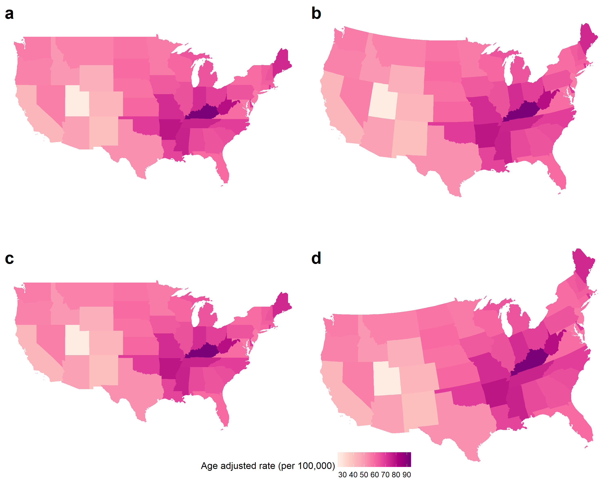
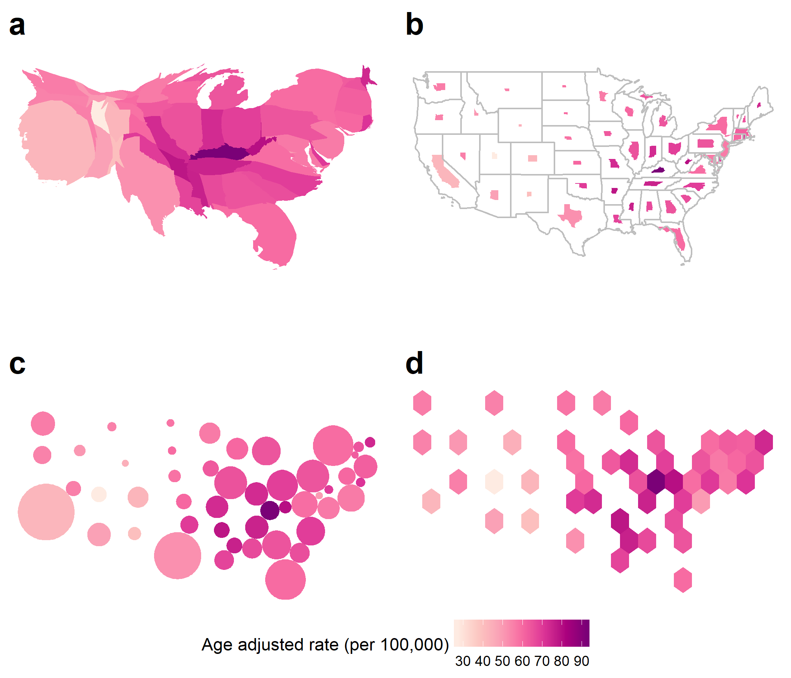
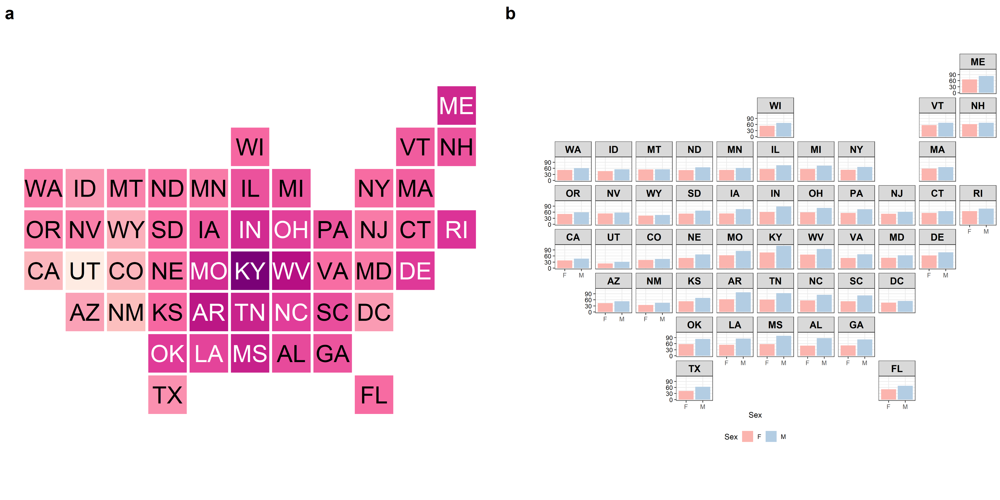

```{r setup, include=FALSE}
knitr::opts_chunk$set(echo = FALSE)
library(ggplot2)
library(cowplot)
library(png)
library(grid)
```


\section*{Abstract}
<!-- 119 words -->

Cancer atlases communicate cancer statistics over geographic domains. These domains are often subdivided by administrative areas such as countries, states or suburbs.
When communicating human-related statistics in Australia, the geographic map base may highlight the sparsely populated rural areas. The smaller geographic areas may not draw the attention of readers but they may be important to consider if they are more densely populated.


# Introduction
<!-- 436 words -->
<!-- What data are we working with, why, what are the purposes -->
Cancer statistics are usually delivered as an aggregated value for a geopolitical area. Presenting these statistics requires transforming individual observations into aggregations of communities as geographical units, in large part for privacy protection or political and policy purposes.  The information could be as simple as counts per area (e.g. state, province, local government area, post/zip code). Counts alone are not sufficient to compare areas, because the populations of areas are all different. In this case, the count data needs to be merged with population data to appropriately calibrate it to incidence, for example, the rate per 100000 people.  This type of data is collected on a routine basis for public health purposes and may be made available to the general public as a service to the community. The task, then, is to examine what are the usual ways to communicate cancer statistics, to the public, are there alternative approaches, and what are the pros and cons of these choices. 

<!-- Ways to visualize, whats our hypothesis -->
A common approach to communicate cancer statistics is to display statistics on a map. Using a choropleth map: the statistic is mapped to color and the geographic region is filled with this color. The viewer would then be able to examine the spatial distribution of the disease incidence, where there is a trend in longitude or latitude, or rural vs urban, or coastal vs inland, or even specific hot spots of the disease. Visualizing diseases on maps is often the first step in exploratory spatial data analysis and effectively helps in the formulation of hypotheses. Disease maps help to present geographic patterns that may be overlooked in a table, obscuring the geospatially related statistics [@SAMGIS].
By providing a visual representation of cancer outcomes, geographic patterns of the disease may be identified and effectively addressed with public health policy and actions.
@SE recognizes one of the key challenges with mapping spatial patterns of disease is the design of visualizations.
This paper addresses the visualization techniques and their applications to cancer statistics. Highlighting the differences and historic use of these displays.

<!-- Structure of the paper -->
The paper is organized as follows. The next section describes the choropleth map which is the common approach to disease maps. Section \ref{ch:public} surveys atlases in use today. Section \ref{ch:alternatives} describes  alternative displays, including the cartogram which is useful when the map has heterogeneously sized geographic units. The pros and cons of these approaches are discussed in Section \ref{ch:compare}. Disease maps are more useful when made interactive, and common options are described in Section \ref{ch:interacting}, along with a discussion of benefits and disadvantages. The last section summarizes the paper. 


# Map displays for disease data {#ch:choropleths}
<!-- 381 words -->
<!-- what is a choropleth map -->
A choropleth map is used to display differences in the geographical distribution of data by spatial unit by shading areas of a map [@EI]. The geography is faithfully rendered, and the color rendering is designed to reveal spatial patterns among data values. Identifying and explaining spatial structures, patterns, and processes involve considering the individuals in communities and organizing communities into representable units [@SAMGIS].
Early versions of choropleth maps used symbols or patterns instead of color.
@CPISACA discuss the use of choropleths to visualize cancer data, and @DMAHP gives an overview of the development of these maps for displaying disease data. In epidemiology, choropleths are often used as a tool to study the spatial distribution of cancer incidence and mortality. 

Figure \ref{fig:choroCRS} shows various geographic projections of choropleth maps of age-adjusted rate (per 100,000 people) of new cases of lung and bronchus in the USA, averaged from 2012 to 2016. The data was extracted from the official federal statistics by @USInteractive on cancer incidence and deaths, produced by the Centers for Disease Control and Prevention (CDC) and the National Cancer Institute (NCI). The rates exhibit a spatial trend, increasing from west to east. There is also a spatial outlier -- Utah has a noticeably lower rate than its neighbors. Also, Kentucky has a noticeably high rate, and Maine also has a higher rate than its neighbors. There is something of a cluster of higher rates around the tobacco states. 

<!-- psychology -->
Utilizing the state boundaries can make a map familiar to read [@CIBMUK], and allows viewers to visually infer the spatial relationships in the data. 
The familiarity of the geography is a worthy consideration when presenting results of spatial analysis, to consumers that extend beyond researchers, to the public, policymakers and the media [@CPISACA].

<!-- potential problems -->
While the areas are recognizable shapes, they are often politically driven boundaries with individual areas being of non-uniform size, containing different population densities and subject to change over time. 
The different population and geographical sizes of administrative areas can attract attention to the shades of the underpopulated but large areas [@EI], Skowronnek [-@BCM] calls this an area-size bias. 
Choropleths can inhibit visual inference when presenting human-related statistics as the display may draw attention away from the 'potentially more important results in the more populous communities' that are geographically smaller [@SE]. 

```{r choropleth-grid-create, message=FALSE, warning = FALSE, fig.cap = "Publicly available choropleth cancer maps published between 2010 and 2015.", out.width='100%', fig.align='center', fig.width=12, fig.height=10}
library(cowplot)

# Import the images
plot1 <- png::readPNG('cancer_map_images/choropleths/21.choropleth.png')
plot2 <- png::readPNG('cancer_map_images/choropleths/3.choropleth.png')
plot3 <- png::readPNG('cancer_map_images/choropleths/25.choropleth.png')
plot4 <- png::readPNG('cancer_map_images/choropleths/15.choropleth.png')
plot5 <- png::readPNG('cancer_map_images/choropleths/7.choropleth.png')
plot6 <- png::readPNG('cancer_map_images/choropleths/23.choropleth.png')
plot7 <- png::readPNG('cancer_map_images/choropleths/26.choropleth.png')

ggdraw() +
  draw_plot(rasterGrob(plot1), 0, .75, 0.33, .25) +
  draw_plot(rasterGrob(plot2), 0.33, 0.75, 0.33, .25) +
  draw_plot(rasterGrob(plot3), 0.66, 0.5, .33, .5) +
  draw_plot(rasterGrob(plot4), 0, 0.5, .33, .25) +
  draw_plot(rasterGrob(plot5), 0.33, 0.5, .33, .25) +
  draw_plot(rasterGrob(plot6), 0, 0, .66, .5) +
  draw_plot(rasterGrob(plot7), .66, 0, .33, .5) +
  draw_plot_label(c("a", "b", "c", "d", "e", "f", "g"), 
    c(0.015, 0.33, 0.63, 0.015, 0.33, 0.014, 0.63), 
    c(0.99, 0.99, 0.99, 0.74, 0.74, 0.47, 0.47), size = 20)

ggsave(filename = "figures/choropleth_grid.png", 
  device = "png", width = 6, height = 5, dpi = 300)
```


# Cancer atlases {#ch:public}
<!-- 360 words -->
<!-- Displaying of cancer data on choropleths -->
A cancer atlas is a map, or collection of maps, representing cancer incidence and mortality for a country, or group of countries. Atlases are key to developing hypotheses regarding areas with unusually high rates, geographic correlations, work-related exposures, and high-risk diets [@MACM]. The data collection of statistics across regions and the administrative control within regions lends itself to choropleth visualization. 
Atlases date to Haviland's maps in 1875, with UK cancer atlases appearing in 1961 [@HEDP], and early work in US cancer atlases appearing in 1971 [@burbank]. The presentation of cancer statistics has increased with greater access to computational power, and the availability of geographic information systems software [@SE].

<!-- Measures reported in cancer atlases -->
Mortality rates are now often presented as relative rates of risk across the population, and age-adjusted to correct for the higher prevalence of cancers in older populations.
Howe [-@HEDP] describes Stock's development of the standardized mortality ratios through the 1930s. Table \ref{tab:measures} summarizes the measures commonly presented in published cancer atlases.

Table: \label{tab:measures} Commonly used measures for reporting cancer information.

|Measure |Details| 
|:--------------------|:------------------------------------------------|  
|1. Count| Crude cancer counts|
|2. Rate per 100,000| Cancer incidence per 100,000 population|  
|3. IR (Incidence Ratio)| $(IR)_i=\frac{(Incidence\ Rate)_i}{Average\ Incidence\ Rate}$, |
|| The cancer incidence rate in region $i$ over the average cancer incidence rate for all of the regions|
|4. Age-Adjusted Rate per 100,000| Standardized by age structure or region|   
|5. Age-Adjusted Relative Risk| Standardized by age structure in each region $i$|  
|6. SIR (Standardized Incidence Ratio)| Standardized by incidence in each region $i$|
|7. Below or above Expected| An alternative expression of the SIR|
|8. RER | $RER = \frac{(Cancer\ related\ mortality)_i}{Average\ cancer\ related\ mortality}$|
|(Relative Excess Risk)| Represents the estimate of cancer-related mortality within five years of diagnosis. Also referred to as 'excess hazard ratio'| 


<!-- Cancer atlas literature -->

Cancer maps are effective tools for communicating incidence, survival, and mortality to a wide range of audiences, including the general public and others not trained in statistical analyses.
These visualizations enable non-expert audiences to interpret the outputs of sophisticated statistical analyses. Cruickshank (1947) as cited by @DMAHP, discusses using visuals as a 'formal statistical assessment of the spatial pattern'. Overwhelmingly, the cancer maps utilized to communicate to the public and other non-expert audiences are choropleths.  


## Overview of publicly available atlases \label{sec:publicatlases}
<!-- 416 words -->
Roberts [@roberts2019communication] identified 33 publicly available cancer atlases, published between January 2010 and November 2015, from different countries around the globe. All of these use choropleth maps. All but one of these were published by non-commercial organizations, including not-for-profits, government, research organizations, advocacy groups or government-funded partnerships.  Figure \ref{fig:choropleth-grid-create} displays a subset of maps from these atlases.


### The Environment and Health Atlas of England and Wales

Figure \ref{fig:choropleth-grid-create}a shows the relative risk for women developing lung cancer in England and Wales in 2010 [@EnvEnglandWales2]. The cancer data was from the Office for National Statistics (ONS) (England) and the Welsh Cancer Intelligence and Surveillance Unit (WCISU).    


### Globocan 2012: Estimated Cancer Incidence, Mortality and Prevalence Worldwide

The map seen in Figure \ref{fig:choropleth-grid-create}b shows age-standardized incidence rates (per 100,000) for all invasive cancers for both men and women, aggregated at a national level for 2018 [@Globocan]. It is published by the [World Health Organization's International Agency for Research on Cancer](https://www.iarc.fr/). Data was sourced from cancer registries of each country. 

### Atlas of Cancer in Queensland 

Figure \ref{fig:choropleth-grid-create}c shows the relative incidence ratio of lung cancer in males in the state of QLD within Australia based on data from 1998 to 2007 [@QLDcancerAtlas]. It is published by the Queensland Cancer Council, using data from the *[Queensland Cancer Registry](https://cancerqld.org.au/research/cancer-registries/queensland-cancer-registry/)*.  

### Bowel Cancer Australia Atlas 
Figure \ref{fig:choropleth-grid-create}d shows the average Standardised Incidence Ratio of colorectal cancer for Australian males from 2006 to 2010 in Australia [@Bowel]. It is published by *[Bowel Cancer Australia](https://www.bowelcanceraustralia.org/)*.  

### United States Cancer Statistics: An Interactive Cancer Statistics Website

The *[United States Cancer Statistics: An Interactive Cancer Statistics Website](https://nccd.cdc.gov/DCPC_INCA/)* [@USInteractive] can be seen in Figure \ref{fig:choropleth-grid-create}e. This map contains  the incidence rate per 100,000, of all cancer types for men and women in the United States in 2016, aggregated at the state level. The map was published by the *[Centers for Disease Control and Prevention](https://www.cdc.gov/)*, with data from state cancer registries.

### Map of Cancer Mortality Rates in Spain

Figure \ref{fig:choropleth-grid-create}f shows side by side maps of the relative risk of lung cancer separately for men and women from 2004 to 2008 [@cancerSpain]. 

### Atlas of Childhood Cancer in Ontario 

Figure \ref{fig:choropleth-grid-create}g  displays the incidence rate of childhood cancers per 100,000 (by census division) for children aged 0-14, in Ontario from 1995 to 2004 [@OntarioPediatric].

## Additional considerations
<!-- 479 words -->
Maps cannot tell the entire story. Supplementary graphs and plots are often included to add more depth and information. Additional materials such as tables, graphs, and text explanations, support understanding and inference derived from maps, ensuring the message communicated will be consistent across a range of viewers [@CPISACA]. The many displays of statistical summaries, including dot plots, bar plots, box plots, cumulative distribution plots, scatter plots, normal probability plots, can provide alternative views of the cancer statistics. These can also display supporting statistics such as error, confidence intervals, distributions, sample or population sizes, standard deviation. When presenting cancer maps, @MACM believes the intuition derived from maps must be 'validated by rigorous statistical analyses', and the display of the supplementary statistics helps in this regard.

### Geographic hierarchies

While atlases are often used to describe differences between areas, statistics may be displayed at different levels of aggregation. Global health statistics can be aggregated to administrative and arbitrarily defined regions, such as those used by the World Health Organization and the United Nations [@IARC_3].
World atlases can allow for displays of data aggregated into continents, countries, states, provinces and congressional districts [@USInteractive].

### Population distribution

Each population area will likely have a different number of people. The distribution of the population residing in all areas may also be communicated in a table or histogram display [@NICR_1].
Atlases can connect the population to the land available to them by communicating population density. Alternatives to choropleth to address this are described in Section \ref{ch:alternatives} . 

### Statistical uncertainty

With any number comes some uncertainty about its value. This can occur for several reasons: numbers are drawn from samples, errors occur in the disease reporting, values are simulated from a model to maintain privacy. Close to half of the atlases identified (42%, n=14) included some measure of uncertainty. Uncertainty is often recorded as sample or population size, standard deviation, confidence intervals, statistical significance, quantiles, credible intervals. The most common measure used to represent uncertainty were credible or confidence intervals (CIs).

Displaying the uncertainty associated with reported statistics is a vital feature of a cancer map, but it can be difficult to display effectively. The map focuses on displaying the statistic and lacks additional space to represent the uncertainty. Providing an adjacent map or overlaying maps with symbols [@VSSDCUC] are two approaches. 

### Demographics

Demographics include information regarding the age and sex distribution of the areas presented. Digital atlases allow for users to control the display, to select subsets such as males, females or those aged over 65. 

### Socio-economic indicators

Socio-economic indicators, such as unemployment rates, poverty rates, remoteness, and education levels,  can explain how the experience of cancer prevalence varies for various members of society. Few atlases provide this level of detail. Data is available from the United Nations Human Development Index and financial indicators are available from the World Bank [@IARC_3]. 


# Alternatives to choropleths {#ch:alternatives}

While there is significant variation across these maps in terms of the measure represented, the scale of the map, the color choices, the legend design and supplementary/supporting statistics, the mapping approach has not changes and almost exclusively only choropleth maps are used. Unlike innovation in spatial statistical methods, interactivity, data collection and record keeping little work has been done to implement different mapping approaches.

## Cartograms
<!-- 1496 words inc table-->

<!-- What is a cartogram? -->
Choropleths imply uniformity of data across the geographic space however population densities are extremely unlikely to be uniform [@BCM]. The cartogram was developed to address this, by transforming the map to better indicate population [@ACCAC]. The resulting display more accurately communicates the impact of the disease across the population, as recorded by the statistic, at the sacrifice of geographic accuracy. 


```{r choroCRS, fig.cap = "Four choropleth maps average age-adjusted rate of incidence for lung and bronchus in the United States averaged from sex and years 2012-2016, using four different map projections. The map projections alter the shapes and angles of the boundaries of each state.", message=FALSE, warning=FALSE, out.width='100%', fig.align='center'}
#
c1 <- png::readPNG("figures/gg3857.png")
c2 <- png::readPNG("figures/gg2163.png")
c3 <- png::readPNG("figures/gg4326.png")
c4 <- png::readPNG("figures/gg2955.png")
#
load("figures/usa_legend.rda")

ggdraw() +
  draw_plot(rasterGrob(c1), 0, .55, 0.5,    0.45) +
  draw_plot(rasterGrob(c2), 0.5, 0.55, 0.5, 0.45) +
  draw_plot(rasterGrob(c3), 0.0, 0.1, 0.5, 0.45) +
  draw_plot(rasterGrob(c4), 0.5, 0.1, 0.5,   0.45) +
  draw_plot(usa_legend, 0, 0, 1, 0.1, scale = 2) +
  draw_plot_label(c("a", "b", "c", "d"), 
    c(0, .5, 0, 0.5), 
    c(1, 1, .5, .5), size = 20)
```

<!-- Denominators -->
The purposeful distortion of the map space, transformed according to population density, is beneficial when a uniform density of the map base is desired. The population then becomes a uniformly distributed background for the statistic presented [@GOINO]. "population distribution is often extremely uneven in former British colonies" [@ACTUC ], and this makes the distortion necessary [@CTTMB].
When implementing a distortion of the geographical shape according to population, the resulting display is an area cartogram [@NAC], or population-by-area cartogram [@TAAM]. Event cartograms change the area of regions on a map depending on the amount of disease-related events, but this does not consider the effects of land area and population [@VSSDCUC].

<!-- Why transform?-->
<!-- Common variables used to create cartograms, e.g. population, mortality -->
Cartograms provide an alternative visualization method for statistical and geographical information.
The key difference between a choropleth and a cartogram is the desirable augmentation of the size, shape or distance of geographical areas [@ACTUC]. 
Monmonier [@HTLWM] suggests that white lies may be employed to create useful displays and map creators can draw lines that may distort the geometry and suppress features and it is easy for the average person to disregard the impact of transformations used to create cartograms.
Cartograms may be seen as an extension of map transformations and projections. The favorable distortion is proportional to a valueother than the actual earth size area [@NAC].
A disadvantage of the conventional map is that sparsely populated rural areas may be emphasized, whereas the areas representing cities are very small, interpreting spatial patterns very difficult.
The distortion of a cartogram accounts for the population density, preventing it from obscuring the spatial patterns [@TAAM]. 
The spatial transformation of map regions relative to the data emphasizes the data distribution instead of land size [@CBATCC].
When visualizing population statistics, Dorling [@ACTUC] considers this equitable representation design 'more socially just', or honest [@NISCC], giving due attention to all members of the population and reducing the visual impact of large areas with small populations [@DMAHP]. 
Howe [@HEDP] suggests that 'cancer occurs in people, not in geographical areas' and @CTTMB believe that spatial socio-economic data, like cancer rates, are best presented on a cartogram for urban areas as the population map base avoids allocating 'undue prominence' to rural areas. 
<!-- @MTMSIH encourage the use of cartograms to highlight small areas and uncover local-level inequalities. DI SAYS I think that focuses on bayesian analysis not on cartograms-->

<!-- Overview of varieties -->
<!-- Cartogram makers -->

The creation of cartograms was historically in the hands of professional cartographers [@CD]. 
Early approaches including John Hunter and Jonathan Young (1968) and Durham's wooden tile method, Skoda and Robertson's (1972) steel ball-bearing approach and Tobler's (1973) computer programs [@ACTUC]. 
Geographical information systems allowed map users, and researchers to create cartograms, but these systems are utilized depending on ‘the effectiveness, efficiency, and satisfaction of the map products (Nielsen 1994), [@CD].
Howe [@HEDP] discusses the impact of electronic computer-assisted techniques.

There are many alternatives to consider, the intended audience of the map, and its purpose are key points in cartogram use and creation.
 'There is no "best" cartogram or method of creating cartograms just as there is no "best" map' (Monmonier and Schnell, 1988) [@ACTUC]. 
Nusrat and Kobourov [@SAIC] provided a framework to investigate implementations of the many algorithms presented, and the "statistical accuracy, geographical accuracy, and topological accuracy". 

```{r ggcartograms, fig.cap = "Common alternatives to maps, showing the same information as in Figure \ref{choroCRS} for the United States of America: (a) contiguous cartogram, (b) non-contiguous, shape-preserved cartogram, (c)  Dorling cartogram (non-contiguous), (d) hexagon tilemap (non-contiguous). In (a) - (c) the state has been resized, and reshaped, to match the 2015 population of the state. This provides a better sense of the extent of disease relative to the population in the country and can help alleviate losing information about physically small but population-dense states. In the hexagon tilemap (d) each state is given equal size and thus equal emphasis.", message=FALSE, warning=FALSE, out.width='100%'}
g1 <- png::readPNG("figures/ggcont.png")
g2 <- png::readPNG("figures/ggncont.png")
g3 <- png::readPNG("figures/ggdorl.png")
g4 <- png::readPNG("figures/gghexmap.png")
#

load("figures/usa_legend.rda")

ggdraw() +
  draw_plot(rasterGrob(g1), 0, .55, 0.5,  0.45) +
  draw_plot(rasterGrob(g2), 0.5, 0.55, 0.5, 0.45) +
  draw_plot(rasterGrob(g3), 0.0, 0.1, 0.5, 0.45) +
  draw_plot(rasterGrob(g4), 0.5, 0.1, 0.5, 0.45) +
  draw_plot(usa_legend, 0, 0, 1, 0.1, scale = 2) +
  draw_plot_label(c("a", "b", "c", "d"), 
    c(0, .5, 0, 0.5), 
    c(1, 1, .5, .5), size = 20)
```

Table: \label{tab:usa} Maps used to present statistics for the United States of America. Each state has been colored according to the average age-adjusted rate of incidence for lung and bronchus for females and males in the United States 2012-2016.

|Map display |Details| 
|:--------------------|:------------------------------------------------|  
|a. Contiguous| Each stated shape has been distorted according to the population of the state in 2015. The state of California has become much larger due to its large population density. This draws attention to the densely populated North-East region and detracts from the less populated Mid West.|
|b. Non-contiguous| The geographic shape of the states has been maintained, but the size has altered according to the population of the state in 2015. The state of California has remained closer to its original size than it's surrounding states. The North-East states have remained closer to their geographical size, in the case of Massachusetts and Connecticut. This draws attention to the densely populated North-East region and the sparse Mid West.|
|c. Dorling| The states have been represented by a circle, but the size was determined by the population of the state in 2015. The North-East states remain closer to their neighbors and could be displaced from their geographic location. The sparsity of the population in the Mid West is highlighted by the distance between the circles, located at the geographic centroids.|
|d. Hexagon Tessellation| Each state is represented by a hexagon of equal size. The neighboring states are easily contrasted however the North-East regions have been displaced from their geographic location. The sparsity of the population in the Mid West is highlighteded by the light yellow color, the Age-Adjusted rate in Kentucky is the darkest and its neighbors are similar.|


Figure \ref{fig:ggcartograms} shows four different cartograms for the same data displayed in Figure \ref{fig:choroCRS}. Table {tab:usa} summarizes information that can be observed in the four types of cartograms.


### Contiguous

<!-- What is a contiguous cartogram -->
<!-- Intentionally preserve neighbors -->

A contiguous cartogram maintains connectivity of the map regions while areas are altered according to a statistic. This transformation often occurs at the expense of the shape of areas [@CBATCC, @NAC, @TAAM].
From a computer graphics perspective, @ACA explain the application of 'map deformation' to account for the value assigned to each area, they provide three methods for creating value-by-area cartograms.
Examples include Tobler’s Pseudo-Cartogram Method, Dorling’s Cellular Automaton Method [-@ACTUC], Radial Expansion Method of Selvin et al., Rubber Sheet Method of Dougenik et al., Gusein-Zade and Tikunov’s Line Integral Method, Constraint-Based Method (Kocmoud and House) [-@CBATCC].


### Non-contiguous

Non-contiguous cartograms prioritize the shapes of the areas instead of connectivity. Each area stays in a similar position to its location on a choropleth map. The choropleth map base is often also displayed to allow comparisons to be made regarding the change in the area displayed. The addition is the gap between areas, created as each area shrinks or grows according to the associated value of the statistic. Olson [@NAC] discusses the creation of these maps, the significance of the empty areas left between the geographic boundaries and the new shape, and the 'degree of difference from the original map that is the real message' of these displays.

As the trade-off regarding boundaries approaches simplicity, the distortion of region shapes on the contiguous cartogram presents an additional hurdle to visual recognition and this hurdle is not only eliminated on the non-contiguous cartogram but is replaced by the meaningful empty-space property [@ECGC, @NAC].

The shapes are valuable for recognition and allows users to orient themselves on the display. Map creators can efficiently communicate with this kind of map by keeping the outlines or particular elements of the original in the new shape [@NISCC].
The scale of the areas does not impact on the shape recognition.
However it may impact on the visibility of all areas if small areas expand beyond their boundaries. 
Figure \ref{fig:ggcartograms}b shows small overlaps in the North-East region of the United States. These overlaps are also shown in the non-contiguous cartogram of Australia in Figure \ref{fig:auscartograms} b.


### Dorling

Daniel Dorling presents an alternative display engineered to highlight the spatial distribution and neighborhood relationships without complex distortions of borders and boundaries. This approach opposes preserving the intricate shape details and is founded in the simple question put forward by Daniel Dorling -@ACTUC:

>"If, for instance, it is desirable that areas on a map have boundaries which are as simple as possible, why not draw the areas as simple shapes in the first place?"

He acknowledged the sophistication of contiguous cartograms but critiqued their 'very complex shapes,' he answers this with his implementation of maps created using 'the simplest of all shapes'. 
Circular cartograms use the same simple shapes for every region represented and resize the shapes according to the statistic represented or the population for a base map. This familiar shape may be more effective for understanding the spatial distribution than contiguous cartograms, as the 'nonsense' shapes shown in contiguous cartograms have 'no meaning' after distortions are applied @NISCC.
To produce a compelling map, a gravity model is applied to avoid overlaps and keep spatial relationships with neighboring areas over many iterations. This implementation can work for up to 'one hundred thousand' areas.

The groundwork for this approach had been laid in the mid-1930s by Raisz, and rectangular cartograms provide dramatic comparisons and are especially useful for correcting misconceptions communicated by geographic maps. 
@TFYCC quotes the official definition of Value-Area Cartograms, the simplistic displays which represent each area as a single rectangle, sized according to the value of the statistic.
This rectangular display also allows for tiling, where geographic neighbors placed in suitable relative positions also share borders however, contiguity may be sacrificed [@CDWCS].
Rectangular cartograms allow for bi-variate displays as the population can be effectively communicated by the size of each rectangular, and a second variable can be communicated using color [@ORC]. 

A similar method, where each geographic area is represented using a square, tessellated to create a square grid. This method has been used broadly in the media, e.g. FiveThirtyEight, Bloomberg Business, The Guardian, The Washington Post, The New York Times and NPR.
Each area is represented by a s

## Hexagon tilemap
<!-- 173 words -->
A tilemap provides a tessellated display of consistent shapes.
Each tile is usually one unit of measurement, this could be geographic regions such as states, or population-based where one tile is used for a consistent measure of population.
<!-- cite mosaic cartograms --> 

A simple tilemap presents the areas in a tessellated grid display, where geographic neighbors are found next to each other, with some necessary displacement employed for regions with more than four neighbors.
These tiles may be labeled or colored to represent a value.
tilemaps may be difficult to create, they are best created manually, with additional time and care required as the number of geographic areas to include increases.
Cano and others [@MDAC] define the term 'mosaic cartograms' for hexagonal tile displays, where the number of tiles for each area can be used to communicate the statistic of regions. 
The complexity of the boundaries can be adjusted in the resulting display, as the size of the tiles used allows a trade-off to be made between boundary complexity and simplicity.
quare of the same dimensions.

Figure \ref{fig:ggcartograms}d shows a hexagon tilemap representing each state using a single hexagon.


```{r ggtilemap, fig.cap = "Two more alternative displays, tilemap (left) and geofaceted map (right), showing state age-adjusted rate of incidence for lung and bronchus in the USA. In the tilemap, the layout approximates spatial location, with each state being an equal box filled with color representing cancer incidence. The geofaceted map shows bar charts laid out in a grid approximating the spatial location of the state. The age-adjusted rates for males and females are shown. This type of display allows multiple variables to be displayed for each geographic area.", out.width="100%"}

```


## Geofacet
<!-- 166 words -->
Hafen [@IGF] formalizes the term geofaceting to describe a grid display, the arrangement of tiles to create a grid that mimics the geographic topology of the set of areas. 
Like tilemaps, the arrangement of the areas can be reused for other spatial distribution visualizations.
Geofaceting has the functionality of facets, often used to replicate visualizations for each subset of the data. In this case, the data subsets are geographic.
The amount of information able to be communicated has increased from one value per region in a tilemap to one visualization, this is a more flexible display.
Virtually any plot display can be fit into the tile representing the areas, allowing displays of multiple variables or values per geographic entity.
As the amount of areas increase care must be taken to ensure legibility of the displays.
@IVMVTSAD acknowledges that this display suffers when the areas have very irregular shapes and large size disparities.
Manual creation of the grid is required.

## Multivariate displays
<!-- 222 words -->

Pickle and others [@MMST] present linked micromap plots to visually link geographic and statistical data, this serves as a solution to  multi-dimensionality issues.
This design has been used in online atlas displays of US states. Areas are grouped based on their value for one variable, and additional columns provide displays that contrast the areas in each group by other variables.
The display juxtaposes of choropleth maps and statistical plots;
it shows one map per group of the key separating variable, in a row with each additional statistical plot.
Linked micromaps predominantly utilize the choropleth map for displays of spatial relationships, that are seen when spatial neighbors are alotted to the same group.
It is one of several alternative displays that allow maps to become bivariate displays, commonly used to present both an estimate and the associated uncertainty.


Bivariate choropleth maps [@VUADBC] blend color schemes to convey the intersection of categorized levels of an estimate and the associated uncertainty for each spatial area.
Lucchesi and Wikle [@VUADBC] also suggests map pixelation, each region is broken into small pixels, the individual pixels are allocated values that reflect the uncertainty around the area's estimate by creating texture.
This display can also be animated, with each frame produced by resampling the pixels.
Areas with uncertain values will flicker more dramatically than areas with more certain values.


# Comparison and critique {#ch:compare}
<!-- 408 words -->


```{r auscartograms, fig.cap = "Cartograms showing melanoma incidence in Australia: (a) contiguous, partially population transformed, (b) non-contiguous shape preserved, (c) Dorling, (d) hexagon tilemap. The contiguous cartogram has expanded the highly populated areas while preserving the full shapes of rural areas. If it accurately sized areas by population the country would be unrecognizable. The shape-preserved is unreadable. Dorling has lost all geographic context. The hexagon tilemap provides a reasonable spatial distribution despite having isolated hexagons in the outback areas.", message=FALSE, warning=FALSE, out.width='100%'}

aus1 <- png::readPNG("figures/aus_ggcont.png")
aus2 <- png::readPNG("figures/aus_ggncont.png")
aus3 <- png::readPNG("figures/aus_ggdorl.png")
aus4 <- png::readPNG("figures/aus_gghexmap.png")
load("aus_legend.rda")

load("figures/aus_legend.rda")

library(cowplot)
ggdraw() +
  draw_plot(rasterGrob(aus1), 0, .55, 0.5, 0.50) +
  draw_plot(rasterGrob(aus2), 0.5, 0.55, 0.5, 0.50) +
  draw_plot(rasterGrob(aus3), 0.0, 0.1, 0.5, 0.55) +
  draw_plot(rasterGrob(aus4), 0.5, 0.1, 0.5, 0.55) +
  draw_plot(aus_legend, 0, 0, 1, .1) +
  draw_plot_label(c("a", "b", "c", "d"), 
    c(0, .5, 0, 0.5), 
    c(1, 1, .5, .5), size = 20)
```

  
## Neither choropleths or cartograms perform well for Australia

Australia presents an extreme case of an urban-rural divide. The landmass occupied by urban electoral districts is only 10% of Australia, yet 90% of the population live in these urban areas. To present election results on a choropleth map should be 'unthinkable', as it means diminishing the visual impact of the majority of the electorates.
Dorling [@ACTUC] has a cartogram showing the 1966 general election results, which looked very little like the geographical shape of Australia. This issue is felt in any nation which experiences a spatially heterogeneous population distribution. As this feature of population distributions continues to intensify, the need for cartograms as an alternative to a choropleth map should only increase.

Figure \ref{fig:auscartograms} shows four main types of cartograms displaying melanoma incidence on SA3 areas in Australia. The version of a contiguous cartogram (a) has expanded the highly populated areas while preserving the full shapes of rural areas. It has not fully resolved the population transformation of areas, and if it had accurately sized areas by population the country would be unrecognizable. The shape-preserved cartogram is unreadable, and all areas have been reduced to tiny spots on the map. Zooming in on a high-resolution output shows that it does indeed preserve the areas though. The Dorling cartogram has lost all geographic context. The hexagon tilemap provides a reasonable spatial distribution despite having too much white-space in the outback areas.

## Pros and cons of different choices

Choropleths provide a familiar display. This may be less threatening to an audience that could be frightened by statistics, but they suffer primarily from unfaithfully representing the disease information by hiding small geographic areas. Inset maps like in Brisbane city in Figure \ref{fig:choropleth-grid-create}c of the state of Queensland, are commonly used to reduce distorted interpretations, but it is a bandaid remedy. 

Cartograms provide the spatial distortion to more accurately convey the statistical distribution, focuses on the human impact of the disease. However, if the population density is highly dissonant with geographic density the cartogram will lose all spatial context, and thus futile. 

Some mix of tiling, faceting or even micromaps, which allow some spatial continuity while also zooming into small areas, are good solutions for difficult geographies. Table \ref{tab:methods} summarizes the key criteria for evaluating maps and alternative displays. Suggestions and comments to help map creators best communicate their health data and spatial analyses are provided in @CPISACA and @SAMGIS.

<!-- Choropleths, true topology, geographic distance, good for showing geographic importance 
To choose an appropriate map display, the map creator must consider the intended user, and message the map will communicate.
Choropleth displays utilize more traditional cartographic methods, they are usually true to the topography, displaying familiar boundaries of countries, states or administrative areas. Highlighting the geographic distribution, and differences between equal spatial units.
When there is a relationship between the variable being mapped and geographical features, a choropleth map would pair this information visually.
Choropleth methods require a decision to be made about the projection of the display, in this case aim to find a map projection that gives the least distorted representation of the geography [@UMPT].
However a choropleth is limited to a uni-variate display, presenting a spatial distribution by filling each area with a color.
These displays favor geographically large regions over small regions, though inset displays are often used to zoom in on a geographic area containing many small regions, this is seen in Figure \ref{fig:choropleth-grid-create} c of the state of Queensland, where the capital city Brisbane is highlighteded by the inset map. 
Users can identify the areas relevant to them by the familiar boundaries, and can easily contrast the experience of geographic neighbors. The map is reusable and fit for many purposes.
-->

<!-- Cartograms, sacrifice geography, focus on the outliers/ relationships in data space 
Cartographers were historically the creators of geographic displays, and epidemiologists utilized the maps that had been prepared in advance.
Cartograms with the population variable used to distortion the geographic map regions and boundaries are density equalizing maps, that reduce the visual prominence of large, but low-population areas [@VSSDCUC]. 
Cartogram displays incorporate the statistics and population into the design of the display,
shifting and sometimes sacrificing familiar boundaries to draw attention to large outliers in the data space or population density.
The unusual shapes are not longer familiar and may be difficult to compare. This can prevent effective comparison of the statistic. Cartograms also favor extreme statistics in the positive direction. Small extreme values are often lost due to the resulting small sized areas the do not draw user's attention.
The change in the map based on one variable provides the opportunity for bi-variate displays, using the change in area for one variable, and color for another.
The difference between the familiar map display helps highlight the impact of the disease on communities.
-->

<!-- Alternatives, remove geographic shapes, keep spatial relationship, focus on the outliers/ relationships in population space 
Alternative maps may replace the unexpected boundaries and shapes with familiar, simple shapes. This makes the spatial distribution the primary concept communicated by the display.
Areas that are geographically close will maintain connectedness in some way, but the population and the statistic will dominate.
tilemap displays may only allow one variable to be visualized if each region is given consistent map space, this occurs in geofaceting. 
Dorlings provide bi-variate displays as they use the size of the shape for one variable, and color for another.
These alternatives are especially helpful for data aggregations where administrative boundaries break populations into groups.
The experience of each community may be worth considering, as the experiences shared by the population within them may be similar due to the services and facilities they share.
This display allows a more equitable view of each community, and does not minimise those that operate on a smaller geographic scale.

Faceting provides an opportunity to contrast the overall distribution of variables across a geographic space or collection of geographic areas.
This display makes is difficult to compare specific regions.-->


Table: \label{tab:methods} Summary of features and constraints of common mapping methods used to display cancer statistics (Y=Yes, N=No, S=Sometimes).


|                     | Choropleth | Contiguous | Non-contig | Dorling | tilemaps | Geofacets |
|:-----------|:------------:|:-----------:|:---------------:|:---------:|:-----------:|:----------:|
|Spatial distortion   |  N  |  Y  |  Y  |  Y  |  Y  |  Y  |
|Preserves neighbors  |  Y  |  Y  |  Y  |  S  |  S  |  S  |
|Conceals small areas |  Y  |  S  |  N  |  N  |  N  |  N  |
|Uniform shape        |  N  |  N  |  N  |  Y  |  Y  |  Y  |
|Univariate only      |  Y  |  Y  |  Y  |  S  |  S  |  N  |
|Manual construction  |  N  |  N  |  N  |  N  |  Y  |  Y  |


<!-- Creating maps of diseases now involves more decisions to be made by map makers, rather than cartographers. 
Technology has played an enormous role in increasing the opportunities for map makers.
The computation and graphics power have made creation, alteration and interactivity possible.
as these options have expanded and it is the objectives of the investigator that will drive the choices. @CPISACA and @SAMGIS have provided suggestions and comments to help map creators best communicate their health data and spatial analyses.-->

# User interaction {#ch:interacting}
<!-- 634 words -->

<!-- Interactivity and animation can add value to online atlases, by enabling additional information to be presented on-the-fly with one display. It also invites the viewer to engage with the display, and the information.  

The word "interactive" is used, and perhaps, confused for many different graphics actions. At one extreme, it is synonymous with direct manipulation of the display, such as selecting an area, mousing over, or panning and zooming, using mouse action on the plot. At the other extreme, it refers to graphical user interfaces (GUI) such as selecting an item on a menu to change the variable being displayed, or checking a toggle box, or dragging a scrollbar. @RPIG provides a good overview of types of interactivity with plots. a key difference from an animation is that interactivity typically involves on-the-fly computations, and changes to the plot. 

The primary interactive tools found in online cancer maps include 

- drop-down menus to select features,
- variable selection, 
- tooltips, 
- zooming and panning.

The latter two would be considered to be direct manipulation on the map display, and the former two are GUI interfaces. The effects of these actions are rapid, incremental, and reversible [@DMIV]. 
-->

One of the concerns of adding too much information to a map is the fear of cognitive overload [@mcgranaghan1993cartographic] in which the user reaches an information threshold, beyond which will not be able to make sense of the information. It can be a juggling act for a diverse audience, with experts probably preferring more detail [@cliburn2002design]. Interactivity is a design feature within modern mapping methods that can be used to incorporate additional information and complexity without overloading the user. Effective  user-centered interactive actions produce rapid, incremental, and reversible changes to the display [@DMIV].

Monmonier [@HTLWM] says that interactivity can be used to allow users to explore the map for more information and provides flexibility for the display. The user can toggle between different variables, map views or even multiple realizations of future scenarios [@goodchild1994introduction]. This provides additional mechanisms for the users to digest the uncertainty of the available information [@maceachren1992visualizing, @van1994visualization]. When the needs of the audience are changeable and are also the priority, the map creator can allow interactivity for map users to explore a data set through dynamic interactions. This can allow inspection of the data from many views [@DQBCM]. @TNTEA says user interaction with maps helps them to understand and interpret the spatial distribution of disease, to validate, explain or explore the presented statistics and their relationships to each other.

Interactivity enables supplementary information to be incorporated into online atlases without cluttering the display. Interactive design features, found in online cancer maps, include tooltips, drop-down menus, data selection, zooming, and panning allow users to explore the map as they want more information and allow flexibility in the display [@HTLWM]. The use of these supports can be found in various online cancer maps identified by @roberts2019communication.

Animation, in contrast to interactivity, usually involves pre-computing views and showing these in a sequence. @TGA provided an overview of animation in association with the R package `gganimate` [@gganimate], with some focus on maps, explaining transitions between frames in a linear, to provide a fixed narrative to passive users. Animations are used to communicate a message by capturing and directing users' attention. It is most often employed to show changes over time. The controls for basic animation are usually placed outside of the plot space [@TGA], the map image is updated/replaced as the animation progresses. 

@CPISACA provide weather maps as a thoroughly developed example of animation of spatial displays to communicate information to the general public. The movement of a weather system will follow a forecasted path, all map users can follow the animated path of the weather system across the geography over a specified period. 

The Australian Cancer Atlas [-@TACA] provides [tours](
https://atlas.cancer.org.au/app/tour/lungcancer) that change the display to the draw users' attention to areas on the map that are relevant to the story.
This implementation of animation gives users tools to plan their exploration.

<!-- 
XXX This part needs to go to interactivity!
One of the concerns of adding too much information to a map is the fear of cognitive overload [@mcgranaghan1993cartographic] in which the user reaches an information threshold, beyond which will not be able to make sense of the information. These concerns are not unfounded, complexity and density of representation methods appear to overwhelm novice decision makers, while experts are able to use the detail more readily when making-decisions [@cliburn2002design]. Interactivity is a design feature within modern mapping methods that can be used to incorporate additional information and complexity without overloading the user.

Interactivity enables supplementary information to be incorporated into online atlases without cluttering the display. Interactive design features, found in online cancer maps, include tooltips, drop-down menus, data selection, zooming and panning allow users to explore the map as they want more information and allow flexibility in the display [@HTLWM]. The use of these supports were found in various online cancer maps identified by @roberts2019communication. The controls for basic interactive features are often placed outside of the plot space [@TGA], thus the map image is updated/replaced as the user interacts with the controls. For example, changing the population age or other demographic variables. Some more advanced interactions include direct interactions with the plot via the use of overlaid tool tip features, very few cancer atlases involve these more complex selection tools. 

Additionally, interactivity allows the user to toggle between different variables, map views or multiple realizations of possible future scenarios [@goodchild1994introduction]. Thus providing additional mechanisms for the users comprehension as well as the uncertainty of the available information (@maceachren1992visualizing; @van1994visualization). 

These interactive features provide an opportunity for users to explore the additional information available. This helps users to understand and interpret the spatial distribution presented, as well as validate, explain or explore the presented statistics and their relationships to each other and/or their underlying spatial distribution. This allows relationships between spatial areas and diseases to be explored with sophistication in non-traditional but still 'cognitively accessible' ways [@TNTEA]. The interactive features of the publicly available maps identified by @roberts2019communication allow the exploration of geographic hierarchies, population distribution, statistical uncertainty, demographics and socio-economic indicators.
@TNTEA suggested LM plots as a solution to linking cartography and statistical graphics.
-->


## Interaction and animation in publicly available atlases

Many publicly available cancer atlases employ interactivity and/or animation. Figure 6 <!--\ref{fig:interacting}--> shows the interactive GUI tools provided with the public atlases discussed in Section \ref{sec:publicatlases}. Mostly these are menus, and toggles, for choosing indicators, and subsets of the population.


## Under-utilized techniques

Figure 7 <!--\ref{fig:animating}--> shows two examples of more sophisticated interactive maps. The Spanish Cancer map (left) contains a linked display between a choropleth map and time series plots of cancer change. In linked plots, changing values in one display will trigger changes of corresponding elements in another display. Here, the temporal change in the choropleth map can be played out as an animation. Mousing over the time series plots will highlight the line for a particular region. The Canadian Breast Cancer Mortality map (right) has a magnifying glass that allows the user to zoom into small areas. It is easy to control and shows precise details in small areas. 

<!-- It is uncommon to see linked displays utilized in online atlases, but there are several frameworks that support interactive displays of multivariate data. @TNTEA suggested LM plots as a solution to linking cartography and statistical graphics. 
Linked displays allow for direct manipulation, @RPIG uses Swayne and Klinke's definition of high level interaction that occurs via data selection or brushing tools that highlight subsets of graphical elements such as polygons or points. Selections can be made statistically through interactions which allow subsets to be selected from statistical displays, such as tables of data.
Monmonier implemented linking choropleths with statistical plots, adding a geographic component to scatter plots [@MCRG], the use of link allows spatial dimensions to be reserved for geographic locations of areas. The statistical variation of additional variables can be presented in other appropriate displays.
Low level interaction is more common, this occurs via the user interface or the map.
Interacting with the map returns values or information used in the graphical display without referring to, of changing, the original data source of the map.
-->

<!-- Animations -->
<!--Animations communicate a story, showcasing a critical region by defining and progressing through a small set of keyframes, or waypoints [@ESRI].
@TGA suggests the use of moving objects demands attention by taking advantage of the behaviour of the visual cognition system.
They can be produced to not tolerate or require user input, creating useful, directed descriptions of processes, such as highlighting a particular region or time period [@HTLWM].
Animations ensure all users follow the same interpretive path but creators cannot control the level of engagement.
-->

<!-- Animations can be implemented to allow users varying degrees of control.
Figure \ref{fig:animating} a gives an example of how time can be included through animating displays. This is a basic form of interactivity with animation allowing users to play, pause and rewind films, where the film is intended to be watched in one direction but the position in the animation can be controlled.
@CPISACA provide weather maps as a thoroughly developed example of animation of spatial displays to communicate information to the general public.
The movement of a weather system will follow a forecasted path, all map users can follow the animated path of the weather system across the geography over a specified period of time.
Where the message is most important, static or animated graphics allow control over the display and interpretation.
User interaction more allow clicks to progress between stages of more complex animations.
The Australian Cancer Atlas [-@TACA] provides [tours](
https://atlas.cancer.org.au/app/tour/lungcancer) which change the display to draw user's attention to areas on the map that are relevant to the story.
This implementation of animation gives users tools to plan their own exploration.
-->

```{r interacting, fig.cap = "Interactive controls of displays in publicly available choropleth cancer maps: (i) GUI controls for statistic, sex, age groups, continents, and cancer types for [Globocan 2018: Cancer Today ](http://globocan.iarc.fr/Pages/Map.aspx), (ii) Menus for variable selection and zooming on [Bowel Cancer Australia Atlas](http://www.bowelcanceratlas.org/), (iii) Menus for choosing variables and countries in [The Cancer Atlas ](http://canceratlas.cancer.org/data/#?view=map&metric=INCID_ALL_M),  (iv) Tabs for different indicators and cancer types in [Global Cancer Map](http://globalcancermap.com/), (v) Menus and toggles for variable and subset selection in [United States Cancer Statistics: Data Visualizations](https://gis.cdc.gov/Cancer/USCS/DataViz.html).", fig.width = 12, fig.height = 9}
i1 <- png::readPNG('cancer_map_images/interactivity/3.interactivity.png') # b in choro grid
i2 <- png::readPNG('cancer_map_images/interactivity/15.interactivity.png') # d in choro grid
i3 <- png::readPNG('cancer_map_images/interactivity/4.interactivity.png')
i4 <- png::readPNG('cancer_map_images/interactivity/5.interactivity.png')
i5 <- png::readPNG('cancer_map_images/interactivity/7.interactivity.png') # e in choro grid

ggdraw() +
  draw_plot(rasterGrob(i1), 0,  0.13,   .28,  .83) + #a
  draw_plot(rasterGrob(i2), 0.32, 0.56, .68, .4) + #b
  draw_plot(rasterGrob(i3), 0.32, 0.41, .68, .13) + #c
  draw_plot(rasterGrob(i4), 0.32, 0.14, .68, .25) + #d
  draw_plot(rasterGrob(i5), 0, 0, 1, .13) + #e
  draw_plot_label(c("i", "ii", "iii", "iv", "v"), 
    c(0.01, 0.3, 0.3, 0.3, 0.01), 
    c(0.99, 0.99, 0.57, 0.40, 0.15), size = 20)

ggsave(filename = "figures/supp_grid.png", device = "png", 
  width = 12, height = 9, dpi = 300)
```

```{r animating, fig.cap = "Two examples of advanced interactivity (and animation) in publicly available choropleth cancer maps: a. Linked maps and time-series line plots, with temporal animation in [Map of Cancer Mortality Rates in Spain](http://www.geeitema.org/AtlasET/atlas.jsp?causa=e27MEPOC), b. A highly responsive magnifying glass on a map of [Breast Cancer Mortality in Canada](http://www.ehatlas.ca/light-pollution/maps/breast-cancer-mortality).", fig.width = 12, fig.height = 9}
a1 <- png::readPNG("cancer_map_images/animation/23.animation.png")
a2 <- png::readPNG("cancer_map_images/animation/2.animation.png")

ggdraw() +
  draw_plot(rasterGrob(a1), 0, 0, 0.3, 1) +
  draw_plot(rasterGrob(a2), 0.3, 0, 0.7, 1) +
  draw_plot_label(c("I", "II"), 
    c(0, .3), c(1, 1), size = 20)
```

# Conclusions
<!-- 307 words -->

<!-- summary of mapping -->
This paper provides an overview of mapping practices as used for cancer atlases and new approaches that could be adopted. The conventional approach is the choropleth map, and it is widely used. When there are small areas, as occurs in Australia where the population is concentrated on the coast, the information about cancer can be lost, and alternatives are needed. Making an inset can clarify congested regions but this breaks the viewers' attention because they need to shift focus from the map to the inset, and if there are many congested areas, many insets would be needed. The map alternatives, like cartograms and their variations, can be useful to allow the spatial distribution of cancer data to be digested.

<!-- statistics -->
Many different statistics are commonly used for cancer displays. The most basic is the incidence rate, which is easy to understand. It is common to see relative rates in many maps which measure how far a region is above or below the average. The purpose of using a relative rate is, perhaps the desire to pinpoint the areas that need attention because they have higher than expected rates. However, we lose the incidence rate information and thus interpretability. A region might be much higher than average, but it may not be close to a health concern, because all regions have a low incidence. 

<!-- interaction -->
Interaction with maps is an important component of public atlases. A purpose is to provide access to more information than is possible to display in a single map, without overwhelming the viewer. Too many choices though can similarly overwhelm a viewer, and thus decisions do need to be made about content to provide, or hide, for accurate and comprehensive communication of information. Similarly, providing ways for users to interact with the display encourages engagement, and creative, efficient, elegant, interactive tools elicit curiosity about the data. 

# Acknowledgements
<!-- 77 words -->
The authors would like to thank Dr. Earl Duncan, Professor Kerrie Mengersen, Dr. Susanna Cramb and Dr. Peter Baade for conversations on the content of this article. 

The following R [@R] packages were used to produce this paper: tidyverse [@tidyverse], RColorBrewer [@RColorBrewer], ggthemes [@ggthemes], png [@png], cowplot [@cowplot], sf [@sf], spData [@spData], cartogram [@cartogram], sugarbag [@sugarbag], knitr [@knitr], rmarkdown [@rmarkdown].

Files to reproduce the paper, and code to reproduce the plots, are available at https://github.com/srkobakian/review. 

# References


<!--
## counts versus predictions

@SEMA
'Disease mapping is carried out to summarise spatial and spatio-temporal variation in risk.'
Descriptive statistic of the relationship between geography and a disease.
population, exposure, and health data may have point data or aggregated summaries (count data)
potentially be subject to a number of inaccuracies
diagnostic error or misclassification

Not only the counts, but population, migration, deaths and births are modelled across census years.

rapid visual summary of complex geographical information, descriptive purposes, to generate hypotheses, for surveillance, and to aid policy formation and resource allocation.

When using counts:
 small populations imply large variability in estimated rates
 
Decisions taken at this stage may be critical as apparent ‘clusters’ may depend crucially on the boundaries chosen in time or space: ‘The more narrowly the underlying population is defined, the less will be the number of expected cases, the greater will be the estimate of the excess rate, and often the more pronounced will be the statistical significance’ 
 
Using prediction:
assuming that neighbouring μi are correlated leads to a ‘clustering’ prior

-->

<!-- presents forms of low level interactions with a user interface, these are the control menus for several online cancer atlases.
The user interface for these online atlases allow combinations of cancer type, gender, and other factors to be shown on the map display and the user to move between and/or compare different views of these variables. 
These controls may also change the geographies shown, such as continents or countries, states or counties. These displays can show familiar shapes for users to orient themselves on the map, then zoom in to explore densely populated communities.
Interactions with online atlases can also change the amount of detail shown.-->


<!-- Interactivity can be implemented within modern mapping methods to incorporate additional information and complexity without overloading the user.
Adding too much information to a map may create cognitive overload [@mcgranaghan1993cartographic] in which the user reaches an information threshold, beyond which will not be able to make sense of the information. 
Complexity and density of visualization methods can overwhelm novice decision makers however, experts are able to use the detail more readily when making-decisions [@cliburn2002design]. 
Supplementary information can be incorporated into online atlases without cluttering the display. Interactive design features found in online cancer maps include tool tip features, drop-down menus, data selection, zooming and panning.
Allowing users to explore the map for more information and providing flexibility in the display [@HTLWM]. The use of these supports were found in various online cancer maps identified by @roberts2019communication.
Additionally, interactivity allows the user to toggle between different variables, map views or multiple realizations of possible future scenarios [@goodchild1994introduction]. Thus providing additional mechanisms for the users comprehension as well as the uncertainty of the available information [@maceachren1992visualizing, @van1994visualization]. For example, changing the population, age or other demographic variables.
The controls for basic interactive features are often placed outside of the plot space [@TGA], the map image is updated/replaced as the user interacts with the controls. 
Some more advanced interactions include direct interactions with the plot via the use of overlaid tool tip features, very few cancer atlases involve these more complex selection interactive capabilities. 

Relationships between spatial areas and diseases can be explored with sophistication in nontraditional but still 'cognitively accessible' ways [@TNTEA]. This helps users to understand and interpret the spatial distribution presented, as well as validate, explain or explore the presented statistics and their relationships to each other and/or their underlying spatial distribution.

The interactive features of the publicly available maps identified by @roberts2019communication allow the exploration of geographic hierarchies, population distribution, statistical uncertainty, demographics and socio-economic indicators.


Interactivity and animation provide an alternative to the traditional approach of a single map for a single use, and enable the map to become more exploratory.
Interactivity allows users to drive their own exploration, controlling a display through variable controls, links, tooltips, and data selection tools [@TGA]. tooltips allow users to obtain additional information regarding specific geographic areas.

Development and adoption of this technology has allowed map users more control of the displayed message. 
-->


<!--to expand the communicative ability of a disease map. It is important to identify the primary questions that might be asked by the users of a map, and allow the display to change to best answer these questions. @CPISACA provide three questions that are generally asked when using a disease map:

- What is the mortality rate in a certain area?
- Are there geographic trends in the data, or regions of unusually high or low rates?
- Is the lung cancer mortality pattern similar to the pattern of smoking prevalence shown in a companion map?

A single map display may not effectively answer all three at the same time.
This is especially true when some areas are small and difficult to identify clearly in a single display or resolution. However, with the ability to interact with a map, or animate the display, map creators can specify and answer these questions by directing the attention of a map user to the areas of interest.
-->